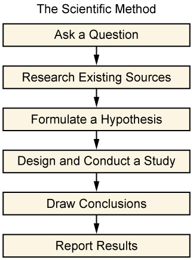

* Define and describe the scientific method
* Explain how the scientific method is used in sociological research
* Understand the function and importance of an interpretive framework
* Define what reliability and validity mean in a research study

When sociologists apply the sociological perspective and begin to ask questions, no topic is off limits. Every aspect of human behavior is a source of possible investigation. Sociologists question the world that humans have created and live in. They notice patterns of behavior as people move through that world. Using sociological methods and systematic research within the framework of the scientific method and a scholarly interpretive perspective, sociologists have discovered workplace patterns that have transformed industries, family patterns that have enlightened parents, and education patterns that have aided structural changes in classrooms.

The students at that college cafeteria discussion put forth a few loosely stated opinions. If the human behaviors around those claims were tested systematically, a student could write a report and offer the findings to fellow sociologists and the world in general. The new perspective could help people understand themselves and their neighbors and help people make better decisions about their lives. It might seem strange to use scientific practices to study social trends, but, as we shall see, it’s extremely helpful to rely on systematic approaches that research methods provide.

Sociologists often begin the research process by asking a question about how or why things happen in this world. It might be a unique question about a new trend or an old question about a common aspect of life. Once a question is formed, a sociologist proceeds through an in-depth process to answer it. In deciding how to design that process, the researcher may adopt a scientific approach or an interpretive framework. The following sections describe these approaches to knowledge.

# The Scientific Method

Sociologists make use of tried and true methods of research, such as experiments, surveys, and field research. But humans and their social interactions are so diverse that they can seem impossible to chart or explain. It might seem that science is about discoveries and chemical reactions or about proving ideas right or wrong rather than about exploring the nuances of human behavior.

However, this is exactly why scientific models work for studying human behavior. A scientific process of research establishes parameters that help make sure results are objective and accurate. Scientific methods provide limitations and boundaries that focus a study and organize its results.

The scientific method involves developing and testing theories about the world based on empirical evidence. It is defined by its commitment to systematic observation of the empirical world and strives to be objective, critical, skeptical, and logical. It involves a series of prescribed steps that have been established over centuries of scholarship.

 {: data-media-type="image/jpg"}

But just because sociological studies use scientific methods does not make the results less human. Sociological topics are not reduced to right or wrong facts. In this field, results of studies tend to provide people with access to knowledge they did not have before—knowledge of other cultures, knowledge of rituals and beliefs, knowledge of trends and attitudes. No matter what research approach is used, researchers want to maximize the study’s **reliability**{: data-type="term" #import-auto-id1203598} (how likely research results are to be replicated if the study is reproduced). Reliability increases the likelihood that what happens to one person will happen to all people in a group. Researchers also strive for **validity**{: data-type="term" #import-auto-id1344671}, which refers to how well the study measures what it was designed to measure. Returning to the Disney World topic, reliability of a study would reflect how well the resulting experience represents the average experience of theme park-goers. Validity would ensure that the study’s design accurately examined what it was designed to study, so an exploration of adults’ interactions with costumed mascots should address that issue and not veer into other age groups’ interactions with them or into adult interactions with staff or other guests.

In general, sociologists tackle questions about the role of social characteristics in outcomes. For example, how do different communities fare in terms of psychological well-being, community cohesiveness, range of vocation, wealth, crime rates, and so on? Are communities functioning smoothly? Sociologists look between the cracks to discover obstacles to meeting basic human needs. They might study environmental influences and patterns of behavior that lead to crime, substance abuse, divorce, poverty, unplanned pregnancies, or illness. And, because sociological studies are not all focused on negative behaviors or challenging situations, researchers might study vacation trends, healthy eating habits, neighborhood organizations, higher education patterns, games, parks, and exercise habits.

Sociologists can use the scientific method not only to collect but to interpret and analyze the data. They deliberately apply scientific logic and objectivity. They are interested in but not attached to the results. They work outside of their own political or social agenda. This doesn’t mean researchers do not have their own personalities, complete with preferences and opinions. But sociologists deliberately use the scientific method to maintain as much objectivity, focus, and consistency as possible in a particular study.

With its systematic approach, the scientific method has proven useful in shaping sociological studies. The scientific method provides a systematic, organized series of steps that help ensure objectivity and consistency in exploring a social problem. They provide the means for accuracy, reliability, and validity. In the end, the scientific method provides a shared basis for discussion and analysis (Merton 1963).

Typically, the scientific method starts with these steps—1) ask a question, 2) research existing sources, 3) formulate a hypothesis—described below.

## Ask a Question

The first step of the scientific method is to ask a question, describe a problem, and identify the specific area of interest. The topic should be narrow enough to study within a geography and timeframe. “Are societies capable of sustained happiness?” would be too vague. The question should also be broad enough to have universal merit. “What do personal hygiene habits reveal about the values of students at XYZ High School?” would be too narrow. That said, happiness and hygiene are worthy topics to study. Sociologists do not rule out any topic, but would strive to frame these questions in better research terms.

That is why sociologists are careful to define their terms. In a hygiene study, for instance, hygiene could be defined as “personal habits to maintain physical appearance (as opposed to health),” and a researcher might ask, “How do differing personal hygiene habits reflect the cultural value placed on appearance?” When forming these basic research questions, sociologists develop an **operational definition**{: data-type="term" #import-auto-id1301566}, that is, they define the concept in terms of the physical or concrete steps it takes to objectively measure it. The operational definition identifies an observable condition of the concept. By operationalizing a variable of the concept, all researchers can collect data in a systematic or replicable manner.

The operational definition must be valid, appropriate, and meaningful. And it must be reliable, meaning that results will be close to uniform when tested on more than one person. For example, “good drivers” might be defined in many ways: those who use their turn signals, those who don’t speed, or those who courteously allow others to merge. But these driving behaviors could be interpreted differently by different researchers and could be difficult to measure. Alternatively, “a driver who has never received a traffic violation” is a specific description that will lead researchers to obtain the same information, so it is an effective operational definition.

## Research Existing Sources

The next step researchers undertake is to conduct background research through a **literature review**{: data-type="term" #import-auto-id2733064}, which is a review of any existing similar or related studies. A visit to the library and a thorough online search will uncover existing research about the topic of study. This step helps researchers gain a broad understanding of work previously conducted on the topic at hand and enables them to position their own research to build on prior knowledge. Researchers—including student researchers—are responsible for correctly citing existing sources they use in a study or that inform their work. While it is fine to borrow previously published material (as long as it enhances a unique viewpoint), it must be referenced properly and never plagiarized.

To study hygiene and its value in a particular society, a researcher might sort through existing research and unearth studies about child-rearing, vanity, obsessive-compulsive behaviors, and cultural attitudes toward beauty. It’s important to sift through this information and determine what is relevant. Using existing sources educates a researcher and helps refine and improve a study’s design.

## Formulate a Hypothesis

A **hypothesis**{: data-type="term" #import-auto-id2217888} is an assumption about how two or more variables are related; it makes a conjectural statement about the relationship between those variables. In sociology, the hypothesis will often predict how one form of human behavior influences another. In research, **independent variables**{: data-type="term" #import-auto-id2875832} are the *cause* of the change. The **dependent variable**{: data-type="term" #import-auto-id1372836} is the *effect*, or thing that is changed.

For example, in a basic study, the researcher would establish one form of human behavior as the independent variable and observe the influence it has on a dependent variable. How does gender (the independent variable) affect rate of income (the dependent variable)? How does one’s religion (the independent variable) affect family size (the dependent variable)? How is social class (the dependent variable) affected by level of education (the independent variable)?

<table id="eip-245" summary="A chart demonstrating and applying the concept of independent and dependent variables."><caption>Examples of Dependent and Independent VariablesTypically, the independent variable causes the dependent variable to change in some way.</caption><thead>
  <tr>
    <th>Hypothesis</th>
    <th>Independent Variable</th>
    <th>Dependent Variable</th>
  </tr>
</thead><tbody>
  <tr>
    <td>The greater the availability of affordable housing, the lower the homeless rate.</td>
    <td>Affordable Housing</td>
    <td>Homeless Rate</td>
  </tr>
  <tr>
    <td>The greater the availability of math tutoring, the higher the math grades.</td>
    <td>Math Tutoring</td>
    <td>Math Grades</td>
  </tr>
  <tr>
    <td>The greater the police patrol presence, the safer the neighborhood.</td>
    <td>Police Patrol Presence</td>
    <td>Safer Neighborhood</td>
  </tr>
  <tr>
    <td>The greater the factory lighting, the higher the productivity.</td>
    <td>Factory Lighting</td>
    <td>Productivity</td>
  </tr>
  <tr>
    <td>The greater the amount of observation, the higher the public awareness.</td>
    <td>Observation</td>
    <td>Public Awareness</td>
  </tr>
</tbody></table>

At this point, a researcher’s operational definitions help measure the variables. In a study asking how tutoring improves grades, for instance, one researcher might define “good” grades as a C or better, while another uses a B+ as a starting point for “good.” Another operational definition might describe “tutoring” as “one-on-one assistance by an expert in the field, hired by an educational institution.” Those definitions set limits and establish cut-off points, ensuring consistency and replicability in a study.

As the chart shows, an independent variable is the one that causes a dependent variable to change. For example, a researcher might hypothesize that teaching children proper hygiene (the independent variable) will boost their sense of self-esteem (the dependent variable). Or rephrased, a child’s sense of self-esteem depends, in part, on the quality and availability of hygienic resources.

Of course, this hypothesis can also work the other way around. Perhaps a sociologist believes that increasing a child’s sense of self-esteem (the independent variable) will automatically increase or improve habits of hygiene (now the dependent variable). Identifying the independent and dependent variables is very important. As the hygiene example shows, simply identifying two topics, or variables, is not enough: Their prospective relationship must be part of the hypothesis.

Just because a sociologist forms an educated prediction of a study’s outcome doesn’t mean data contradicting the hypothesis aren’t welcome. Sociologists analyze general patterns in response to a study, but they are equally interested in exceptions to patterns. In a study of education, a researcher might predict that high school dropouts have a hard time finding a rewarding career. While it has become at least a cultural assumption that the higher the education, the higher the salary and degree of career happiness, there are certainly exceptions. People with little education have had stunning careers, and people with advanced degrees have had trouble finding work. A sociologist prepares a hypothesis knowing that results will vary.

Once the preliminary work is done, it’s time for the next research steps: designing and conducting a study, and drawing conclusions. These research methods are discussed below.

# Interpretive Framework

While many sociologists rely on the scientific method as a research approach, others operate from an **interpretive framework**{: data-type="term" #import-auto-id2731490}. While systematic, this approach doesn’t follow the hypothesis-testing model that seeks to find generalizable results. Instead, an *interpretive framework*, sometimes referred to as an interpretive perspective, seeks to understand social worlds from the point of view of participants, leading to in-depth knowledge.

Interpretive research is generally more descriptive or narrative in its findings. Rather than formulating a hypothesis and method for testing it, an interpretive researcher will develop approaches to explore the topic at hand that may involve lots of direct observation or interaction with subjects. This type of researcher also learns as he or she proceeds, sometimes adjusting the research methods or processes midway to optimize findings as they evolve.

# Summary

Using the scientific method, a researcher conducts a study in five phases: asking a question, researching existing sources, formulating a hypothesis, conducting a study, and drawing conclusions. The scientific method is useful in that it provides a clear method of organizing a study. Some sociologists conduct research through an interpretive framework rather than employing the scientific method.

Scientific sociological studies often observe relationships between variables. Researchers study how one variable changes another. Prior to conducting a study, researchers are careful to apply operational definitions to their terms and to establish dependent and independent variables.

# Section Quiz

A measurement is considered \_\_\_\_\_\_­ if it actually measures what it is intended to measure, according to the topic of the study.

1.  reliable
2.  sociological
3.  valid
4.  quantitative
{: data-number-style="lower-alpha"}

Answer

C

Sociological studies test relationships in which change in one \_\_\_\_\_\_ causes change in another.

1.  test subject
2.  behavior
3.  variable
4.  operational definition
{: data-number-style="lower-alpha"}

Answers

C

In a study, a group of 10-year-old boys are fed doughnuts every morning for a week and then weighed to see how much weight they gained. Which factor is the dependent variable?

1.  The doughnuts
2.  The boys
3.  The duration of a week
4.  The weight gained
{: data-number-style="lower-alpha"}

Answers

D

Which statement provides the best operational definition of “childhood obesity”?

1.  Children who eat unhealthy foods and spend too much time watching television and playing video games
2.  A distressing trend that can lead to health issues including type 2 diabetes and heart disease
3.  Body weight at least 20% higher than a healthy weight for a child of that height
4.  The tendency of children today to weigh more than children of earlier generations
{: data-number-style="lower-alpha"}

Answers

C

# Short Answer

Write down the first three steps of the scientific method. Think of a broad topic that you are interested in and which would make a good sociological study—for example, ethnic diversity in a college, homecoming rituals, athletic scholarships, or teen driving. Now, take that topic through the first steps of the process. For each step, write a few sentences or a paragraph: 1) Ask a question about the topic. 2) Do some research and write down the titles of some articles or books you’d want to read about the topic. 3) Formulate a hypothesis.

# Further Research

For a historical perspective on the scientific method in sociology, read “The Elements of Scientific Method in Sociology” by F. Stuart Chapin (1914) in the *American Journal of Sociology*\: [http://openstaxcollege.org/l/Method-in-Sociology][1]

# References

Berger, Peter L. 1963. *Invitation to Sociology: A Humanistic Perspective*. New York: Anchor Books.

Merton, Robert. 1968 \[1949\]. *Social Theory and Social Structure*. New York: Free Press.

“Scientific Method Lab,” the University of Utah, http://aspire.cosmic-ray.org/labs/scientific\\\_method/sci\\\_method\\\_main.html

[1]: http://openstaxcollege.org/l/Method-in-Sociology
