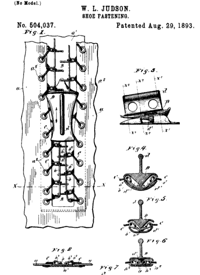
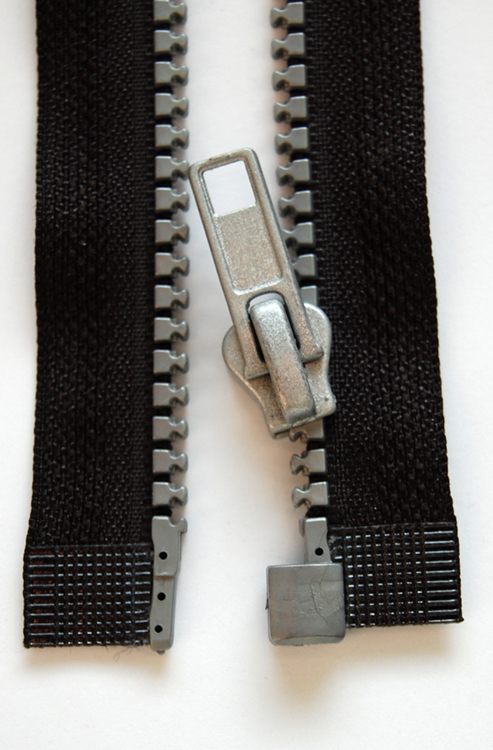

* Discuss the roles of both high culture and pop culture within society
* Differentiate between subculture and counterculture
* Explain the role of innovation, invention, and discovery in culture
* Understand the role of cultural lag and globalization in cultural change

It may seem obvious that there are a multitude of cultural differences between societies in the world. After all, we can easily see that people vary from one society to the next. It’s natural that a young woman from rural Kenya would have a very different view of the world from an elderly man in Mumbai—one of the most populated cities in the world. Additionally, each culture has its own internal variations. Sometimes the differences between cultures are not nearly as large as the differences inside cultures.

# High Culture and Popular Culture

Do you prefer listening to opera or hip hop music? Do you like watching horse racing or NASCAR? Do you read books of poetry or celebrity magazines? In each pair, one type of entertainment is considered high-brow and the other low-brow. Sociologists use the term **high culture**{: data-type="term" #import-auto-id1169033140160} to describe the pattern of cultural experiences and attitudes that exist in the highest class segments of a society. People often associate high culture with intellectualism, political power, and prestige. In America, high culture also tends to be associated with wealth. Events considered high culture can be expensive and formal—attending a ballet, seeing a play, or listening to a live symphony performance.

The term **popular culture**{: data-type="term" #import-auto-id1169033066905} refers to the pattern of cultural experiences and attitudes that exist in mainstream society. Popular culture events might include a parade, a baseball game, or the season finale of a TV show. Rock and pop music—“pop” short for “popular”—are part of popular culture. In modern times, popular culture is often expressed and spread via commercial media such as radio, television, movies, the music industry, publishers, and corporate-run websites. Unlike high culture, popular culture is known and accessible to most people. You can share a discussion of favorite football teams with a new coworker, or comment on “American Idol” when making small talk in line at the grocery store. But if you tried to launch into a deep discussion on the classical Greek play *Antigone*, few members of American society today would be familiar with it.

Although high culture may be viewed as superior to popular culture, the labels of high culture and popular culture vary over time and place. Shakespearean plays, considered pop culture when they were written, are now among our society’s high culture. Five hundred years from now, will our descendants associate watching *Two and a Half Men* with members of the cultural elite?

# Subculture and Counterculture

A **subculture**{: data-type="term" #import-auto-id1169033099116} is just as it sounds—a smaller cultural group within a larger culture; people of a subculture are part of the larger culture, but also share a specific identity within a smaller group.

Thousands of subcultures exist within the United States. Ethnic and racial groups share the language, food, and customs of their heritage. Other subcultures are united by shared experiences. Biker culture revolves around a dedication to motorcycles. Some subcultures are formed by members who possess traits or preferences that differ from the majority of a society’s population. The body modification community embraces aesthetic additions to the human body, such as tattoos, piercings, and certain forms of plastic surgery. In the United States, adolescents often form subcultures to develop a shared youth identity. Alcoholics Anonymous offers support to those suffering from alcoholism. But even as members of a subculture band together, they still identify with and participate in the larger society.

Sociologists distinguish subcultures from **countercultures**{: data-type="term" #import-auto-id1169033063380}, which are a type of subculture that rejects some of the larger culture’s norms and values. In contrast to subcultures, which operate relatively smoothly within the larger society, countercultures might actively defy larger society by developing their own set of rules and norms to live by, sometimes even creating communities that operate outside of greater society.

Cults, a word derived from culture, are also considered counterculture group. The group “Yearning for Zion” (YFZ) in Eldorado, Texas, existed outside the mainstream, and the limelight, until its leader was accused of statutory rape and underage marriage. The sect’s formal norms clashed too severely to be tolerated by U.S. law, and in 2008, authorities raided the compound, removing more than two hundred women and children from the property.

The Evolution of American Hipster Subculture

Skinny jeans, chunky glasses, and T-shirts with vintage logos—the American hipster is a recognizable figure in the modern United States. Based predominately in metropolitan areas, sometimes clustered around hotspots such as the Williamsburg neighborhood in New York City, hipsters define themselves through a rejection of the mainstream. As a subculture, hipsters spurn many of the values and beliefs of American culture, preferring vintage clothing to fashion and a bohemian lifestyle to one of wealth and power. While hipster culture may seem to be the new trend among young, middle-class youth, the history of the group stretches back to the early decades of the 1900s.

Where did the hipster culture begin? In the early 1940s, jazz music was on the rise in the United States. Musicians were known as “hepcats” and had a smooth, relaxed quality that went against upright, mainstream life. Those who were “hep” or “hip” lived by the code of jazz, while those who were “square” lived according to society’s rules. The idea of a “hipster” was born.

The hipster movement spread and young people, drawn to the music and fashion, took on attitudes and language derived from the culture of jazz. Unlike the vernacular of the day, hipster slang was purposefully ambiguous. When hipsters said, “It’s cool, man,” they meant not that everything was good, but that it was the way it was.

"){: #import-auto-id1169033102890 data-media-type="image/jpg"}

By the 1950s, the jazz culture was winding down and many traits of hepcat culture were becoming mainstream. A new subculture was on the rise. The “Beat Generation,” a title coined by writer Jack Kerouac, were anticonformist and antimaterialistic. They were writers who listened to jazz and embraced radical politics. They bummed around, hitchhiked the country, and lived in squalor.

The lifestyle spread. College students, clutching copies of Kerouac’s *On the Road*, dressed in berets, black turtlenecks, and black-rimmed glasses. Women wore black leotards and grew their hair long. Herb Caen, a San Francisco journalist, used the suffix from *Sputnik 1*, the Russian satellite that orbited Earth in 1957, to dub the movement’s followers “Beatniks.”

As the Beat Generation faded, a new, related movement began. It too focused on breaking social boundaries, but also advocated freedom of expression, philosophy, and love. It took its name from the generations before; in fact, some theorists claim that Beats themselves coined the term to describe their children. Over time, the “little hipsters” of the 1970s became known simply as “hippies.”

Today’s generation of hipsters rose out of the hippie movement in the same way that hippies rose from Beats and Beats from hepcats. Although contemporary hipsters may not seem to have much in common with 1940 hipsters, the emulation of nonconformity is still there. In 2010, sociologist Mark Greif set about investigating the hipster subculture of the United States and found that much of what tied the group members together was not based on fashion or musical taste or even a specific point of contention with the mainstream. “All hipsters play at being the inventors or first adopters of novelties,” Greif wrote. “Pride comes from knowing, and deciding, what’s cool in advance of the rest of the world. Yet the habits of hatred and accusation are endemic to hipsters because they feel the weakness of everyone’s position—including their own” (Greif 2010). Much as the hepcats of jazz era opposed common culture with carefully crafted appearances of coolness and relaxation, modern hipsters reject mainstream values with a purposeful apathy.

Young people are often drawn to oppose mainstream conventions, even if in the same way that others do. Ironic, cool to the point of non-caring, and intellectual, hipsters continue to embody a subculture, while simultaneously impacting mainstream culture.

"){: #import-auto-id1169033138537 data-media-type="image/jpg"}

# Cultural Change

As the hipster example illustrates, culture is always evolving. Moreover, new things are added to material culture every day, and they affect nonmaterial culture as well. Cultures change when something new (say, railroads or smartphones) opens up new ways of living and when new ideas enter a culture (say, as a result of travel or globalization).

## Innovation: Discovery and Invention

An **innovation**{: data-type="term" #import-auto-id1169033063648} refers to an object or concept’s initial appearance in society—it’s innovative because it is markedly new. There are two ways to come across an innovative object or idea: discover it or invent it. **Discoveries**{: data-type="term" #import-auto-id1169033063654} make known previously unknown but existing aspects of reality. In 1610, when Galileo looked through his telescope and discovered Saturn, the planet was already there, but until then, no one had known about it. When Christopher Columbus encountered America, the land was, of course, already well known to its inhabitants. However, Columbus’s discovery was new knowledge for Europeans, and it opened the way to changes in European culture, as well as to the cultures of the discovered lands. For example, new foods such as potatoes and tomatoes transformed the European diet, and horses brought from Europe changed hunting practices of Native American tribes of the Great Plains.

**Inventions**{: data-type="term" #import-auto-id1169033058189} result when something new is formed from existing objects or concepts—when things are put together in an entirely new manner. In the late 1800s and early 1900s, electric appliances were invented at an astonishing pace. Cars, airplanes, vacuum cleaners, lamps, radios, telephones, and televisions were all new inventions. Inventions may shape a culture when people use them in place of older ways of carrying out activities and relating to others, or as a way to carry out new kinds of activities. Their adoption reflects (and may shape) cultural values, and their use may require new norms for new situations.

Consider the introduction of modern communication technology such as mobile phones and smartphones. As more and more people began carrying these devices, phone conversations no longer were restricted to homes, offices, and phone booths. People on trains, in restaurants, and in other public places became annoyed by listening to one-sided conversations. Norms were needed for cell phone use. Some people pushed for the idea that those who are out in the world should pay attention to their companions and surroundings. However, technology enabled a workaround: texting, which enables quiet communication, and has surpassed phoning as the chief way to meet today’s highly valued ability to stay in touch anywhere, everywhere.

When the pace of innovation increases, it can lead to generation gaps. Technological gadgets that catch on quickly with one generation are sometimes dismissed by a skeptical older generation. A culture’s objects and ideas can cause not just generational but cultural gaps. Material culture tends to diffuse more quickly than nonmaterial culture; technology can spread through society in a matter of months, but it can take generations for the ideas and beliefs of society to change. Sociologist William F. Ogburn coined the term **culture lag**{: data-type="term" #import-auto-id1169033056812} to refer to this time that elapses between when a new item of material culture is introduced and when it becomes an accepted part of nonmaterial culture (Ogburn 1957).

Culture lag can also cause tangible problems. The infrastructure of the United States, built a hundred years ago or more, is having trouble supporting today’s more heavily populated and fast-paced life. Yet there is a lag in conceptualizing solutions to infrastructure problems. Rising fuel prices, increased air pollution, and traffic jams are all symptoms of culture lag. Although people are becoming aware of the consequences of overusing resources, the means to support changes takes time to achieve.

  developed a model of the diffusion of innovations. As consumers gradually adopt a new innovation, the item grows toward a market share of 100 percent, or complete saturation within a society. (Graph courtesy of Tungsten/Wikimedia Commons)"){: #import-auto-id1169033140142 data-media-type="image/png"}

## Diffusion and Globalization

The integration of world markets and technological advances of the last decades have allowed for greater exchange between cultures through the processes of globalization and diffusion. Beginning in the 1980s, Western governments began to deregulate social services while granting greater liberties to private businesses. As a result, world markets became dominated by multinational companies in the 1980s, a new state of affairs at that time. We have since come to refer to this integration of international trade and finance markets as **globalization**{: data-type="term" #import-auto-id1169033066608}. Increased communications and air travel have further opened doors for international business relations, facilitating the flow not only of goods but of information and people as well (Scheuerman 2010). Today, many U.S. companies set up offices in other nations where the costs of resources and labor are cheaper. When a person in the United States calls to get information about banking, insurance, or computer services, the person taking that call may be working in India or Indonesia.

Alongside the process of globalization is **diffusion**{: data-type="term" #import-auto-id1169033069809}, or, the spread of material and nonmaterial culture. While globalization refers to the integration of markets, diffusion relates a similar process to the integration of international cultures. Middle-class Americans can fly overseas and return with a new appreciation of Thai noodles or Italian gelato. Access to television and the Internet has brought the lifestyles and values portrayed in American sitcoms into homes around the globe. Twitter feeds from public demonstrations in one nation have encouraged political protesters in other countries. When this kind of diffusion occurs, material objects and ideas from one culture are introduced into another.

<figure markdown="1" id="import-auto-id1169033066672">
<figcaption>
Officially patented in 1893 as the “clasp locker” (left), the zipper did not diffuse through society for many decades. Today, it is immediately recognizable around the world. (Photo (a) courtesy of U.S. Patent Office/Wikimedia Commons; Photo (b) courtesy of Rabensteiner/Wikimedia Commons)
</figcaption>
{: #eip-id2199723 data-media-type="image/png"}

{: #eip-id1685950 data-media-type="image/jpg"}

</figure>

# Summary

Sociologists recognize high culture and popular culture within societies. Societies are also comprised of many subcultures—smaller groups that share an identity. Countercultures reject mainstream values and create their own cultural rules and norms. Through invention or discovery, cultures evolve via new ideas and new ways of thinking. In many modern cultures, the cornerstone of innovation is technology, the rapid growth of which can lead to cultural lag. Technology is also responsible for the spread of both material and nonmaterial culture that contributes to globalization.

# Section Quiz

An example of high culture is \_\_\_\_\_\_\_\_\_\_\_, whereas an example of popular culture would be \_\_\_\_\_\_\_\_\_\_\_\_.

1.  Dostoevsky style in film; “American Idol” winners
2.  medical marijuana; film noir
3.  country music; pop music
4.  political theory; sociological theory
{: data-number-style="lower-alpha"}

Answer

A

The Ku Klux Klan is an example of what part of culture?

1.  Counterculture
2.  Subculture
3.  Multiculturalism
4.  Afrocentricity
{: data-number-style="lower-alpha"}

Answer

A

Modern-day hipsters are an example of:

1.  ethnocentricity
2.  counterculture
3.  subculture
4.  high culture
{: data-number-style="lower-alpha"}

Answer

C

Your 83-year-old grandmother has been using a computer for some time now. As a way to keep in touch, you frequently send e-mails of a few lines to let her know about your day. She calls after every e-mail to respond point by point, but she has never e-mailed a response back. This can be viewed as an example of:

1.  cultural lag
2.  innovation
3.  ethnocentricity
4.  xenophobia
{: data-number-style="lower-alpha"}

Answer

A

Some jobs today advertise in multinational markets and permit telecommuting in lieu of working from a primary location. This broadening of the job market and the way that jobs are performed can be attributed to:

1.  cultural lag
2.  innovation
3.  discovery
4.  globalization
{: data-number-style="lower-alpha"}

Answer

D

The major difference between invention and discovery is:

1.  Invention is based on technology, whereas discovery is usually based on culture
2.  Discovery involves finding something that already exists, but invention puts things together in a new way
3.  Invention refers to material culture, whereas discovery can be material or theoretic, like laws of physics
4.  Invention is typically used to refer to international objects, whereas discovery refers to that which is local to one’s culture
{: data-number-style="lower-alpha"}

Answer

B

That McDonald’s is found in almost every country around the world is an example of:

1.  globalization
2.  diffusion
3.  culture lag
4.  xenocentrism
{: data-number-style="lower-alpha"}

Answer

B

# Short Answer

Identify several examples of popular culture and describe how they inform larger culture. How prevalent is the effect of these examples in your everyday life?

Consider some of the specific issues or concerns of your generation. Are any ideas countercultural? What subcultures have emerged from your generation? How have the issues of your generation expressed themselves culturally? How has your generation made its mark on society’s collective culture?

What are some examples of cultural lag that are present in your life? Do you think technology affects culture positively or negatively? Explain.

# Further Research

The Beats were a counterculture that birthed an entire movement of art, music, and literature—much of which is still highly regarded and studied today. The man responsible for naming the generation was Jack Kerouac; however, the man responsible for introducing the world to that generation was John Clellon Holmes, a writer often lumped in with the group. In 1952 he penned an article for the *New York Times Magazine* titled “This Is the Beat Generation.” Read that article and learn more about Clellon Holmes and the Beats: [http://openstaxcollege.org/l/The-Beats][1]

Popular culture meets counterculture in this as Oprah Winfrey interacts with members of the Yearning for Zion cult. Read about it here: [http://openstaxcollege.org/l/Oprah][2]

# References

Greif, Mark. 2010. “The Hipster in the Mirror.” *New York Times*, November 12. Retrieved February 10, 2012 ([http://www.nytimes.com/2010/11/14/books/review/Greif-t.html?pagewanted=1][3]).

Ogburn, William F. 1957. “Cultural Lag as Theory.” *Sociology &amp; Social Research* 41(3):167–174.

Rogers, Everett M. 1962. *Diffusion of Innovations*. Glencoe: Free Press.

Scheuerman, William. 2010. “Globalization.” *The Stanford Encyclopedia of Philosophy*, edited by E. N. Zalta, Summer. Retrieved February 10, 2012 ([http://plato.stanford.edu/archives/sum2010/entries/globalization/][4]).

[1]: http://openstaxcollege.org/l/The-Beats
[2]: http://openstaxcollege.org/l/Oprah
[3]: http://www.nytimes.com/2010/11/14/books/review/Greif-t.html?pagewanted=1
[4]: http://plato.stanford.edu/archives/sum2010/entries/globalization/
