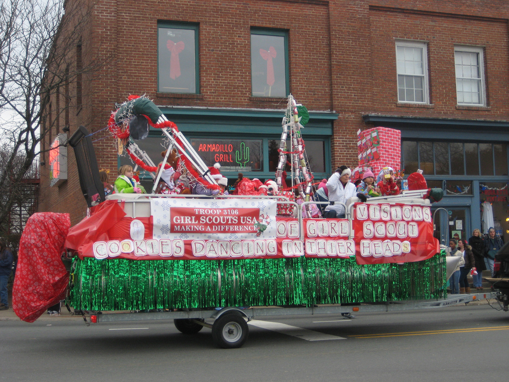
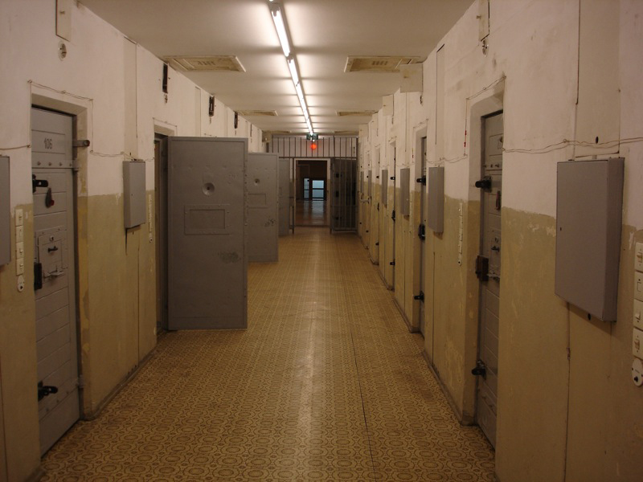

* Understand the different types of formal organizations
* Recognize the characteristics of bureaucracies
* Identify the concepts of the McJob and the McDonaldization of society

A complaint of modern life is that society is dominated by large and impersonal secondary organizations. From schools to businesses to healthcare to government, these organizations, referred to as **formal organizations**{: data-type="term" #import-auto-id2731918}, are highly bureaucratized. Indeed, all formal organizations are, or likely will become, **bureaucracies**{: data-type="term" #import-auto-id1244687}. A bureaucracy is an ideal type of formal organization. Ideal doesn’t mean “best” in its sociological usage; it refers to a general model that describes a collection of characteristics, or a type that could describe most examples of the item under discussion. For example, if your professor were to tell the class to picture a car in their minds, most students will picture a car that shares a set of characteristics: four wheels, a windshield, and so on. Everyone’s car will be somewhat different, however. Some might picture a two-door sports car while others picture an SUV. The general idea of the car that everyone shares is the ideal type. We will discuss bureaucracies as an ideal type of organization.

# Types of Formal Organizations

<figure markdown="1" id="import-auto-id2756026" data-orient="horizontal">
<figcaption>
Girl Scout troops and correctional facilities are both formal organizations. (Photo (a) courtesy of moonlightbulb/flickr; Photo (b) courtesy of CxOxS/flickr)
</figcaption>
{:}

{:}

</figure>

Sociologist Amitai Etzioni (1975) posited that formal organizations fall into three categories. **Normative organizations**{: data-type="term" #import-auto-id2736039}, also called **voluntary organizations**{: data-type="term" #import-auto-id2841372}, are based on shared interests. As the name suggests, joining them is voluntary and typically done because people find membership rewarding in an intangible way. The Audubon Society or a ski club are examples of normative organizations. **Coercive organizations**{: data-type="term" #import-auto-id852410} are groups that one must be coerced, or pushed, to join. These may include prison or a rehabilitation center. Goffman states that most coercive organizations are **total institutions**{: data-type="term" #import-auto-id2679323} (1961). A total institution refers to one in which inmates live a controlled lifestyle and in which total resocialization takes place. The third type is **utilitarian organizations**{: data-type="term" #import-auto-id1762968}, which, as the name suggests, are joined because of the need for a specific material reward. High school or a workplace would fall into this category—one joined in pursuit of a diploma, the other in order to make money.

<table id="import-auto-id1496221" summary="A table showing Etzioni's three types of formal organizations: normative or voluntary, coercive, and utilitarian."><caption>Table of Formal OrganizationsThis table shows Etzioni’s three types of formal organizations. (Table courtesy of Etzioni 1975)</caption><thead>
<tr>
<th />
<th>Normative or Voluntary</th>
<th>Coercive</th>
<th>Utilitarian</th></tr>
</thead><tbody>
<tr><td>Benefit of Membership</td>
<td>Intangible benefit</td>
<td>Corrective benefit</td>
<td>Tangible benefit</td></tr>
<tr><td>Type of Membership</td>
<td>Volunteer basis</td>
<td>Required</td>
<td>Contractual basis</td></tr>
<tr><td>Feeling of Connectedness</td>
<td>Shared affinity</td>
<td>No affinity</td>
<td>Some affinity</td></tr>
</tbody></table>

## Bureaucracies

Bureaucracies are an ideal type of formal organization. Pioneer sociologist Max Weber popularly characterized a bureaucracy as having a hierarchy of authority<strong>, </strong>a clear division of labor<strong>, </strong>explicit rules<strong>, </strong>and impersonality (1922). People often complain about bureaucracies––declaring them slow, rule-bound, difficult to navigate, and unfriendly. Let’s take a look at terms that define a bureaucracy to understand what they mean.

**Hierarchy of authority**{: data-type="term" #import-auto-id2775098} refers to the aspect of bureaucracy that places one individual or office in charge of another, who in turn must answer to her own superiors. For example, as an employee at Walmart, your shift manager assigns you tasks. Your shift manager answers to his store manager, who must answer to her regional manager, and so on in a chain of command, up to the CEO who must answer to the board members, who in turn answer to the stockholders. Everyone in this bureaucracy follows the chain of command.

A **clear division of labor**{: data-type="term" #import-auto-id2339537} refers to the fact that within a bureaucracy, each individual has a specialized task to perform. For example, psychology professors teach psychology, but they do not attempt to provide students with financial aid forms. In this case, it is a clear and commonsense division. But what about in a restaurant where food is backed up in the kitchen and a hostess is standing nearby texting on her phone? Her job is to seat customers, not to deliver food. Is this a smart division of labor?

The existence of **explicit rules**{: data-type="term" #import-auto-id1722694} refers to the way in which rules are outlined, written down, and standardized. For example, at your college or university, the student guidelines are contained within the Student Handbook. As technology changes and campuses encounter new concerns like cyberbullying, identity theft, and other hot-button issues, organizations are scrambling to ensure their explicit rules cover these emerging topics.

Finally, bureaucracies are also characterized by **impersonality**{: data-type="term" #import-auto-id1180992}, which takes personal feelings out of professional situations. This characteristic grew, to some extent, out of a desire to protect organizations from nepotism, backroom deals, and other types of favoritism, simultaneously protecting customers and others served by the organization. Impersonality is an attempt by large formal organizations to protect their members. However, the result is often that personal experience is disregarded. For example, you may be late for work because your car broke down, but the manager at Pizza Hut doesn’t care about why you are late, only that you are late.

Bureaucracies are, in theory at least, **meritocracies**{: data-type="term" #import-auto-id2794328}, meaning that hiring and promotion is based on proven and documented skills, rather than on nepotism or random choice. In order to get into a prestigious college, you need to perform well on the SAT and have an impressive transcript. In order to become a lawyer and represent clients, you must graduate law school and pass the state bar exam. Of course, there are many well-documented examples of success by those who did not proceed through traditional meritocracies. Think about technology companies with founders who dropped out of college, or performers who became famous after a YouTube video went viral. How well do you think established meritocracies identify talent? Wealthy families hire tutors, interview coaches, test-prep services, and consultants to help their kids get into the best schools. This starts as early as kindergarten in New York City, where competition for the most highly-regarded schools is especially fierce. Are these schools, many of which have copious scholarship funds that are intended to make the school more democratic, really offering all applicants a fair shake?

There are several positive aspects of bureaucracies. They are intended to improve efficiency, ensure equal opportunities, and increase efficiency. And there are times when rigid hierarchies are needed. But remember that many of our bureaucracies grew large at the same time that our school model was developed––during the Industrial Revolution. Young workers were trained and organizations were built for mass production, assembly line work, and factory jobs. In these scenarios, a clear chain of command was critical. Now, in the information age, this kind of rigid training and adherence to protocol can actually decrease both productivity and efficiency.

Today’s workplace requires a faster pace, more problem-solving, and a flexible approach to work. Too much adherence to explicit rules and a division of labor can leave an organization behind. And unfortunately, once established, bureaucracies can take on a life of their own. Maybe you have heard the expression “trying to turn a tanker around mid-ocean,” which refers to the difficulties of changing direction with something large and set in its ways. State governments and current budget crises are examples of this challenge. It is almost impossible to make quick changes, leading states to continue, year after year, with increasingly unbalanced budgets. Finally, bureaucracies, as mentioned, grew as institutions at a time when privileged white males held all the power. While ostensibly based on meritocracy, bureaucracies can perpetuate the existing balance of power by only recognizing the merit in traditionally male and privileged paths.

Michels (1911) suggested that all large organizations are characterized by the **Iron Rule of Oligarchy**{: data-type="term" #import-auto-id3132240}**,** wherein an entire organization is ruled by a few elites. Do you think this is true? Can a large organization be collaborative?

"){: #import-auto-id2684383}

# The McDonaldization of Society

The **McDonaldization of Society**{: data-type="term" #import-auto-id2978241}**** (Ritzer 1993) refers to the increasing presence of the fast food business model in common social institutions. This business model includes efficiency (the division of labor), predictability, calculability, and control (monitoring). For example, in your average chain grocery store, people at the register check out customers while stockers keep the shelves full of goods and deli workers slice meats and cheese to order (efficiency). Whenever you enter a store within that grocery chain, you receive the same type of goods, see the same store organization, and find the same brands at the same prices (predictability). You will find that goods are sold by the pound, so that you can weigh your fruit and vegetable purchase rather than simply guessing at the price for that bag of onions, while the employees use a timecard to calculate their hours and receive overtime pay (calculability). Finally, you will notice that all store employees are wearing a uniform (and usually a name tag) so that they can be easily identified. There are security cameras to monitor the store, and some parts of the store, such as the stockroom, are generally considered off-limits to customers (control). While McDonaldization has resulted in improved profits and an increased availability of various goods and services to more people worldwide, it has also reduced the variety of goods available in the marketplace while rendering available products uniform, generic, and bland. Think of the difference between a mass-produced shoe and one made by a local cobbler, between a chicken from a family-owned farm versus a corporate grower, or a cup of coffee from the local diner instead of one from Starbucks.

Secrets of the McJob

We often talk about bureaucracies disparagingly, and no organization takes more heat than fast food restaurants. The book and movie *Fast Food Nation: The Dark Side of the All-American Meal* by Eric Schossler paints an ugly picture of what goes in, what goes on, and what comes out of fast food chains. From their environmental impact to their role in the US obesity epidemic, fast food chains are connected to numerous societal ills. Furthermore, working at a fast food restaurant is often disparaged, and even referred to dismissively, as a McJob rather than a real job.

But business school professor Jerry Newman went undercover and worked behind the counter at seven fast food restaurants to discover what really goes on there. His book, *My Secret Life on the McJob* documents his experience. Newman found, unlike Schossler, that these restaurants have much good alongside the bad. Specifically, he asserted that the employees were honest and hardworking, the management was often impressive, and that the jobs required a lot more skill and effort than most people imagined. In the book, Newman cites a pharmaceutical executive who states that a fast-food service job on an applicant’s résumé is a plus because it indicates the employee is reliable and can handle pressure.

So what do you think? Are these McJobs and the organizations that offer them still serving a role in the economy and people’s careers? Or are they dead-end jobs that typify all that is negative about large bureaucracies? Have you ever worked in one? Would you?

"){: #import-auto-id1447555}

# Summary

Large organizations fall into three main categories: normative/voluntary, coercive, and utilitarian. We live in a time of contradiction: while the pace of change and technology are requiring people to be more nimble and less bureaucratic in their thinking, large bureaucracies like hospitals, schools, and governments are more hampered than ever by their organizational format. At the same time, the past few decades have seen the development of a trend to bureaucratize and conventionalize local institutions. Increasingly, Main Streets across the country resemble each other; instead of a Bob’s Coffee Shop and Jane’s Hair Salon there is a Dunkin Donuts and a Supercuts. This trend has been referred to as the McDonaldization of society.

# Section Quiz

Which is NOT an example of a normative organization?

1.  A book club
2.  A church youth group
3.  A People for the Ethical Treatment of Animals (PETA) protest group
4.  A study hall
{: data-number-style="lower-alpha"}

Which of these is an example of a total institution?

1.  Jail
2.  High school
3.  Political party
4.  A gym
{: data-number-style="lower-alpha"}

Why do people join utilitarian organizations?

1.  Because they feel an affinity with others there
2.  Because they receive a tangible benefit from joining
3.  Because they have no choice
4.  Because they feel pressured to do so
{: data-number-style="lower-alpha"}

Which of the following is NOT a characteristic of bureaucracies?

1.  Coercion to join
2.  Hierarchy of authority
3.  Explicit rules
4.  Division of labor
{: data-number-style="lower-alpha"}

What are some of the intended positive aspects of bureaucracies?

1.  Increased productivity
2.  Increased efficiency
3.  Equal treatment for all
4.  All of the above
{: data-number-style="lower-alpha"}

What is an advantage of the McDonaldization of society?

1.  There is more variety of goods.
2.  There is less theft.
3.  There is more worldwide availability of goods.
4.  There is more opportunity for businesses.
{: data-number-style="lower-alpha"}

What is a disadvantage of the McDonaldization of society?

1.  There is less variety of goods.
2.  There is an increased need for employees with postgraduate degrees.
3.  There is less competition so prices are higher.
4.  There are fewer jobs so unemployment increases.
{: data-number-style="lower-alpha"}

Answers

(1:D, 2:A, 3:B, 4:A, 5:D, 6:C, 7:A)

# Short Answer

What do you think about the recent spotlight on fast food restaurants? Do you think they contribute to society’s ills? Do you believe they provide a needed service? Have you ever worked a job like this? What did you learn?

Do you consider today’s large companies like General Motors, Amazon, or Facebook to be bureaucracies? Why or why not? Which of the main characteristics of bureaucracies do you see in them? Which are absent?

Where do you prefer to shop, eat out, or grab a cup of coffee? Large chains like Walmart or smaller retailers? Starbucks or a local restaurant? What do you base your decisions on? Does this section change how you think about these choices? Why or why not?

# Further Research

As mentioned above, the concept of McDonaldization is a growing one. The following link discusses this phenomenon further: [http://openstaxcollege.org/l/McDonaldization][1]

# References

Di Meglio, Francesca. 2007. “Learning on the McJob.” *Bloomberg Businessweek*, March 22. Retrieved February 10, 2012 ([http://www.businessweek.com/stories/2007-03-22/learning-on-the-mcjobbusinessweek-business-news-stock-market-and-financial-advice][2]).

Etzioni, Amitai. 1975. *A Comparative Analysis of Complex Organizations: On Power, Involvement, and Their Correlates*. New York: Free Press.

Goffman, Erving. 1961. *Asylums: Essays on the Social Situation of Mental Patients and Other Inmates*. Chicago, IL: Aldine.

Michels, Robert. 1949 \[1911\]. *Political Parties*. Glencoe, IL: Free Press.

Newman, Jerry. 2007. *My Secret Life on the McJob*. New York: McGraw-Hill.

Ritzer, George. 1993. *The McDonaldization of Society*. Thousand Oaks, CA: Pine Forge.

Schlosser, Eric. 2001. *Fast Food Nation: The Dark Side of the All-American Meal*. Boston: Houghton Mifflin Company.

United States Department of Labor. Bureau of Labor Statistics *Occupational Outlook Handbook,* 2010–2011 Edition. Retrieved February 10, 2012 ([http://www.bls.gov/oco/ocos162.htm][3]).

Weber, Max. 1968 \[1922\]. *Economy and Society: An Outline of Interpretative Sociology*. New York: Bedminster.

[1]: http://openstaxcollege.org/l/McDonaldization
[2]: http://www.businessweek.com/stories/2007-03-22/learning-on-the-mcjobbusinessweek-business-news-stock-market-and-financial-advice
[3]: http://www.bls.gov/oco/ocos162.htm/
