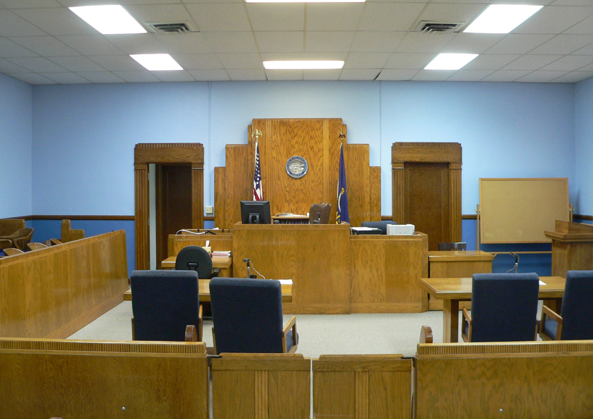
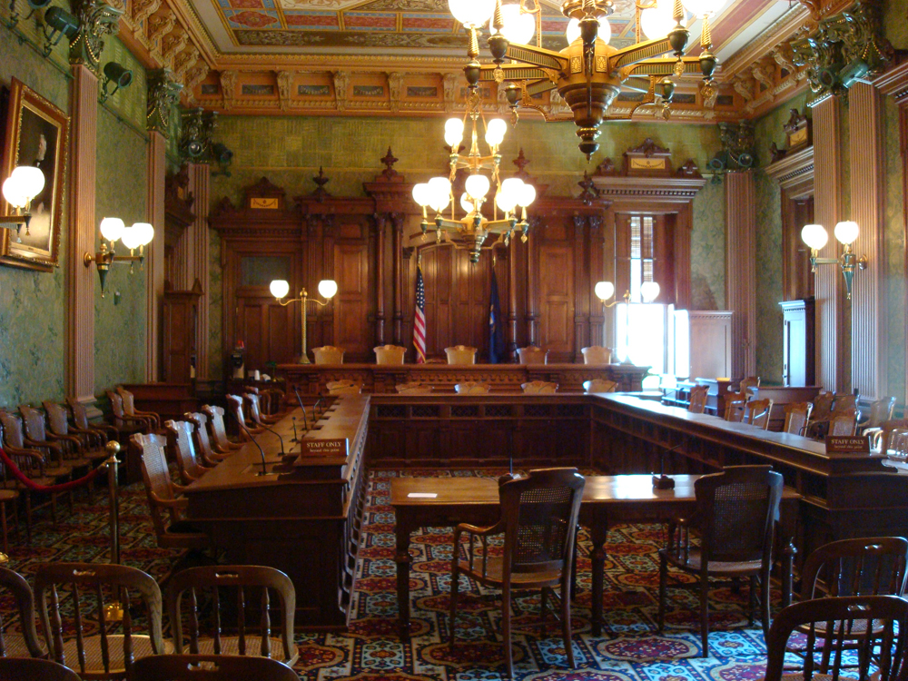

* Identify and differentiate between different types of crimes
* Evaluate U.S. crime statistics
* Understand the three branches of the U.S. criminal justice system

 "){: #import-auto-id1349570}

On December 16, 2011, 20-year-old Colton Harris-Moore was sentenced to seven years in prison by an Island County judge after pleading guilty to dozens of charges including burglary, fraud, and identity theft. Harris-Moore, dubbed the “Barefoot Bandit,” spent two years evading the police by means of transportation theft and squatting, frequently leaving a trail of bare footprints in his wake (Johnson 2011).

\"Colton\'s very pleased (with the sentence),\" his attorney John Henry Browne told the *New York Times*. \"He was expecting the worst.\"

The son of an alcoholic mother, Harris-Moore’s life was filled with physical and verbal abuse, and a series of convict boyfriends frequently inhabited the Harris-Moore home. After dropping out of school in the ninth grade, Harris Moore’s crimes increased in severity. His antics gained worldwide media attention after he began stealing and successfully piloting planes, though he’d had no aviation training. When authorities caught him, he was driving a stolen boat off the coast of the Bahamas (Yardley 2010).

\"This case is a tragedy in many ways,” said Judge Churchill, “but it\'s a triumph of the human spirit in other ways. I could have been reading about the history of a mass murderer. I could have been reading about a drug abusive, alcoholic young man. That is the triumph of Colton Harris-Moore: He has survived\" (Johnson 2011).

Though the judge’s ruling was largely sympathetic, Harris-Moore had immediate regrets. \"Let me put it this way,” said his attorney. “He wishes he had done things a little differently in his life\" (CNN News Wire Staff 2010).

Although deviance is a violation of social norms, it’s not always punishable, and it’s not necessarily bad. **Crime**{: data-type="term" #import-auto-id2689839}, on the other hand, is a behavior that violates official law and is punishable through formal sanctions. Walking to class backwards is a deviant behavior. Driving with a blood alcohol percentage over the state’s limit is a crime. Like other forms of deviance, however, ambiguity exists concerning what constitutes a crime and whether all crimes are, in fact, “bad” and deserve punishment. For example, during the 1960s, civil rights activists often violated laws intentionally as part of their effort to bring about racial equality. In hindsight, we recognize that the laws that deemed many of their actions crimes—for instance, Rosa Parks taking a seat in the “whites only” section of the bus—were inconsistent with social equality.

As you learned previously, all societies have informal and formal ways of maintaining social control. Within these systems of norms, societies have **legal codes**{: data-type="term" #import-auto-id842608} that maintain formal social control through laws, which are rules adopted and enforced by a political authority. Those who violate these rules incur negative formal sanctions. Normally, punishments are relative to the degree of the crime and the importance to society of the value underlying the law. As we will see, however, there are other factors that influence criminal sentencing.

# Types of Crimes

Not all crimes are given equal weight. Society generally socializes its members to view certain crimes as more severe than others. For example, most people would consider murdering someone to be far worse than stealing a wallet and would expect a murderer to be punished more severely than a thief. In modern American society, crimes are classified as one of two types based on their severity. **Violent crimes**{: data-type="term" #import-auto-id1904230} (also known as “crimes against a person”) are based on the use of force or the threat of force. Rape, murder, and armed robbery fall under this category. **Nonviolent crimes**{: data-type="term" #import-auto-id2626144} involve the destruction or theft of property, but do not use force or the threat of force. Because of this, they are also sometimes called “property crimes.” Larceny, car theft, and vandalism are all types of nonviolent crimes. If you use a crowbar to break into a car, you are committing a nonviolent crime; if you mug someone with the crowbar, you are committing a violent crime.

When we think of crime, we often picture **street crime**{: data-type="term" #import-auto-id2770627}, or offenses committed by ordinary people against other people or organizations, usually in public spaces. An often overlooked category is **corporate crime**{: data-type="term" #import-auto-id1365511}, or crime committed by white-collar workers in a business environment. Embezzlement, insider trading, and identity theft are all types of corporate crime. Although these types of offenses rarely receive the same amount of media coverage as street crimes, they can be far more damaging. The current economic recession in the United States is the ultimate result of a financial collapse triggered by corporate crime.

An often-debated third type of crime is **victimless crime**{: data-type="term" #import-auto-id1255710}. These are called victimless because the perpetrator is not explicitly harming another person. As opposed to battery or theft, which clearly have a victim, a crime like drinking a beer at age 20 or selling a sexual act do not result in injury to anyone other than the individual who engages in them, although they are illegal. While some claim acts like these are victimless, others argue that they actually do harm society. Prostitution may foster abuse toward women by clients or pimps. Drug use may increase the likelihood of employee absences. Such debates highlight how the deviant and criminal nature of actions develops through ongoing public discussion.

Hate Crimes

On the evening of October 3, 2010, a 17-year-old boy from the Bronx was abducted by a group of young men from his neighborhood and taken to an abandoned row house. After being beaten, the boy admitted he was gay. His attackers seized his partner and beat him as well. Both victims were drugged, sodomized, and forced to burn one another with cigarettes. When questioned by police, the ringleader of the crime explained that the victims were gay and “looked like \[they\] liked it” (Wilson and Baker 2010).

Attacks based on a person’s race, religion, or other characteristics are known as **hate crimes**{: data-type="term" #import-auto-id2281532}. Hate crimes in the United States evolved from the time of early European settlers and their violence toward Native Americans. Such crimes weren’t investigated until the early 1900s, when the Ku Klux Klan began to draw national attention for its activities against blacks and other groups. The term “hate crime,” however, didn’t become official until the1980s (Federal Bureau of Investigations 2011).

An average of 195,000 Americans fall victim to hate crimes each year, but fewer than five percent ever report the crime (FBI 2010). The majority of hate crimes are racially motivated, but many are based on religious (especially anti-Semitic) prejudice (FBI 2010). After incidents like the murder of Matthew Shepard in Wyoming in 1998 and the tragic suicide of Rutgers University student Tyler Clementi in 2010, there has been a growing awareness of hate crimes based on sexual orientation.

"){: #import-auto-id2689318}

# Crime Statistics

What crimes are people in the United States most likely to commit, and who is most likely to commit them? To understand criminal statistics, you must first understand how these statistics are collected.

Since 1930, the Federal Bureau of Investigation has been collecting and publishing an archive of crime statistics. Known as *Uniform Crime Reports* (UCR), these annual publications contain data from approximately 17,000 law enforcement agencies (FBI 2011). Although the UCR contains comprehensive data on police reports, it fails to take into account the fact that many crimes go unreported due to the victim’s unwillingness to report them, largely based on fear, shame, or distrust of the police. The quality of the data collected by the UCR also varies greatly. Because officers’ approaches to gathering victims’ accounts frequently differed, important details were not always asked for or reported (Cantor and Lynch 2000).

To offset this publication, in 1973 the U.S. Bureau of Justice Statistics began to publish a separate report known as the *National Crime Victimization Survey* (NCVS). The NCVS is a **self-report study**{: data-type="term" #import-auto-id2301683}. A self-report study is a collection of data acquired using voluntary response methods, such as questionnaires or telephone interviews. Each year, survey data are gathered from approximately 135,000 people in the United States on the frequency and type of crime they experience in their daily lives (BJS 2011). The surveys are thorough, providing a wider scope of information than was previously available. This allows researchers to examine crime from more detailed perspectives and to analyze the data based on factors such as the relationship between victims and offenders, the consequences of the crimes, and substance abuse involved in the crimes. Demographics are also analyzed, such as age, race, gender, location, and income level (National Archive of Criminal Justice Data 2010). The NCVS reports a higher rate of crime than the UCR.

Though the NCVS is a critical source of statistical information, disadvantages exist. “Non-response,” or a victim’s failure to participate in the survey or a particular question, is among them. Inability to contact important demographics, such as those who don’t have access to phones or frequently relocate, also skews the data. For those who participate, memory issues can be problematic for the data sets. Some victims’ recollection of the crimes can be inaccurate or simply forgotten over time (Cantor and Lynch 2000).

While neither of these publications can take into account all of the crimes committed in the country, some general trends may be noted. Crime rates were on the rise after 1960, but following an all-time high in the 1980s and 1990s, rates of violent and non-violent crimes once again started to decline.

In 2009, approximately 4.3 million violent crimes occurred in the United States, the majority being assault and robbery. An estimated 15.6 million nonviolent crimes took place, the most common being larceny. Less than half of all violent and nonviolent crimes were reported to the police (BJS 2010).

In general, demographic patterns tend to correlate with crime: factors such as sex and socioeconomic status may relate to a person’s chances of being a crime victim or a perpetrator. Women are much more likely than men to be victimized by someone they know, such as a family member or friend, and one-fourth of all nonfatal attacks on women are carried out by a romantic partner (BJS 2011b).

# The United States Criminal Justice System

A **criminal justice system**{: data-type="term" #import-auto-id1317987} is an organization that exists to enforce a legal code. There are three branches of the United States criminal justice system: the police, the courts, and the corrections system.

## Police

**Police**{: data-type="term" #import-auto-id3637603} are a civil force in charge of enforcing laws and public order at a federal, state, or community level. No unified national police force exists in the United States, although there are federal law enforcement officers. Federal officers operate under specific government agencies such as the Federal Bureau of Investigations (FBI); the Bureau of Alcohol, Tobacco, Firearms, and Explosives (ATF); and the Department of Homeland Security (DHS). Federal officers can only deal with matters that are explicitly within the power of the federal government, and their field of expertise is usually narrow. A county police officer may spend time responding to emergency calls, working at the local jail, or patrolling areas as needed, whereas a federal officer would be more likely to investigate suspects in firearms trafficking or provide security for government officials.

State police have the authority to enforce statewide laws, including regulating traffic on highways. Local or county police, on the other hand, have a limited jurisdiction with authority only in the town or county in which they serve.

 "){: #import-auto-id1428533}

## Courts

Once a crime has been committed and a violator is identified by the police, the case goes to the court. A **court**{: data-type="term" #import-auto-id1318799} is a system that has the authority to make decisions based on law. Similar to the police, the U.S. judicial system is divided into federal courts and state courts. As the name implies, federal courts (including the U.S. Supreme Court) deal with federal matters, including trade disputes, military justice, and government lawsuits. Judges who preside over federal courts are selected by the president with the consent of Congress.

State courts vary in their structure, but generally include three levels: trial courts, appellate courts, and state supreme courts. Unlike the large courtroom trials in TV shows, most noncriminal cases are decided by a judge without a jury present. Traffic court and small claims court are both types of trial courts that handle specific civil matters.

Criminal cases are heard by trial courts that handle general jurisdictions. Usually, a judge and jury are both present. It is the jury’s responsibility to determine guilt, and the judge’s responsibility to determine the penalty, though in some states, the jury may also decide the penalty. Unless a defendant is found “not guilty,” any member of the prosecution or defense can appeal the case to a higher court. In some states, the case then goes to a special appellate court; in others, it goes to the highest state court, often known as the state supreme court.

<figure markdown="1" id="import-auto-id1333177">
<figcaption>
This county courthouse in Kansas (top) is a typical setting for a state trial court. Compare this to the courtroom of the Michigan Supreme Court (bottom). (Photo (a) courtesy of Ammodramus/Wikimedia Commons; Photo (b) courtesy of Steve &amp; Christine/Wikimedia Commons)
</figcaption>
{: #eip-id1237005}

{: #eip-id1877478}

</figure>

## Corrections

The **corrections system**{: data-type="term" #import-auto-id1521030}, more commonly known as the prison system, is tasked with supervising individuals who have been arrested, convicted, and sentenced for a criminal offense. At the end of 2010, approximately seven million Americans were behind bars (BJS 2011d).

The United States incarceration rate has grown considerably in the last hundred years. In 2008, more than 1 in 100 U.S. adults were in jail or prison, the highest benchmark in our nation’s history. And while Americans account for 5 percent of the global population, we have 25 percent of the world’s inmates, the largest number of prisoners in the world (Liptak 2008b).

Prison is different from jail. A jail provides temporary confinement, usually while an individual awaits trial or parole. Prisons are facilities built for individuals serving sentences of more than a year. Whereas jails are small and local, prisons are large and run by either the state or the federal government.

Parole refers to a temporary release from prison or jail that requires supervision and the consent of officials. Parole is different from probation, which is supervised time used as an alternative to prison. Probation and parole can both follow a period of incarceration in prison, especially if the prison sentence is shortened.

# Summary

Crime is established by legal codes and upheld by the criminal justice system. In the United States, there are three branches of the justice system: police, courts, and corrections. Although crime rates increased throughout most of the 20th century, they are now dropping.

# Section Quiz

Which of the following is an example of corporate crime?

1.  Embezzlement
2.  Larceny
3.  Assault
4.  Burglary
{: data-number-style="lower-alpha"}

Answer

A

Spousal abuse is an example of a \_\_\_\_\_\_\_\_.

1.  street crime
2.  corporate crime
3.  violent crime
4.  nonviolent crime
{: data-number-style="lower-alpha"}

Answer

C

Which of the following situations best describes crime trends in the United States?

1.  Rates of violent and nonviolent crimes are decreasing.
2.  Rates of violent crimes are decreasing, but there are more nonviolent crimes now than ever before.
3.  Crime rates have skyrocketed since the 1970s due to lax corrections laws.
4.  Rates of street crime have gone up, but corporate crime has gone down.
{: data-number-style="lower-alpha"}

Answer

A

What is a disadvantage of the *National Crime Victimization Survey* (NCVS)?

1.  The NCVS doesn’t include demographic data, such as age or gender.
2.  The NCVS may be unable to reach important groups, such as those without phones.
3.  The NCVS doesn’t address the relationship between the criminal and the victim.
4.  The NCVS only includes information collected by police officers.
{: data-number-style="lower-alpha"}

Answer

B

# Short Answer

Recall the crime statistics presented in this section. Do they surprise you? Are these statistics represented accurately in the media? Why or why not?

# Further Research

Is the U.S. criminal justice system confusing? You’re not alone. Check out this handy flowchart from the Bureau of Justice Statistics: [http://openstaxcollege.org/l/US\\\_Criminal\\\_Justice\\\_BJS][1]

How is crime data collected in the United States? Read about the methods of data collection and take the National Crime Victimization Survey. Visit [http://openstaxcollege.org/l/Victimization\\\_Survey][2]

# References

Bureau of Justice Statistics. 2010. “Violent and Property Crime Rates Declined in 2009, Continuing the Trend Observed in the Last Ten Years.” Retrieved February 10, 2012 ([http://bjs.ojp.usdoj.gov/content/pub/press/cv09pr.cfm][3]).

Bureau of Justice Statistics. 2011a. *National Crime Victimization Survey*. Retrieved February 10, 2012 ([http://bjs.ojp.usdoj.gov/index.cfm?ty=dcdetail&amp;iid=245][4]).

Bureau of Justice Statistics. 2011b. Victim Characteristics. Retrieved February 10, 2012 ([http://bjs.ojp.usdoj.gov/index.cfm?ty=tp&amp;tid=92][5]).

Bureau of Justice Statistics. 2011c. Hate Crime, 2003–2009. Retrieved February 10, 2012 ([http://www.bjs.gov/content/pub/pdf/hc0309.pdf][6]).

Bureau of Justice Statistics. 2011d. “U.S. Correctional Population Declined for Second Consecutive Year.” Retrieved January 6, 2011 ([http://bjs.ojp.usdoj.gov/content/pub/press/p10cpus10pr.cfm][7]).

Cantor, D. and Lynch, J. 2000. *Self-Report Surveys as Measures of Crime and Criminal Victimization*. Rockville, MD: National Institute of Justice. Retrieved February 10, 2012 ([https://www.ncjrs.gov/criminal\\\_justice2000/vol\\\_4/04c.pdf][8]).

CNN Wire Staff. 2010. “‘Barefoot bandit’ returned to United States from Bahamas.” CNN, July 13. Retrieved February 10, 2012 ([http://edition.cnn.com/2010/CRIME/07/13/bahamas.barefoot.bandit/][9]).

Federal Bureau of Investigation. 2010. “Latest Hate Crime Statistics.” Retrieved February 10, 2012 ([http://www.fbi.gov/news/stories/2010/november/hate\\\_112210/hate\\\_112210][10]).

Federal Bureau of Investigation. 2011. “Uniform Crime Reports.” Retrieved February 10, 2012 ([http://www.fbi.gov/about-us/cjis/ucr][11]).

Johnson, Gene. 2011. “‘Barefoot Bandit’ gets more than 7 years for spree.” Associated Press, December 17. Retrieved January 10, 2012 ([http://usatoday30.usatoday.com/news/nation/story/2011-12-16/barefoot-bandit/52011930/1][12]).

Langton, Lynn and Michael Planty. 2011. “Hate Crime, 2003–2009.” Bureau of Justice Statistics. Retrieved February 10, 2012 ([http://www.bjs.gov/index.cfm?ty=pbdetail&amp;iid=1760][13]).

Liptak, Adam. 2008a. “1 in 100 U.S. Adults Behind Bars, New Study Says.” *New York Times*, February 28. Retrieved February 10, 2012 ([http://www.nytimes.com/2008/02/28/us/28cnd-prison.html][14]).

Liptak, Adam. 2008b. “Inmate Count in U.S. Dwarfs Other Nations’.” *New York Times*, April 23. Retrieved February 10, 2012 ([http://www.nytimes.com/2008/04/23/us/23prison.html?ref=adamliptak][15]).

National Archive of Criminal Justice Data. 2010. “National Crime Victimization Survey Resource Guide.” Retrieved February 10, 2012 ([http://www.icpsr.umich.edu/icpsrweb/NACJD/NCVS/][16]).

Wilson, Michael and Al Baker. 2010. “Lured into a Trap, Then Tortured for Being Gay.” *New York Times*, October 8. Retrieved from February 10, 2012 ([http://www.nytimes.com/2010/10/09/nyregion/09bias.html?pagewanted=1][17]).

Yardley, William. 2010. “Barefoot Bandit Started Life on the Run Early.” *New York Times*, July 21. Retrieved from February 10, 2012 ([http://www.nytimes.com/2010/07/22/us/22barefoot.html?adxnnl=1&amp;adxnnlx=1324486879-2H5iJVkslFMlxUWlySPTcA&amp;pagewanted=1][18]).

[1]: http://openstaxcollege.org/l/US_Criminal_Justice_BJS
[2]: http://openstaxcollege.org/l/Victimization_Survey
[3]: http://bjs.ojp.usdoj.gov/content/pub/press/cv09pr.cfm
[4]: http://bjs.ojp.usdoj.gov/index.cfm?ty=dcdetail&amp;iid=245
[5]: http://bjs.ojp.usdoj.gov/index.cfm?ty=tp&amp;tid=92
[6]: http://www.bjs.gov/content/pub/pdf/hc0309.pdf
[7]: http://bjs.ojp.usdoj.gov/content/pub/press/p10cpus10pr.cfm
[8]: https://www.ncjrs.gov/criminal_justice2000/vol_4/04c.pdf
[9]: http://edition.cnn.com/2010/CRIME/07/13/bahamas.barefoot.bandit/
[10]: http://www.fbi.gov/news/stories/2010/november/hate_112210/hate_112210
[11]: http://www.fbi.gov/about-us/cjis/ucr
[12]: http://usatoday30.usatoday.com/news/nation/story/2011-12-16/barefoot-bandit/52011930/1
[13]: http://www.bjs.gov/index.cfm?ty=pbdetail&amp;iid=1760
[14]: http://www.nytimes.com/2008/02/28/us/28cnd-prison.html
[15]: http://www.nytimes.com/2008/04/23/us/23prison.html?ref=adamliptak
[16]: http://www.icpsr.umich.edu/icpsrweb/NACJD/NCVS/
[17]: http://www.nytimes.com/2010/10/09/nyregion/09bias.html?pagewanted=1
[18]: http://www.nytimes.com/2010/07/22/us/22barefoot.html?adxnnl=1&amp;adxnnlx=1324486879-2H5iJVkslFMlxUWlySPTcA&amp;pagewanted=1
