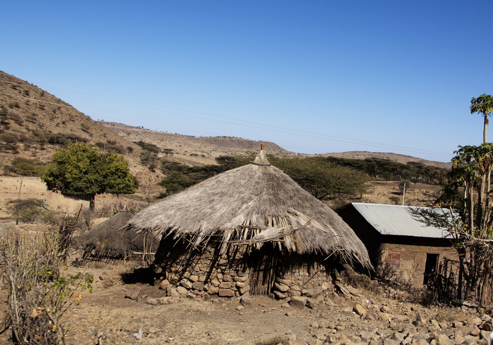
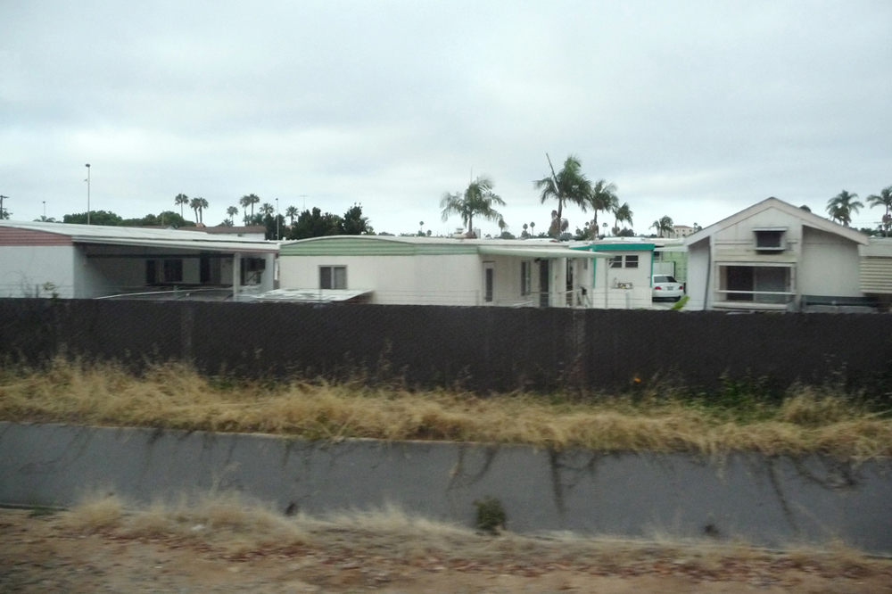

* Define global stratification
* Describe different sociological models for understanding global stratification
* Understand how studies of global stratification identify worldwide inequalities

<figure markdown="1" data-orient="horizontal">
<figcaption>
A family lives in this grass hut in Ethiopia. Another family lives in a single-wide trailer in the trailer park in the United States. Both families are considered poor, or lower class. With such differences in global stratification, what constitutes poverty? (Photo (a) courtesy of Canned Muffins/flickr; Photo (b) courtesy of Herb Neufeld/flickr)
</figcaption>
{: data-media-type="image/png"}

{: data-media-type="image/png"}

</figure>

**Global stratification**{: data-type="term" #import-auto-id1401052}**** compares the wealth, economic stability, status, and power of countries across the world. Global stratification highlights worldwide patterns of social inequality.

In the early years of civilization, hunter-gatherer and agrarian societies lived off the earth, rarely interacting with other societies. When explorers began traveling, societies began trading goods, as well as ideas and customs.

In the 19th century, the Industrial Revolution created unprecedented wealth in Western Europe and North America. Due to mechanical inventions and new means of production, people began working in factories—not only men, but women and children as well. By the late 19th and early 20th centuries, industrial technology had gradually raised the standard of living for many people in the United States and Europe.

The Industrial Revolution also saw the rise of vast inequalities between countries that were industrialized and those that were not. As some nations embraced technology and saw increased wealth and goods, others maintained their ways; as the gap widened, the nonindustrialized nations fell further behind. Some social researchers, such as Walt Rostow, suggest that the disparity also resulted from power differences. Applying a conflict theory perspective, he asserts that industrializing nations took advantage of the resources of traditional nations. As industrialized nations became rich, other nations became poor (Rostow 1960).

Sociologists studying global stratification analyze economic comparisons between nations. Income, purchasing power, and wealth are used to calculate global stratification. Global stratification also compares the quality of life that a country’s population can have.

Poverty levels have been shown to vary greatly. The poor in wealthy countries like the United States or Europe are much better off than the poor in less-industrialized countries such as Mali or India. In 2002 the UN implemented the Millennium Project, an attempt to cut poverty worldwide by the year 2015. To reach the project’s goal, planners in 2006 estimated that industrialized nations must set aside 0.7 percent of their gross national income—the total value of the nation’s good and service, plus or minus income received from and sent to other nations—to aid in developing countries (Landler and Sanger, 2009; Millennium Project 2006).

# Models of Global Stratification

"){: #import-auto-id2316443 data-media-type="image/jpg"}

Various models of global stratification all have one thing in common: they rank countries according to their relative economic status, or gross national product (GNP). Traditional models, now considered outdated, used labels to describe the stratification of the different areas of the world. Simply put, they were named “first world, “second world,” and “third world.” First and second world described industrialized nations, while third world referred to “undeveloped” countries (Henslin 2004). When researching existing historical sources, you may still encounter these terms, and even today people still refer to some nations as the “third world.”

Another model separates countries into two groups: more developed and less developed. More developed nations have higher wealth, such as Canada, Japan, and Australia. Less developed nations have less wealth to distribute among higher populations, including many countries in central Africa, South America, and some island nations.

Yet another system of global classification defines countries based on the per capita gross domestic product (GDP), a country’s average national wealth per person. The GDP is calculated (usually annually) one of two ways: by totaling either the income of all citizens or the value of all goods and services produced in the country during the year. It also includes government spending. Because the GDP indicates a country’s productivity and performance, comparing GDP rates helps establish a country’s economic health in relation to other countries.

The figures also establish a country’s standard of living. According to this analysis, a GDP standard of a middle-income nation represents a global average. In low-income countries, most people are poor relative to people in other countries. Citizens have little access to amenities such as electricity, plumbing, and clean water. People in low-income countries are not guaranteed education, and many are illiterate. The life expectancy of citizens is lower than in high-income countries.

The Big Picture: Calculating Global Stratification

A few organizations take on the job of comparing the wealth of nations. The Population Reference Bureau (PRB) is one of them. Besides a focus on population data, the PRB publishes an annual report that measures the relative economic well-being of all the world’s countries. It’s called the GNI PPP.

GNI, or gross national income, measures the current value of goods and services produced by a country. PPP, or purchasing power parity, measures the relative power a country has to purchase those same goods and services. So, GNI refers to productive output and PPP refers to buying power. The total figure is divided by the number of residents living in a country to establish the average income of a resident of that country.

Because costs of goods and services vary from one country to the next, the GNI PPP converts figures into a relative international unit. Calculating GNI PPP figures helps researchers accurately compare countries’ standard of living. They allow the United Nations and Population Reference Bureau to compare and rank the wealth of all countries and consider international stratification issues (nationsonline.org).

# Summary

Global stratification compares the wealth, economic stability, status, and power of countries as a whole. By comparing income and productivity between nations, researchers can better identify global inequalities.

# Section Quiz

Social stratification is a system that:

1.  ranks society members into categories
2.  destroys competition between society members
3.  allows society members to choose their social standing
4.  reflects personal choices of society members
{: data-number-style="lower-alpha"}

Answer

A

Which graphic concept best illustrates the concept of social stratification?

1.  Pie chart
2.  Flag poles
3.  Planetary movement
4.  Pyramid
{: data-number-style="lower-alpha"}

Answer

D

The GNI PPP figure represents:

1.  a country’s total accumulated wealth
2.  annual government spending
3.  the average annual income of a country’s citizens
4.  a country’s debt
{: data-number-style="lower-alpha"}

Answer

C

# Short Answer

Why is it important to understand and be aware of global stratification? Make a list of specific issues that are related to global stratification. For inspiration, turn on a news channel or read the newspaper. Next, choose a topic from your list and look at it more closely. Who is affected by this issue? How is the issue specifically related to global stratification?

Compare a family that lives in a grass hut in Ethiopia to an American family living in a trailer home in the Unites States. Assuming both exist at or below the poverty levels established by their country, how are the families’ lifestyles and economic situations similar and how are they different?

# Further Research

Nations Online refers to itself as “among other things, a more or less objective guide to the world, a statement for the peaceful, nonviolent coexistence of nations.” The website provides a variety of cultural, financial, historical, and ethnic information on countries and peoples throughout the world: [http://www.nationsonline.org/oneworld/index.html][1].

# References

Millennium Project. 2006. “Expanding the financial envelope to achieve the Goals.” Millennium Project Official Website. Retrieved January 9, 2012 ([http://www.unmillenniumproject.org/reports/costs\_benefits2.htm][2]).

Nationsonline.org. “Countries by Gross National Income (GNI).” Retrieved January 9, 2012 ([http://www.nationsonline.org/oneworld/GNI\_PPP\_of\_countries.htm][3]).

PRB.org. “GNI PPP Per Capita (US$).” <em> PRB 2011 World Population Data Sheet</em>. 2011 Population Reference Bureau. Retrieved January 10, 2012 ([http://www.prb.org/DataFinder/Topic/Rankings.aspx?ind=61][4]).

Rostow, Walt W. 1960. *The Stages of Economic Growth: A Non-Communist Manifesto*. Cambridge, MA: Cambridge University Press.

Landler, Mark and David E. Sanger. 2009. “World Leaders Pledge $1.1 Trillion for Crisis.” *New York Times*, April 3. Retrieved January 9, 2012 ([http://www.nytimes.com/2009/04/03/world/europe/03summit.html][5]).

[1]: http://www.nationsonline.org/oneworld/index.html
[2]: http://www.unmillenniumproject.org/reports/costs_benefits2.htm
[3]: http://www.nationsonline.org/oneworld/GNI_PPP_of_countries.htm
[4]: http://www.prb.org/DataFinder/Topic/Rankings.aspx?ind=61
[5]: http://www.nytimes.com/2009/04/03/world/europe/03summit.html
