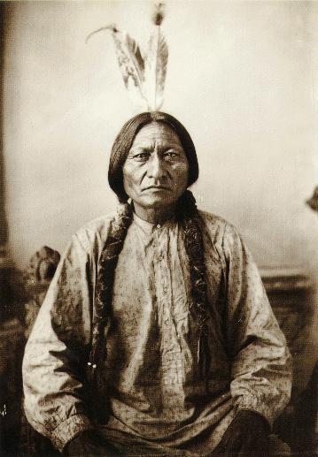
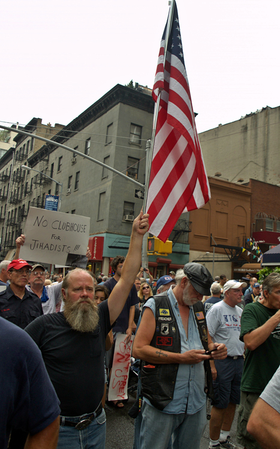
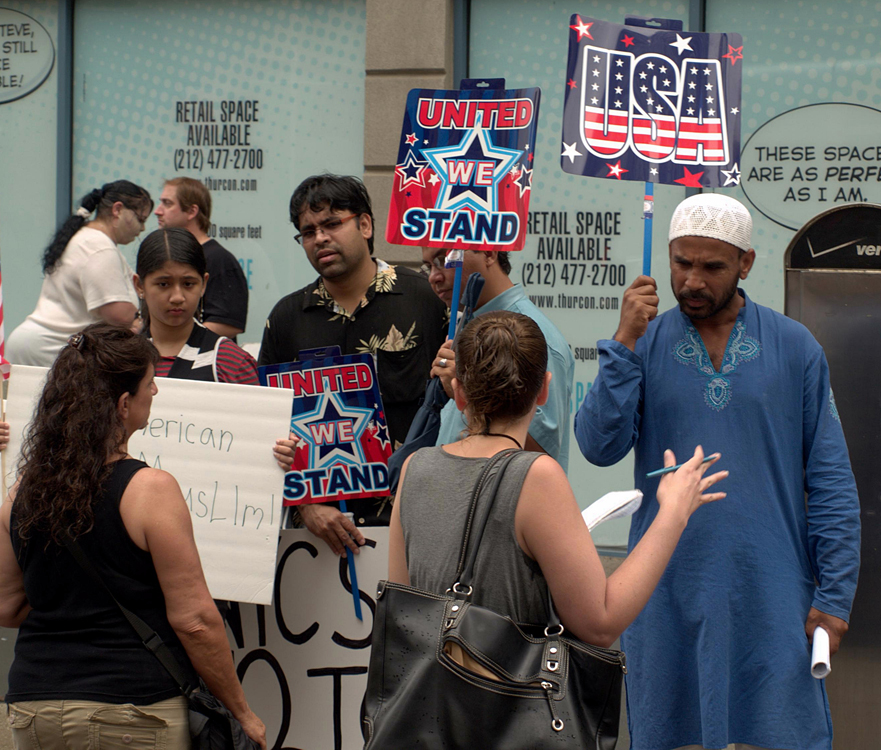

* Compare and contrast the different experiences of various ethnic groups in the United States
* Apply theories of intergroup relations and race and ethnicity to different subordinate groups

When colonists came to the New World, they found a land that did not need “discovering” since it was already occupied. While the first wave of immigrants came from Western Europe, eventually the bulk of people entering North America were from Northern Europe, then Eastern Europe, then Latin America and Asia. And let us not forget the forced immigration of African slaves. Most of these groups underwent a period of disenfranchisement in which they were relegated to the bottom of the social hierarchy before they managed (for those who could) to achieve social mobility. Today, our society is multicultural, although the extent to which this multiculturality is embraced varies, and the many manifestations of multiculturalism carry significant political repercussions. The sections below will describe how several groups became part of American society, discuss the history of intergroup relations for each faction, and assess each group’s status today.

# Native Americans

The only nonimmigrant ethnic group in the United States, Native Americans were once a large population but by 2010 made up only 0.9 percent of U.S. populace (U.S. Census 2010).

Sports Teams with Native American Names

<figure markdown="1" id="import-auto-id1450892">
<figcaption>
Many Native Americans (and others) believe sports teams with names like the Indians, Braves, and Warriors perpetuate unwelcome stereotypes. (Photo (a) courtesy of public domain/Wikimedia Commons; Photo (b) courtesy of Chris Brown/flickr)
</figcaption>
{: #eip-id1826691}

{: #eip-id2167320}

</figure>
The sports world abounds with team names like the Indians, the Warriors, the Braves, and even the Savages and Redskins. These names arise from historically prejudiced views of Native Americans as fierce, brave, and strong savages: attributes that would be beneficial to a sports team, but are not necessarily beneficial to Americans who should be seen as more than just fierce savages.

Since the civil rights movement of the 1960s, the National Congress of American Indians (NCAI) has been campaigning against the use of such mascots, asserting that the “warrior savage myth . . . reinforces the racist view that Indians are uncivilized and uneducated and it has been used to justify policies of forced assimilation and destruction of Indian culture” (NCAI Resolution #TUL-05-087 2005). The campaign has met with only limited success. While some teams have changed their names, hundreds of professional, college, and K–12 school teams still have names derived from this stereotype. Another group, American Indian Cultural Support (AICS), is especially concerned with such names at K-12 schools, grades where children should be gaining a fuller and more realistic understanding of Native Americans than such stereotypes supply.

What do you think about such names? Should they be allowed or banned? What argument would a symbolic interactionist make on this topic?

## How and Why They Came

The earliest immigrants to America arrived millennia before European immigrants. Dates of the migration are debated with estimates ranging from between 45,000 and 12,000 BCE. It is thought that early Indians migrated to this new land in search of big game to hunt, which they found in huge herds of grazing herbivores in the Americas. Over the centuries and then the millennia, Native American culture blossomed into an intricate web of hundreds of interconnected tribes, each with its own customs, traditions, languages, and religions.

## History of Intergroup Relations

Native American culture prior to European settlement is referred to as Pre-Columbian: that is, prior to the coming of Christopher Columbus in 1492. Mistakenly believing that he had landed in the East Indies, Columbus named the indigenous people “Indians:” a name that has persisted for centuries despite it being a geographical misnomer used to homogenously label over 500 distinct people groups who have their own languages and traditions.

The history of intergroup relations between European colonists and Native Americans is a brutal one that most Americans are familiar with. As discussed in the section on genocide, the effect of European settlement of the Americans was to nearly destroy the indigenous population. And although Native Americans’ lack of immunity to European diseases caused the most deaths, overt mistreatment of Native Americans by Europeans was equally devastating.

From the first Spanish colonists to the French, English, and Dutch who followed, European settlers took what land they wanted, expanding across the continent at will. If indigenous people tried to retain their stewardship of the land, Europeans fought them off with superior weapons. A key element of this issue is the indigenous view of land and land ownership. Most tribes considered the earth a living entity whose resources they were stewards of, the concepts of land ownership and conquest didn’t exist in Native American society. Europeans’ domination of the Americas was indeed a conquest; one scholar points out that Native Americans are the only minority group in the United States whose subordination occurred purely through conquest by the dominant group (Marger 1993).

After the establishment of the United States government, discrimination against Native Americans was codified and formalized in a series of laws intended to subjugate them and keep them from gaining any power. Some of the most impactful laws are as follows:

* The Indian Removal Act of 1930 forced the relocation of any native tribes east of the Mississippi River to lands west of the river.
* The Indian Appropriation Acts funded further removals and declared that no Indian tribe could be recognized as an independent nation, tribe, or power with which the American government would have to make treaties. This made it even easier for the U.S. government to take land it wanted.
* The Dawes Act of 1887 reversed the policy of isolating Native Americans on reservations, instead forcing them onto individual properties that were intermingled with white settlers, thereby reducing their capacity for power as a group.

Native American culture was further eroded by the establishment of Indian boarding schools in the late 19th century. These schools, run by both Christian missionaries and the United States government, had the express purpose of “civilizing” Native American children and assimilating them into white society. The boarding schools were located off-reservation to ensure that children were separated from their families and culture. Schools forced children to cut their hair, speak English, and practice Christianity. Physical and sexual abuses were rampant for decades; only in 1987 did the Bureau of Indian Affairs issue a policy on sexual abuse in boarding schools. Some scholars argue that many of the problems that Native Americans face today result from almost a century of mistreatment at these boarding schools.

## Current Status

The eradication of Native American culture continued until the 1960s, when Native Americans were able to participate in and benefit from the civil rights movement. The Indian Civil Rights Act of 1968 guaranteed Indian tribes most of the rights of the United States Bill of Rights. New laws like the Indian Self-Determination Act of 1975 and the Education Assistance Act of the same year recognized tribal governments and gave them more power. Indian boarding schools have dwindled to only a few, and Native American cultural groups are striving to preserve and maintain old traditions to keep them from being lost forever.

However, Native Americans (some of whom now wished to be called American Indians so as to avoid the “savage” connotations of the term “native”) still suffer the effects of centuries of degradation. Long-term poverty, inadequate education, cultural dislocation, and high rates of unemployment contribute to Native American populations falling to the bottom of the economic spectrum. Native Americans also suffer disproportionately with lower life expectancies than most groups in the United States.

# African Americans

As discussed in the section on race, the term African American can be a misnomer for many individuals. Many people with dark skin may have their more recent roots in Europe or the Caribbean, seeing themselves as Dominican American or Dutch American. Further, actual immigrants from Africa may feel that they have more of a claim to the term African American than those who are many generations removed from ancestors who originally came to this country. This section will focus on the experience of the slaves who were transported from Africa to the United States, and their progeny.

## How and Why They Came

If Native Americans are the only minority group whose subordinate status occurred by conquest, African Americans are the exemplar minority group in the United States whose ancestors did not come here by choice. A Dutch sea captain brought the first Africans to the Virginia colony of Jamestown in 1619 and sold them as indentured servants. This was not an uncommon practice for either blacks or whites, and indentured servants were in high demand. For the next century, black and white indentured servants worked side by side. But the growing agricultural economy demanded greater and cheaper labor, and by 1705, Virginia passed the slave codes declaring that any foreign-born non-Christian could be a slave, and that slaves were considered property.

The next 150 years saw the rise of American slavery, with black Africans being kidnapped from their own lands and shipped to the New World on the trans-Atlantic journey known as the Middle Passage. Once in the Americas, the black population grew until American-born blacks outnumbered those born in Africa. But colonial (and later, American) slave codes declared that the child of a slave was a slave, so the slave class was created. By 1869, the slave trade was internal in the United States, with slaves being bought and sold across state lines like livestock.

## History of Intergroup Relations

There is no starker illustration of the dominant-subordinate group relationship than that of slavery. In order to justify their severely discriminatory behavior, slaveholders and their supporters had to view blacks as innately inferior. Slaves were denied even the most basic rights of citizenship, a crucial factor for slaveholders and their supporters. Slavery poses an excellent example of conflict theory’s perspective on race relations; the dominant group needed complete control over the subordinate group in order to maintain its power. Whippings, executions, rapes, denial of schooling and health care were all permissible and widely practiced.

Slavery eventually became an issue over which the nation divided into geographically and ideologically distinct factions, leading to the Civil War. And while the abolition of slavery on moral grounds was certainly a catalyst to war, it was not the only driving force. Students of American history will know that the institution of slavery was crucial to the Southern economy, whose production of crops like rice, cotton, and tobacco relied on the virtually limitless and cheap labor that slavery provided. In contrast, the North didn’t benefit economically from slavery, resulting in an economic disparity tied to racial/political issues.

A century later, the civil rights movement was characterized by boycotts, marches, sit-ins, and freedom rides: demonstrations by a subordinate group that would no longer willingly submit to domination. The major blow to America’s formally institutionalized racism was the Civil Rights Act of 1964. This Act, which is still followed today, banned discrimination based on race, color, religion, sex, or national origin. Some sociologists, however, would argue that institutionalized racism persists.

## Current Status

Although government-sponsored, formalized discrimination against African Americans has been outlawed, true equality does not yet exist. The National Urban League’s *2011 Equality Index* reports that blacks’ overall equality level with whites has dropped in the past year, from 71.5 percent to 71.1 percent in 2010. The *Index*, which has been published since 2005, notes a growing trend of increased inequality with whites, especially in the areas of unemployment, insurance coverage, and incarceration. Blacks also trail whites considerably in the areas of economics, health, and education.

To what degree do racism and prejudice contribute to this continued inequality? The answer is complex. 2008 saw the election of this country’s first African American president: Barack Hussein Obama. Despite being popularly identified as black, we should note that President Obama is of a mixed background that is equally white, and although all presidents have been publicly mocked at times (Gerald Ford was depicted as a klutz, Bill Clinton as someone who could not control his libido), a startling percentage of the critiques of Obama have been based on his race. The most blatant of these was the controversy over his birth certificate, where the “birther” movement questioned his citizenship and right to hold office. Although blacks have come a long way from slavery, the echoes of centuries of disempowerment are still evident.

# Asian Americans

Like many groups this section discusses, Asian Americans represent a great diversity of cultures and backgrounds. The experience of a Japanese American whose family has been in the United States for three generations will be drastically different from a Laotian American who has only been in the U.S. for a few years. This section primarily discusses Chinese, Japanese, and Vietnamese immigrants and shows the differences between their experiences.

## How and Why They Came

The national and ethnic diversity of Asian American immigration history is reflected in the variety of their experiences in joining American society. Asian immigrants have come to the United States in waves, at different times, and for different reasons.

The first Asian immigrants to come to the United States in the mid-19th century were Chinese. These immigrants were primarily men whose intention was to work for several years in order to earn incomes to support their families in China. Their main destination was the American West, where the Gold Rush was drawing people with its lure of abundant money. The construction of the Transcontinental Railroad was underway at this time, and the Central Pacific section hired thousands of migrant Chinese men to complete the laying of rails across the rugged Sierra Nevada mountain range. Chinese men also engaged in other manual labor like mining and agricultural work. The work was grueling and underpaid, but like many immigrants, they persevered.

Japanese immigration began in the 1880s, on the heels of the Chinese Exclusion Act of 1882. Many Japanese immigrants came to Hawaii to participate in the sugar industry; others came to the mainland, especially to California. Unlike the Chinese, however, the Japanese had a strong government that negotiated with the United States government to ensure the well-being of their immigrants. Japanese men were able to bring their wives and families to the United States, and were thus able to produce second- and third-generation Japanese Americans more quickly than their Chinese counterparts.

The most recent large-scale Asian immigration came from Korea and Vietnam and largely took place during the second half of the 20th century. While Korean immigration has been fairly gradual, Vietnamese immigration occurred primarily post-1975, after the fall of Saigon and the establishment of restrictive communist policies in Vietnam. Whereas many Asian immigrants came to the United States to seek better economic opportunities, Vietnamese immigrants came as political refugees, seeking asylum from harsh conditions in their homeland. The Refugee Act of 1980 helped them to find a place to settle in the United States.

 . They are being rescued from a 35-foot fishing boat 350 miles northeast of Cam Ranh Bay, Vietnam, after spending eight days at sea. (Photo courtesy of U.S. Navy/Wikimedia Commons)"){: #import-auto-id2653818}

## History of Intergroup Relations

Chinese immigration came to an abrupt end with the Chinese Exclusion Act of 1882. This act was a result of anti-Chinese sentiment burgeoned by a depressed economy and loss of jobs. White workers blamed Chinese migrants for taking jobs, and the passage of the Act meant the number of Chinese workers decreased. Chinese men did not have the funds to return to China or to bring their families to America, so they remained physically and culturally segregated in the Chinatowns of large cities. Later legislation, the Immigration Act of 1924, further curtailed Chinese immigration. The Act included the race-based National Origins Act, which was aimed at keeping American ethnic stock as undiluted as possible by reducing “undesirable” immigrants. It was not until after the Immigration and Nationality Act of 1965 that Chinese immigration again increased and many Chinese families were reunited.

Although Japanese Americans have deep, long-reaching roots in the U.S., their history here has not always been smooth. The California Alien Land Law of 1913 was aimed at them and other Asian immigrants, and it prohibited aliens from owning land. An even uglier action was the Japanese internment camps of World War II, discussed earlier as an illustration of expulsion.

## Current Status

Asian Americans certainly have been subject to their share of racial prejudice, despite the seemingly positive stereotype as the model minority. The **model minority**{: data-type="term" #import-auto-id1428533} stereotype is applied to a minority group that is seen as reaching significant educational, professional, and socioeconomic levels without challenging the existing establishment.

This stereotype is typically applied to Asian groups in the United States, and it can result in unrealistic expectations, putting a stigma on members of this group that do not meet the expectations. Stereotyping all Asians as smart and capable can also lead to a lack of much-needed government assistance and to educational and professional discrimination.

# Hispanic Americans

Like the individuals comprising many “groups,” Hispanic Americans have a wide range of backgrounds and nationalities. According to the 2010 U.S. Census, about 75 percent of the respondents who identify as Hispanic report being of Mexican, Puerto Rican, or Cuban origin. Of the total Hispanic group, 60 percent reported as Mexican, 44 percent reported as Cuban, and nine percent reported as Puerto Rican. Remember that the U.S. Census allows people to report as being more than one ethnicity.

Not only are there wide differences among the different origins that make up the Hispanic American population, there are also different names for the group itself. The 2010 U.S. Census states that “Hispanic” or “Latino” refers to a person of Cuban, Mexican, Puerto Rican, South or Central American, or other Spanish culture or origin regardless of race.” There have been some disagreements over whether Hispanic or Latino is the correct term for a group this diverse, and whether it would be better for people to refer to themselves as being of their origin specifically, for example, Mexican American or Dominican American. This section will compare the experiences of Mexican Americans and Cuban Americans.

## How and Why They Came

Mexican Americans form the largest Hispanic subgroup and also the oldest. Mexican migration to the United States started in the early 1900s in response to the need for cheap agricultural labor. Mexican migration was often circular; workers would stay for a few years, and then go back to Mexico with more money than they could have made in their country of origin. The length of Mexico’s shared border with the United States has made immigration easier than for many other immigrant groups.

Cuban Americans are the second-largest Hispanic subgroup, and their history is quite different from that of Mexican Americans. The main wave of Cuban immigration to the United States started after Fidel Castro came to power in 1959 and reached its crest with the Mariel boatlift in 1980. Castro’s Cuban Revolution ushered in an era of communism that continues to this day. To avoid having their assets seized by the government, many wealthy and educated Cubans migrated north, generally to the Miami area.

## History of Intergroup Relations

For several decades, Mexican workers crossed the long border into America, both legally and illegally, to work in the fields that provided produce for the developing United States. Western growers needed a steady supply of labor, and the 1940s and 1950s saw the official federal Bracero Program (*bracero* is Spanish for *strong-arm*) that offered protection to Mexican guest workers. Interestingly, 1954 also saw the enactment of “Operation Wetback,” which deported thousands of illegal Mexican workers. From these examples, we can see that the U.S. treatment of immigration from Mexico has been ambivalent at best.

Sociologist Douglas Massey (2006) suggests that although the average standard of living in Mexico may be lower in the United States, it is not so low as to make permanent migration the goal of most Mexicans. However, the strengthening of the border that began with 1986’s Immigration Reform and Control Act has made one-way migration the rule for most Mexicans. Massey argues that the rise of illegal one-way immigration of Mexicans is a direct outcome of the law that was intended to reduce it.

Cuban Americans, perhaps because of their relative wealth and education level at the time of immigration, have fared better than many immigrants. Further, because they were fleeing a Communist country, they were given refugee status and offered protection and social services. The Cuban Migration Agreement of 1995 has curtailed legal immigration from Cuba, leading many Cubans to try to immigrate illegally by boat. According to a 2009 report from the Congressional Research Service, the U.S. government applies a “wet foot/dry foot” policy toward Cuban immigrants; Cubans who are intercepted while still at sea will be returned to Cuba, while those who reach the shore will be permitted to stay in the United States.

## Current Status

Mexican Americans, especially those who are here illegally, are at the center of a national debate about immigration. Myers (2007) observes that no other minority group (except the Chinese) has immigrated to the United States in such an environment of illegality. He notes that in some years, three times as many Mexican immigrants may have entered the United States illegally as those who arrived legally. It should be noted that this is due to enormous disparity of economic opportunity on two sides of an open border, not because of any inherent inclination to break laws. In his report, “Measuring Immigrant Assimilation in the United States,” Jacob Vigdor (2008) states that Mexican immigrants experience relatively low rates of economic and civil assimilation. He further suggests that “the slow rates of economic and civic assimilation set Mexicans apart from other immigrants, and may reflect the fact that the large numbers of Mexican immigrants residing in the United States illegally have few opportunities to advance themselves along these dimensions.”

By contrast, Cuban Americans are often seen as a model minority group within the larger Hispanic group. Many Cubans had higher socioeconomic status when they arrived in this country, and their anti-Communist agenda has made them welcome refugees to this country. In south Florida, especially, Cuban Americans are active in local politics and professional life. As with Asian Americans, however, being a model minority can mask the issue of powerlessness that these minority groups face in U.S. society.

Arizona’s Senate Bill 1070

"){: #import-auto-id1554948}

As both legal and illegal immigrants, and with high population numbers, Mexican Americans are often the target of stereotyping, racism, and discrimination. A harsh example of this is in Arizona, where a new stringent immigration law—known as SB 1070 (for Senate Bill 1070)—has caused a nationwide controversy. The law requires that during a lawful stop, detention, or arrest, Arizona police officers must establish the immigration status of anyone they suspect may be here illegally. The law makes it a crime for individuals to fail to have documents confirming their legal status, and it gives police officers the right to detain people they suspect may be in the country illegally.

To many, the most troublesome aspect of this law is the latitude it affords police officers in terms of whose citizenship they may question. Having “reasonable suspicion that the person is an alien who is unlawfully present in the United States” is reason enough to demand immigration papers (Senate Bill 1070 2010). Critics say this law will encourage racial profiling (the illegal practice of law enforcement using race as a basis for suspecting someone of a crime), making it hazardous to be caught “Driving While Brown,” a takeoff on the legal term Driving While Intoxicated (DWI) or the slang reference of “Driving While Black.” Driving While Brown refers to the likelihood of getting pulled over just for being nonwhite.

SB 1070 has been the subject of many lawsuits, from parties as diverse as Arizona police officers, the American Civil Liberties Union, and even the federal government, which is suing on the basis of Arizona contradicting federal immigration laws (ACLU 2011). The future of SB 1070 is uncertain, but many other states have tried or are trying to pass similar measures. Do you think such measures are appropriate?

# Arab Americans

If ever a category was hard to define, the various groups lumped under the name “Arab American” is it. After all, Hispanic Americans or Asian Americans are so designated because of their counties of origin. But for Arab Americans, their country of origin—Arabia—has not existed for centuries. In addition, Arab Americans represent all religious practices, despite there being a stereotype of them as Islamic. As Myers (2007) asserts, not all Arabs are Muslim, and not all Muslims are Arab, complicating the stereotype of what it means to be an Arab American. Geographically, the Arab region comprises the Middle East and parts of northern Africa. People whose ancestry lies in that area or who speak primarily Arabic may consider themselves Arabs.

The U.S. Census has struggled with the issue of Arab identity. The 2010 Census, as in previous years, did not offer an “Arab” box to check under the question of race. Individuals who want to be counted as Arabs had to check the box for “Some other race” and then write in their race. However, when the Census data is tallied, they will be marked as white. This is problematic, however, denying Arab Americans opportunities for federal assistance.

## Why They Came

The first Arab immigrants came to this country in the late 19th and early 20th century. They were predominantly Syrian, Lebanese, and Jordanian Christians, and they came to escape persecution and to make a better life. These early immigrants and their descendants, who were more likely to think of themselves as Syrian or Lebanese than Arab, represent almost half of the Arab American population today (Myers 2007). Restrictive immigration policies from the 1920s until 1965 curtailed all immigration, but Arab immigration since 1965 has been steady. Immigrants from this time period have been more likely to be Muslim and more highly educated, escaping political unrest and looking for better opportunities.

## History of Intergroup Relations

Relations between Arab Americans and the dominant majority have been marked by mistrust, misinformation, and deeply entrenched beliefs. Helen Samhan of the Arab American Institute suggests that Arab-Israeli conflicts in the 1970s contributed significantly to cultural and political anti-Arab sentiment in the United States (2001). The United States has historically supported the State of Israel, while some Middle Eastern countries deny the existence of the Israeli state. Disputes over these issues have involved Egypt, Syria, Iraq, Jordan, Lebanon, and Palestine.

As is often the case with stereotyping and prejudice, the actions of extremists come to define the entire group, regardless of the fact that most U.S. citizens with ties to the Middle Eastern community condemn terrorist actions, as do most inhabitants of the Middle East. Would it be fair to judge all Catholics by the events of the Inquisition? Of course, the United States was deeply affected by the events of September 11, 2001. This event has left a deep scar on the American psyche, and it has fortified anti-Arab sentiment for a large percentage of Americans. In the first month after 9/11, hundreds of hate crimes were perpetrated against people who looked like they might be of Arab descent.

<figure markdown="1" id="import-auto-id1997421" data-orient="vertical">
<figcaption>
The proposed Park51 Muslim Community Center generated heated controversy due to its close proximity to Ground Zero. In these photos, people march in protest against the center, while counter-protesters demonstrate their support. (Photos (a) and (b) courtesy of David Shankbone/Wikimedia Commons)
</figcaption>
{: #eip-id1140971}

{: #eip-id1654457}

</figure>

## Current Status

Although the rate of hate crimes against Arab Americans has slowed, Arab Americans are still victims of racism and prejudice. Racial profiling has proceeded against Arab Americans as a matter of course since 9/11. Particularly when engaged in air travel, being young and Arab-looking is enough to warrant a special search or detainment. This Islamophobia (irrational fear of or hatred against Muslims) does not show signs of abating. Scholars noted that white domestic terrorists like Timothy McVeigh, who detonated a bomb at an Oklahoma courthouse in 1995, have not inspired similar racial profiling or hate crimes against whites.

# White Ethnic Americans

As we have seen, there is no minority group that fits easily in a category or that can be described simply. While sociologists believe that individual experiences can often be understood in light of their social characteristics (such as race, class, or gender), we must balance this perspective with awareness that no two individuals’ experiences are alike. Making generalizations can lead to stereotypes and prejudice. The same is true for white ethnic Americans, who come from diverse backgrounds and have had a great variety of experiences. In this section, we will focus on German, Irish, Italian, and Eastern European immigrants.

## Why They Came

White ethnic Europeans formed the second and third great waves of immigration, from the early 19th century to the mid-20th century. They joined a newly minted United States that was primarily made up of white Protestants from England. While most immigrants came searching for a better life, their experiences were not all the same.

The first major influx of European immigrants came from Germany and Ireland, starting in the 1820s. Germans came both for economic opportunity and to escape political unrest and military conscription, especially after the Revolutions of 1848. Many German immigrants of this period were political refugees: liberals who wanted to escape from an oppressive government. They were well-off enough to make their way inland, and they formed heavily German enclaves in the Midwest that exist to this day.

The Irish immigrants of the same time period were not always as well off financially, especially after the Irish Potato Famine of 1945. Irish immigrants settled mainly in the cities of the East Coast, where they were employed as laborers and where they faced significant discrimination.

German and Irish immigration continued into the late 19th century and earlier 20th century, at which point the numbers for Southern and Eastern European immigrants started growing as well. Italians, mainly from the Southern part of the country, began arriving in large numbers in the 1890s. Eastern European immigrants—people from Russia, Poland, Bulgaria, and Austria-Hungary—started arriving around the same time. Many of these Eastern Europeans were peasants forced into a hardscrabble existence in their native lands; political unrest, land shortages, and crop failures drove them to seek better opportunities in the United States. The Eastern European immigration wave also included Jewish people escaping pogroms (anti-Jewish uprisings) of Eastern Europe and the Pale of Settlement in what was then Poland and Russia.

## History of Intergroup Relations

In a broad sense, German immigrants were not victimized to the same degree as many of the other subordinate groups this section discusses. While they may not have been welcomed with open arms, they were able to settle in enclaves and establish roots. A notable exception to this was during the lead up to World War I and through World War II, when anti-German sentiment was virulent.

Irish immigrants, many of whom were very poor, were more of an underclass than the Germans. In Ireland, the English had oppressed the Irish for centuries, eradicating their language and culture and discriminating against their religion (Catholicism). Although the Irish had a larger population than the English, they were a subordinate group. This dynamic reached into the new world, where Anglo Americans saw Irish immigrants as a race apart: dirty, lacking ambition, and suitable for only the most menial jobs. In fact, Irish immigrants were subject to criticism identical to that with which the dominant group characterized African Americans. By necessity, Irish immigrants formed tight communities segregated from their Anglo neighbors.

The later wave of immigrants from Southern and Eastern Europe was also subject to intense discrimination and prejudice. In particular, the dominant group—which now included second- and third-generation Germans and Irish—saw Italian immigrants as the dregs of Europe and worried about the purity of the American race (Myers 2007). Italian immigrants lived in segregated slums in Northeastern cities, and in some cases were even victims of violence and lynchings similar to what African Americans endured. They worked harder and were paid less than other workers, often doing the dangerous work that other laborers were reluctant to take on.

## Current Status

The U.S. Census from 2008 shows that 16.5 percent of respondents reported being of German descent: the largest group in the country. For many years, German Americans endeavored to maintain a strong cultural identity, but they are now culturally assimilated into the dominant culture.

There are now more Irish Americans in the United States than there are Irish in Ireland. One of the country’s largest cultural groups, Irish Americans have slowly achieved acceptance and assimilation into the dominant group.

Myers (2007) states that Italian Americans’ cultural assimilation is “almost complete, but with remnants of ethnicity.” The presence of “Little Italy” neighborhoods—originally segregated slums where Italians congregated in the 19th century—exist today. While tourists flock to the saints’ festivals in Little Italies, most Italian Americans have moved to the suburbs at the same rate as other white groups.

# Summary

The history of the American people contains an infinite variety of experiences that sociologist understand follow patterns. From the indigenous people who first inhabited these lands to the waves of immigrants over the past 500 years, migration is an experience with many shared characteristics. Most groups have experienced various degrees of prejudice and discrimination as they have gone through the process of assimilation.

# Section Quiz

What makes Native Americans unique as a subordinate group in the United States?

1.  They are the only group that experienced expulsion.
2.  They are the only group that was segregated.
3.  They are the only group that was enslaved.
4.  They are the only group that did not come here as immigrants.
{: data-number-style="lower-alpha"}

Answer

D

Which subordinate group is often referred to as the “model minority?”

1.  African Americans
2.  Asian Americans
3.  White ethnic Americans
4.  Native Americans
{: data-number-style="lower-alpha"}

Answer

B

Which federal act or program was designed to allow more Hispanic American immigration, not block it?

1.  The Bracero Program
2.  Immigration Reform and Control Act
3.  Operation Wetback
4.  SB 1070
{: data-number-style="lower-alpha"}

Answer

A

Many Arab Americans face \_\_\_\_\_\_\_\_\_\_\_\_\_\_\_, especially after 9/11.

1.  racism
2.  segregation
3.  Islamophobia
4.  prejudice
{: data-number-style="lower-alpha"}

Answer

C

Why did most white ethnic Americans come to the United States?

1.  For a better life
2.  To escape oppression
3.  Because they were forced out of their own countries
4.  a and b only
{: data-number-style="lower-alpha"}

Answer

D

# Short Answer

In your opinion, which group had the easiest time coming to this country? Which group had the hardest time? Why?

Which group has made the most socioeconomic gains? Why do you think that group has had more success than others?

# Further Research

Are people interested in reclaiming their ethnic identities? Read this article and decide:

The White Ethnic Revival: [http://openstaxcollege.org/l/ethnic\\\_revival][1]

# References

ACLU. 2011. “Appellate Court Upholds Decision Blocking Arizona’s Extreme Racial Profiling Law.” American Civil Liberties Union. Retrieved December 8, 2011 ([http://www.aclu.org/immigrants-rights/appellate-court-upholds-decision-blocking-arizona-s-extreme-racial-profiling-law-0][2]).

Greely, Andrew M. 1972. *That Most Distressful Nation: The Taming of the American Irish*. Chicago: Quadrangle Books.

Marger, Martin. 2003. *Race and Ethnic Relations: American and Global Perspectives*. Belmont, CA: Wadsworth.

American Indian Cultural Support. “Mascots: Racism in Schools by State.” 2005. Retrieved December 8, 2011 ( [http://www.aics.org/mascot/mascot.html][3]).

Massey, Douglas S. 2006. “Seeing Mexican Immigration Clearly.” *Cato Unbound*. Retrieved December 4, 2011 ([http://www.cato-unbound.org/2006/08/20/douglas-s-massey/seeing-mexican-immigration-clearly/][4]).

Myers, John P. 2007. *Dominant-Minority Relations in America*. Boston: Pearson.

National Congress of American Indians. 2005. “The National Congress of American Indians Resolution #TUL-05-087: Support for NCAA Ban on ‘Indian’ Mascots.” Retrieved December 8, 2011 ( [http://www.ncai.org/attachments/Resolution\\\_dZoHILXNEzXOuYlebzAihFwqFzfNnTHDGJVwjaujdNvnsFtxUVd\\\_TUL-05-087.pdf ][5]).

Senate Bill 1070. 2010. State of Arizona. Retrieved December 8, 2011 ([http://www.azleg.gov/legtext/49leg/2r/bills/sb1070s.pdf][6]).

U.S. Census Bureau. 2010. “State and County Quickfacts.” Retrieved February 22, 2012 ([http://quickfacts.census.gov/qfd/states/00000.html][7]).

U.S. Department of Homeland Security. 2010. “Persons Obtaining Legal Permanent Resident Status by Region and Selected Country of Last Residence: Fiscal Years 1820 to 2010.” *Yearbook of Immigration Statistics*. Retrieved December 6, 2011 ([http://www.dhs.gov/files/statistics/publications/LPR10.shtm][8]).

Vigdor, Jacob L. 2008. “Measuring Immigrant Assimilation in the United States.” Manhattan Institute for Policy Research Civic Report 53. Retrieved December 4, 2011 ([http://www.manhattan-institute.org/html/cr\\\_53.htm][9]).

[1]: http://openstaxcollege.org/l/ethnic_revival
[2]: http://www.aclu.org/immigrants-rights/appellate-court-upholds-decision-blocking-arizona-s-extreme-racial-profiling-law-0
[3]: http://www.aics.org/mascot/mascot.html
[4]: http://www.cato-unbound.org/2006/08/20/douglas-s-massey/seeing-mexican-immigration-clearly/
[5]: http://www.ncai.org/attachments/Resolution_dZoHILXNEzXOuYlebzAihFwqFzfNnTHDGJVwjaujdNvnsFtxUVd_TUL-05-087.pdf
[6]: http://www.azleg.gov/legtext/49leg/2r/bills/sb1070s.pdf
[7]: http://quickfacts.census.gov/qfd/states/00000.html
[8]: http://www.dhs.gov/files/statistics/publications/LPR10.shtm
[9]: http://www.manhattan-institute.org/html/cr_53.htm
