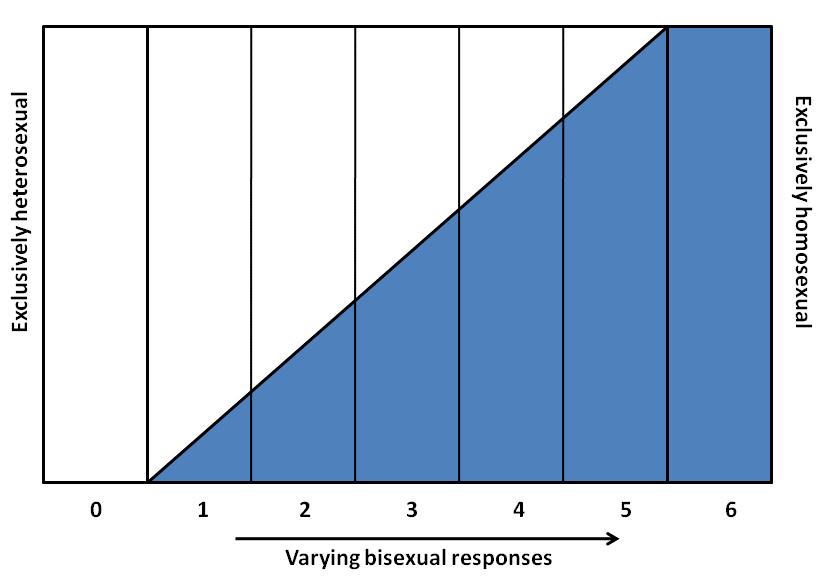

* Define and differentiate between sex and gender
* Define and discuss what is meant by gender identity
* Understand and discuss the role of homophobia and heterosexism in society
* Distinguish the meanings of transgender, transsexual, and homosexual identities

 "){: #import-auto-id1522091}

When filling out a document such as a job application or school registration form you are often asked to provide your name, address, phone number, birth date, and sex or gender. But have you ever been asked to provide your sex *and* your gender? As with most people, it may not have occurred to you that sex and gender are not the same. However, sociologists and most other social scientists view sex and gender as conceptually distinct. **Sex**{: data-type="term" #import-auto-id1520798} refers to physical or physiological differences between males and females, including both primary sex characteristics (the reproductive system) and secondary characteristics such as height and muscularity. **Gender**{: data-type="term" #import-auto-id2021309} is a term that refers to social or cultural distinctions associated with being male or female. **Gender identity**{: data-type="term" #import-auto-id2102744} is the extent to which one identifies as being either masculine or feminine (Diamond 2002).

A person’s sex, as determined by his or her biology, does not always correspond with his or her gender. Therefore, the terms *sex* and *gender* are not interchangeable. A baby boy who is born with male genitalia will be identified as male. As he grows, however, he may identify with the feminine aspects of his culture. Since the term *sex* refers to biological or physical distinctions, characteristics of sex will not vary significantly between different human societies. For example, all persons of the female sex, in general, regardless of culture, will eventually menstruate and develop breasts that can lactate. Characteristics of gender, on the other hand, may vary greatly between different societies. For example, in American culture, it is considered feminine (or a trait of the female gender) to wear a dress or skirt. However, in many Middle Eastern, Asian, and African cultures, dresses or skirts (often referred to as sarongs, robes, or gowns) can be considered masculine. The kilt worn by a Scottish male does not make him appear feminine in his culture.

The dichotomous view of gender (the notion that one is either male or female) is specific to certain cultures and is not universal. In some cultures gender is viewed as fluid. In the past, some anthropologists used the term *berdache* to refer to individuals who occasionally or permanently dressed and lived as the opposite gender. The practice has been noted among certain Native American tribes (Jacobs, Thomas, and Lang 1997). Samoan culture accepts what they refer to as a “third gender.” *Fa’afafine*, which translates as “the way of the woman,” is a term used to describe individuals who are born biologically male but embody both masculine and feminine traits. Fa’afafines are considered an important part of Samoan culture. Individuals from other cultures may mislabel them as homosexuals because fa’afafines have a varied sexual life that may include men or women (Poasa 1992).

The Legalese of Sex and Gender

The terms *sex* and *gender* have not always been differentiated in the English language. It was not until the 1950s that American and British psychologists and other professionals working with intersex and transsexual patients formally began distinguishing between sex and gender. Since then, psychological and physiological professionals have increasingly used the term gender (Moi 2005). By the end of the 21st century, expanding the proper usage of the term *gender* to everyday language became more challenging—particularly where legal language is concerned. In an effort to clarify usage of the terms *sex* and *gender*, U.S. Supreme Court Justice Antonin Scalia wrote in a 1994 briefing, “The word gender has acquired the new and useful connotation of cultural or attitudinal characteristics (as opposed to physical characteristics) distinctive to the sexes. That is to say, gender is to sex as feminine is to female and masculine is to male” (*J.E.B. v. Alabama*, 144 S. Ct. 1436 \[1994\]). Supreme Court Justice Ruth Bader Ginsburg had a different take, however. Viewing the words as synonymous, she freely swapped them in her briefings so as to avoid having the word “sex” pop up too often. It is thought that her secretary supported this practice by suggestions to Ginsberg that “those nine men” (the other Supreme Court justices), “hear that word and their first association is not the way you want them to be thinking” (Case 1995). This anecdote reveals that even human experience that is assumed to be biological and personal (such as our self-perception and behavior) is actually a socially defined variable by culture.

# Sexual Orientation   {#h21201_01}

A person’s **sexual orientation**{: data-type="term" #import-auto-id1446754} is their emotional and sexual attraction to a particular sex (male or female). Sexual orientation is typically divided into four categories: *heterosexuality*, the attraction to individuals of the opposite sex; *homosexuality*, the attraction to individuals of one’s own sex; *bisexuality*, the attraction to individuals of either sex; and *asexuality*, no attraction to either sex. Heterosexuals and homosexuals may also be referred to informally as “straight” and “gay,” respectively. The United States is a heteronormative society, meaning it supports heterosexuality as the norm. Consider that homosexuals are often asked, “When did you know you were gay?” but heterosexuals are rarely asked, “When did you know that you were straight?” (Ryle 2011).

According to current scientific understanding, individuals are usually aware of their sexual orientation between middle childhood and early adolescence (American Psychological Association 2008). They do not have to participate in sexual activity to be aware of these emotional, romantic, and physical attractions; people can be celibate and still recognize their sexual orientation. Homosexual women (also referred to as lesbians), homosexual men (also referred to as gays), and bisexuals of both genders may have very different experiences of discovering and accepting their sexual orientation. At the point of puberty, some may be able to claim their sexual orientations while others may be unready or unwilling to make their homosexuality or bisexuality known since it goes against American society’s historical norms (APA 2008).

Alfred Kinsey was among the first to conceptualize sexuality as a continuum rather than a strict dichotomy of gay or straight. To classify this continuum of heterosexuality and homosexuality, Kinsey created a six-point rating scale that ranges from exclusively heterosexual to exclusively homosexual (see the figure below). In his 1948 work *Sexual Behavior in the Human Male*, Kinsey writes, “Males do not represent two discrete populations, heterosexual and homosexual. The world is not to be divided into sheep and goats … The living world is a continuum in each and every one of its aspects” (Kinsey 1948).

 {: #import-auto-id1522092}

Later scholarship by Eve Kosofsky Sedgwick expanded on Kinsey’s notions. She coined the term “homosocial” to oppose “homosexual,” describing non-sexual same-sex relations. Sedgwick recognized that in American culture, males are subject to a clear divide between the two sides of this continuum, whereas females enjoy more fluidity. This can be illustrated by the way women in America can express homosocial feelings (nonsexual regard for people of the same sex) through hugging, handholding, and physical closeness. In contrast, American males refrain from these expressions since they violate the heteronormative expectation. While women experience a flexible norming of variations of behavior that spans the heterosocial-homosocial spectrum, male behavior is subject to strong social sanction if it veers into homosocial territory because of societal homophobia (Sedgwick 1985).

There is no scientific consensus regarding the exact reasons why an individual holds a heterosexual, homosexual, or bisexual orientation. There has been research conducted to study the possible genetic, hormonal, developmental, social, and cultural influences on sexual orientation, but there has been no evidence that links sexual orientation to one factor (APA 2008). Research, however, does present evidence showing that homosexuals and bisexuals are treated differently than heterosexuals in schools, the workplace, and the military. It is reported that in the workplace, for example, discrimination based on sexual orientation occurs at a rate of 4 per 10,000, which is higher than the rate of discrimination based on race, which stands at 3.90 (Sears and Mallory 2007.)

Much of this discrimination is based on stereotypes, misinformation, and **homophobia**{: data-type="term" #import-auto-id1373383}, an extreme or irrational aversion to homosexuals. Major policies to prevent discrimination based on sexual orientation have not come into effect until the last few years. In 2011, President Obama overturned “don’t ask, don’t tell,” a controversial policy that required homosexuals in the US military to keep their sexuality undisclosed. Between 2004 and 2010, five states and the District of Columbia legalized gay marriage. The Employee Non-Discrimination Act, which ensures workplace equality regardless of sexual orientation, is still pending full government approval. Organizations such as GLAAD (Gay &amp; Lesbian Alliance Against Defamation) advocate for homosexual rights and encourage governments and citizens to recognize the presence of sexual discrimination and work to prevent it. Other advocacy agencies frequently use the acronyms LBGT and LBGTQ, which stands for “Lesbian, Gay, Bisexual, Transgender” (and “Queer” or “Questioning” when the Q is added).

# Gender Roles   {#h21201_02}

As we grow, we learn how to behave from those around us. In this socialization process, children are introduced to certain roles that are typically linked to their biological sex. The term **gender role**{: data-type="term" #import-auto-id2265759} refers to society’s concept of how men and women are expected to act and how they should behave. These roles are based on norms, or standards, created by society. In American culture, masculine roles are usually associated with strength, aggression, and dominance, while feminine roles are usually associated with passivity, nurturing, and subordination. Role learning starts with socialization at birth. Even today, our society is quick to outfit male infants in blue and girls in pink, even applying these color-coded gender labels while a baby is in the womb.

One way children learn gender roles is through play. Parents typically supply boys with trucks, toy guns, and superhero paraphernalia, which are active toys that promote motor skills, aggression, and solitary play. Daughters are often given dolls and dress-up apparel that foster nurturing, social proximity, and role play. Studies have shown that children will most likely choose to play with “gender appropriate” toys (or same-gender toys) even when cross-gender toys are available because parents give children positive feedback (in the form of praise, involvement, and physical closeness) for gender normative behavior (Caldera, Huston, and O’Brien 1998).

 "){: #import-auto-id1274881}

The drive to adhere to masculine and feminine gender roles continues later in life. Men tend to outnumber women in professions such as law enforcement, the military, and politics. Women tend to outnumber men in care-related occupations such as childcare, healthcare, and social work. These occupational roles are examples of typical American male and female behavior, derived from our culture’s traditions. Adherence to them demonstrates fulfillment of social expectations but not necessarily personal preference (Diamond 2002).

# Gender Identity   {#h21201_03}

American society allows for some level of flexibility when it comes to acting out gender roles. To a certain extent, men can assume some feminine roles and women can assume some masculine roles without interfering with their gender identity. **Gender identity**{: data-type="term" #import-auto-id2101043} is an individual’s self-conception of being male or female based on his or her association with masculine or feminine gender roles.

Individuals who identify with the role that is the opposite of their biological sex are called **transgender**{: data-type="term" #import-auto-id1873139}. Transgendered males, for example, have such a strong emotional and psychological connection to the feminine aspects of society that they identify their gender as female. The parallel connection to masculinity exists for transgendered females. It is difficult to determine the prevalence of transgenderism in society. However, it is estimated that two to five percent of the US population is transgendered (Transgender Law and Policy Institute 2007).

Transgendered individuals who wish to alter their bodies through medical interventions such as surgery and hormonal therapy—so that their physical being is better aligned with gender identity—are called **transsexuals**{: data-type="term" #import-auto-id1254695}. They may also be known as male-to-female (MTF) or female-to-male (FTM). Not all transgendered individuals choose to alter their bodies: many will maintain their original anatomy but may present themselves to society as the opposite gender. This is typically done by adopting the dress, hairstyle, mannerisms, or other characteristic typically assigned to the opposite gender. It is important to note that people who cross-dress, or wear clothing that is traditionally assigned to opposite gender, are not necessarily transgendered. Cross-dressing is typically a form of self-expression, entertainment, or personal style, not necessarily an expression against one’s assigned gender (APA 2008).

There is no single, conclusive explanation for why people are transgendered. Transgendered expressions and experiences are so diverse that it is difficult to identify their origin. Some hypotheses suggest biological factors such as genetics or prenatal hormone levels as well as social and cultural factors such as childhood and adulthood experiences. Most experts believe that all of these factors contribute to a person’s gender identity (APA 2008).

It is known, however, that transgendered and transsexual individuals experience discrimination based on their gender identity. People who identify as transgendered are twice as likely to experience assault or discrimination as non-transgendered individuals; they are also one and a half times more likely to experience intimidation (National Coalition of Anti-Violence Programs 2010). Organizations such as the National Coalition of Anti-Violence Programs and Global Action for Trans Equality work to prevent, respond to, and end all types of violence against transgender, transsexual, and homosexual individuals. These organizations hope that by educating the public about gender identity and empowering transgender and transsexual individuals, this violence will end.

Real-Life *Freaky Friday*

What if you had to live as the opposite sex? If you are a man, imagine that you were forced to wear frilly dresses, dainty shoes, and makeup to special occasions, and you were expected to enjoy romantic comedies and TLC reality shows. If you are a woman, imagine that you were forced to wear shapeless clothing, put only minimal effort into your personal appearance, not show emotion, and watch countless hours of sporting events and sports-related commentary. It would be pretty uncomfortable, right? Well, maybe not. Many people enjoy participating in activities that are typically associated with the opposite sex and would not mind if some of the cultural expectations for men and women were loosened.

Now, imagine that when you look at your body in the mirror, you feel disconnected. You feel your genitals are shameful and dirty, and you feel as though you are trapped in someone else’s body with no chance of escape. As you get older, you hate the way your body is changing, and, therefore, you hate yourself. These elements of disconnect and shame are important to understand when discussing transgendered individuals. Fortunately, sociological studies pave the way for a deeper and more empirically grounded understanding of transgendered experience.

"){: #import-auto-id2626827}

# Summary   {#summary}

The terms “sex” and “gender” refer to two different identifiers. Sex denotes biological characteristics differentiating males and females, while gender denotes social and cultural characteristics of masculine and feminine behavior. Sex and gender are not always synchronous. Individuals who strongly identify with the opposing gender are considered transgendered.

# Section Quiz   {#sq1201}

The terms “masculine” and “feminine” refer to a person’s \_\_\_\_\_\_\_\_\_.

1.  sex
2.  gender
3.  both sex and gender
4.  none of the above
{: data-number-style="lower-alpha"}

Answer

B

­\_\_\_\_\_\_\_ is/are an individual’s self-conception of being male or female based on his or her association with masculine or feminine gender roles.

1.  Gender identity
2.  Gender bias
3.  Sexual orientation
4.  Sexual attitudes
{: data-number-style="lower-alpha"}

Answer

A

Research indicates that individuals are aware of their sexual orientation \_\_\_\_\_\_\_.

1.  at infancy
2.  in early adolescence
3.  in early adulthood
4.  in late adulthood
{: data-number-style="lower-alpha"}

Answer

B

A person who is biologically female but identifies with the male gender and has undergone surgery to alter her body is considered \_\_\_\_\_\_\_.

1.  transgendered
2.  transsexual
3.  a cross-dresser
4.  homosexual
{: data-number-style="lower-alpha"}

Answer

B

Which of following is correct regarding the explanation for transgenderism?

1.  It is strictly biological and associated with chemical imbalances in the brain.
2.  It is a behavior that is learned through socializing with other transgendered individuals.
3.  It is genetic and usually skips one generation.
4.  Currently, there is no definitive explanation for transgenderism.
{: data-number-style="lower-alpha"}

Answer

D

# Short Answer   {#sh12_01}

Why do sociologists find it important to differentiate between sex and gender? What importance does the differentiation have in modern society?

How is children’s play influenced by gender roles? Think back to your childhood. How “gendered” were the toys and activities available to you? Do you remember gender expectations being conveyed through the approval or disapproval of your playtime choices?

# Further Research   {#fresearch1201}

For more information on gender identity and advocacy for transgendered individuals see the Global Action for Trans Equality web site at [http://openstaxcollege.org/l/trans\\\_equality][1].

# References   {#ref1201}

American Psychological Association (APA). 2008. “Answers to Your Questions: For a Better Understanding of Sexual Orientation and Homosexuality.” Washington, DC. Retrieved January 10, 2012 ([http://www.apa.org/topics/sexuality/orientation.aspx][2]).

Caldera, Yvonne, Aletha Huston, and Marion O’Brien. 1998. “Social Interactions and Play Patterns of Parents and Toddlers with Feminine, Masculine, and Neutral Toys.” *Child Development* 60(1):70–76.

Case, M.A. 1995. \"Disaggregating Gender from Sex and Sexual Orientation: The Effeminate Man in the Law and Feminist Jurisprudence.\" *Yale Law Journal* 105(1):1–105.

Diamond, Milton. 2002. “Sex and Gender Are Different: Sexual Identity and Gender Identity Are Different.” *Clinical Child Psychology &amp; Psychiatry* 7(3):320–334. Retrieved February 13, 2012 ([http://www.hawaii.edu/PCSS/biblio/articles/2000to2004/2002-sex-and-gender.html][3]).

Jacobs, Sue-Ellen, Wesley Thomas, and Sabine Lang. 1997. *Two Spirit People: Native American Gender Identity, Sexuality, and Spirituality*. Champaign, IL: University of Illinois Press.

*J.E.B. v. Alabama*, 144 S. Ct. 1436 (1994).

Kinsey, Alfred C. et al. 1998 \[1948\]. *Sexual Behavior in the Human Male*. Bloomington, IN: Indiana University Press.

Moi, T. 2005. *Sex, Gender and the Body*. New York: Oxford University Press.

National Coalition of Anti-Violence Programs. 2010. “Hate Violence Against Lesbian, Gay, Bisexual, Transgender, Queer and HIV-Affected Communities in the United States.” Retrieved January 10, 2012 ([http://www.avp.org/storage/documents/Reports/2012\\\_NCAVP\\\_2011\\\_HV\\\_Report.pdf][4]).

Poasa, Kris. 1992. “The Samoan Fa’afafine: One Case Study and Discussion of Transsexualism.” *Journal of Psychology &amp; Human Sexuality* 5(3):39–51.

Ryle, Robyn. 2011. *Questioning Gender: A Sociological Exploration.* Thousand Oaks, CA: Pine Forge Press.

Sears, Brad and Christy Mallory. 2007. “Evidence of Employment Discrimination on the Basis of Sexual Orientation in State and Local Government: Complaints Filed with State Enforcement Agencies 2003-2007.” Los Angeles, CA: The Williams Institute.

Sedgwick, Eve. 1985. *Between Men: English Literature and Male Homosocial Desire*. New York: Columbia University Press.

## Glossary
{: data-type="glossary-title"}

gender identity
: an individual’s sense of being either masculine or feminine
{: .definition #import-auto-id1343447}

gender role
: society’s concept of how men and women should behave
{: .definition #import-auto-id2103450}

gender
: a term that refers to social or cultural distinctions of behaviors that are considered male or female
{: .definition #import-auto-id1255141}

homophobia
: an extreme or irrational aversion to homosexuals
{: .definition #import-auto-id1749045}

sex
: a term that denotes the presence of physical or physiological differences between males and females
{: .definition #import-auto-id2616781}

sexual orientation
: a person’s emotional and sexual attraction to a particular sex (male or female)
{: .definition #import-auto-id1458871}

transgender
: a term that refers to individuals who identify with the behaviors and characteristics that are opposite of their biological sex
{: .definition #import-auto-id3123467}

transsexuals
: transgendered individuals who wish to alter their bodies through medical interventions such as surgery and hormonal therapy
{: .definition #import-auto-id2010531}

[1]: http://openstaxcollege.org/l/trans_equality
[2]: http://www.apa.org/topics/sexuality/orientation.aspx
[3]: http://www.hawaii.edu/PCSS/biblio/articles/2000to2004/2002-sex-and-gender.html
[4]: http://www.avp.org/storage/documents/Reports/2012_NCAVP_2011_HV_Report.pdf
