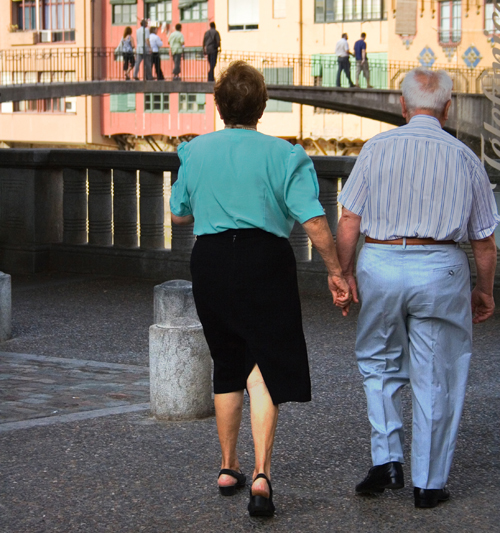
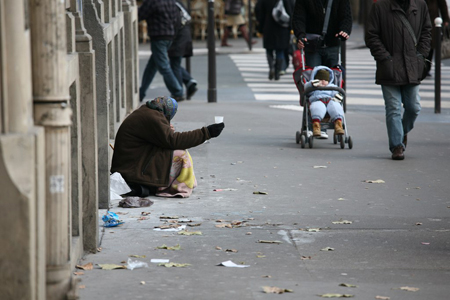

* Understand the historical and current trends of poverty among elderly populations
* Recognize ageist thinking and ageist attitudes in individuals and in institutions
* Learn about elderly individuals’ risks of being mistreated and abused

Aging comes with many challenges. The loss of independence is one potential part of the process, as are diminished physical ability and age discrimination. The term **senescence**{: data-type="term" #import-auto-id1455049} refers to the aging process, including biological, emotional, intellectual, social, and spiritual changes. This section discusses some of the challenges we encounter during this process.

As already observed, many older adults remain highly self-sufficient. Others require more care. Because the elderly typically no longer hold jobs, finances can be a challenge. And due to cultural misconceptions, older people can be targets of ridicule and stereotypes. The elderly face many challenges in later life, but they do not have to enter old age without dignity.

# Poverty   {#h21303_01}

<figure markdown="1" data-orient="horizontal">
<figcaption>
While elderly poverty rates showed an improvement trend for decades, the 2008 recession has changed some older people’s financial futures. Some who had planned a leisurely retirement have found themselves at risk of late-age destitution. (Photo (a) courtesy of Michael Cohen/flickr; photo (b) courtesy of Alex Proimos/flickr)
</figcaption>
{:}

{:}

</figure>

For many people in the United States, growing older once meant living with less income. In 1960, almost 35 percent of the elderly existed on poverty-level incomes. A generation ago, the nation’s oldest populations had the highest risk of living in poverty.

At the start of the 21st century, the older population was putting an end to that trend. Among people over 65, the poverty rate fell from 30 percent in 1967 to 9.7 percent in 2008, well below the national average of 13.2 percent (U.S. Census Bureau 2009). However, with the subsequent recession, which severely reduced the retirement savings of many while taxing public support systems, how are the elderly affected? According to the Kaiser Commission on Medicaid and the Uninsured, the national poverty rate among the elderly had risen to 14 percent by 2010 (Urban Institute and Kaiser Commission 2010).

Before the recession hit, what had changed to cause a reduction in poverty among the elderly? What social patterns contributed to the shift? For several decades, a greater number of women joined the workforce. More married couples earned double incomes during their working years and saved more money for their retirement. Private employers and governments began offering better retirement programs. By 1990, senior citizens reported earning 36 percent more income on average than they did in 1980; that was five times the rate of increase for people under age 35 (U.S. Census Bureau 2009).

In addition, many people were gaining access to better health care. New trends encouraged people to live more healthful lifestyles, placing an emphasis on exercise and nutrition. There was also greater access to information about the health risks of behaviors such as cigarette smoking, alcohol consumption, and drug use. Because they were healthier, many older people continue to work past the typical retirement age, providing more opportunity to save for retirement. Will these patterns return once the recession ends? Sociologists will be watching to see. In the meantime, they are realizing the immediate impact of the recession on elderly poverty.

During the recession, older people lost some of the financial advantages that they’d gained in the 1980s and 1990s. From October 2007 to October 2009 the values of retirement accounts for people over age 50 lost 18 percent of their value. The sharp decline in the stock market also forced many to delay their retirement (Administration on Aging 2009).

# Ageism   {#h21303_02}

![Five sets of road signs, the top one green and the bottom one red in each set, are shown along the right-hand side of a road in a desert setting. The green signs all read &#x201C;Senior Center&#x201D; and feature an arrow pointing left. The blue signs, from front to back, read &#x201C;Don&#x2019;t Forget,&#x201D; &#x201C;Remember to \[u\]Turn!\[/u\]&#x201D;, &#x201C;Wake Up!&#x201D;, &#x201C;Lunch Only $4,&#x201D; and &#x201C;Turn Now.&#x201D;](../resources/Figure_13_03_02.jpg "Are these street signs humorous or offensive? What shared assumptions make them humorous? Or is memory loss too serious to be made fun of? (Photo courtesy of Tumbleweed/flickr)"){: #import-auto-id2338346}

Driving to the grocery store, Peter, 23, got stuck behind a car on a four-lane main artery through his city’s business district. The speed limit was 35 miles per hour, and while most drivers sped along at 40 to 45 mph, the driver in front of him was going the minimum speed. Peter tapped on his horn. He tailgated the driver. Finally, Peter had a chance to pass the car. He glanced over. Sure enough, Peter thought, a gray-haired old man guilty of “DWE,” driving while elderly.

At the grocery store, Peter waited in the checkout line behind an older woman. She paid for her groceries, lifted her bags of food into her cart, and toddled toward the exit. Peter, guessing her to be about 80, was reminded of his grandmother. He paid for his groceries and caught up with her.

“Can I help you with your cart?” he asked.

“No, thank you. I can get it myself,” she said and marched off toward her car.

Peter’s responses to both older people, the driver and the shopper, were prejudiced. In both cases, he made unfair assumptions. He assumed the driver drove cautiously simply because the man was a senior citizen, and he assumed the shopper needed help carrying her groceries just because she was an older woman.

Responses like Peter’s toward older people are fairly common. He didn’t intend to treat people differently based on personal or cultural biases, but he did. **Ageism**{: data-type="term" #import-auto-id2689839} is discrimination (when someone acts on a prejudice) based on age. Dr. Robert Butler coined the term in 1968, noting that ageism exists in all cultures (Brownell). Ageist attitudes and biases based on stereotypes reduce elderly people to inferior or limited positions.

Ageism can vary in severity. Peter’s attitudes are probably seen as fairly mild, but relating to the elderly in ways that are patronizing can be offensive. When ageism is reflected in the workplace, in health care, and in assisted-living facilities, the effects of discrimination can be more severe. Ageism can make older people fear losing a job, feel dismissed by a doctor, or feel a lack of power and control in their daily living situations.

In early societies, the elderly were respected and revered. Many preindustrial societies observed **gerontocracy**{: data-type="term" #import-auto-id2269425}, a type of social structure wherein the power is held by a society’s oldest members. In some countries today, the elderly still have influence and power and their vast knowledge is respected.

In many modern nations, however, industrialization contributed to the diminished social standing of the elderly. Today wealth, power, and prestige are also held by those in younger age brackets. The average age of corporate executives was 59 in 1980. In 2008, the average age had lowered to 54 (Stuart 2008). Some older members of the workforce felt threatened by this trend and grew concerned that younger employees in higher level positions would push them out of the job market. Rapid advancements in technology and media have required new skill sets that older members of the workforce are less likely to have.

Changes happened not only in the workplace but also at home. In agrarian societies, a married couple cared for their aging parents. The oldest members of the family contributed to the household by doing chores, cooking, and helping with child care. As economies shifted from agrarian to industrial, younger generations moved to cities to work in factories. The elderly began to be seen as an expensive burden. They did not have the strength and stamina to work outside the home. What began during industrialization, a trend toward older people living apart from their grown children, has become commonplace.

# Mistreatment and Abuse   {#h21303_03}

Mistreatment and abuse of the elderly is a major social problem. As expected, with the biology of aging, the elderly sometimes become physically frail. This frailty renders them dependent on others for care—sometimes for small needs like household tasks, and sometimes for assistance with basic functions like eating and toileting. Unlike a child, who also is dependent on another for care, an elder is an adult with a lifetime of experience, knowledge, and opinions—a more fully developed person. This makes the care providing situation more complex.

**Elder abuse**{: data-type="term" #import-auto-id1497972} describes when a caretaker intentionally deprives an older person of care or harms the person in their charge. Caregivers may be family members, relatives, friends, health professionals, or employees of senior housing or nursing care. The elderly may be subject to many different types of abuse.

In a 2009 study on the topic led by Dr. Ron Acierno, the team of researchers identified five major categories of elder abuse: 1) physical abuse, such as hitting or shaking, 2) sexual abuse including rape and coerced nudity, 3) psychological or emotional abuse, such as verbal harassment or humiliation, 4) neglect or failure to provide adequate care, and 5) financial abuse or exploitation (Acierno 2010).

The National Center on Elder Abuse (NCEA), a division of the U.S. Administration on Aging, also identifies abandonment and self-neglect as types of abuse. [\[link\]](#import-auto-id1428238) shows some of the signs and symptoms that the NCEA encourages people to notice.

<table id="import-auto-id1428238" summary="A chart depicting the symptoms and signs of the 6 different types of elderly abuse."><caption>Signs of Elder AbuseThe National Center on Elder Abuse encourages people to watch for these signs of mistreatment. (Chart courtesy of National Center on Elder Abuse)</caption><thead>
                            <tr>
                                <th>Type of Abuse</th>
                                <th>Signs and Symptoms</th>
                            </tr>
                        </thead><tbody>
                            <tr>
                                <td>Physical abuse</td>
                                <td>Bruises, untreated wounds, sprains, broken glasses, lab findings of medication overdosage</td>
                            </tr>
                            <tr>
                                <td>Sexual abuse</td>
                                <td>Bruises around breasts or genitals, torn or bloody underclothing, unexplained venereal disease</td>
                            </tr>
                            <tr>
                                <td>Emotional/psychological abuse</td>
                                <td>Being upset or withdrawn, unusual dementia-like behavior (rocking, sucking)</td>
                            </tr>
                            <tr>
                                <td>Neglect</td>
                                <td>Poor hygiene, untreated bed sores, dehydration, soiled bedding</td>
                            </tr>
                            <tr>
                                <td>Financial</td>
                                <td>Sudden changes in banking practices, inclusion of additional names on bank cards, abrupt changes to will</td>
                            </tr>
                            <tr>
                                <td>Self-neglect</td>
                                <td>Untreated medical conditions, unclean living area, lack of medical items like dentures or glasses</td>
                            </tr>
                        </tbody></table>

How prevalent is elder abuse? Two recent U.S. studies found that roughly 1 in 10 elderly people surveyed had suffered at least one form of elder abuse. Some social researchers believe elder abuse is underreported and that the number may be higher. The risk of abuse also increases in people with health issues such as dementia (Kohn and Verhoek-Oftedahl 2011). Older women were found to be victims of verbal abuse more often than their male counterparts.

In Acierno’s study, which included a sample of 5,777 respondents age 60 and older, 5.2 percent of respondents reported financial abuse, 5.1 percent said they’d been neglected, and 4.6 endured emotional abuse (Acierno 2010). The prevalence of physical and sexual abuse was lower at 1.6 and 0.6 percent, respectively (Acierno 2010).

Other studies have focused on the caregivers to the elderly in an attempt to discover the causes of elder abuse. Researchers identified factors that increased the likelihood of caregivers perpetrating abuse against those in their care. Those factors include inexperience, having other demands such as jobs (for those who weren’t professionally employed as caregivers), caring for children, living full time with the dependent elder, and experiencing high stress, isolation, and lack of support (Kohn and Verhoek-Oftedahl 2011).

A history of depression in the caregiver was also found to increase the likelihood of elder abuse. Neglect was more likely when care was provided by paid caregivers. Many of the caregivers who physically abused elders were themselves abused—in many cases, when they were children. Family members with some sort of dependency on the elder in their care were more likely to physically abuse that elder. For example, an adult child caring for an elderly parent while, at the same time, depending on some form of income from that parent, would be considered more likely to perpetrate physical abuse (Kohn and Verhoek-Oftedahl 2011).

A survey in Florida found that 60.1 percent of caregivers reported verbal aggression as a style of conflict resolution. Paid caregivers in nursing homes were at a high risk of becoming abusive if they had low job satisfaction, treated the elderly like children, or felt burnt out (Kohn and Verhoek-Oftedahl 2011). Caregivers who tended to be verbally abusive were found to have had less training, lower education, and higher likelihood of depression or other psychiatric disorders. Based on the results of these studies, many housing facilities for seniors have increased their screening procedures for caregiver applicants.

World War II Veterans

 veterans and members of an Honor Flight from Milwaukee, Wisconsin, visit the National World War II Memorial in Washington, D.C. Most of these men and women were in their late teens or 20s when they served. (Photo courtesy of Sean Hackbarth/flickr)"){: #import-auto-id2768187}

World War II veterans are aging. Many are in their 80s and 90s. They are dying at an estimated rate of about 740 per day, according to the U.S. Veterans Administration (National Center for Veterans Analysis and Statistics 2011). Data suggest that by 2036, there will be no living veterans of WWII (U.S. Department of Veteran Affairs).

When these veterans came home from the war and ended their service, little was known about posttraumatic stress disorder (PTSD). These heroes did not receive the mental and physical health care that could have helped them. As a result, many of them, now in old age, are dealing with the effects of PTSD. Research suggests a high percentage of World War II veterans are plagued by flashback memories and isolation, and that many “self-medicate” with alcohol.

Research has found that veterans of any conflict are more than twice as likely as non-veterans to commit suicide, with rates highest among the oldest veterans. Reports show that WWII-era veterans are four times as likely to take their own lives as people of the same age with no military service (Glantz 2010).

In May 2004, the National World War II Memorial in Washington, D.C., was completed and dedicated to honor those who served during the conflict. Dr. Earl Morse, a physician and retired Air Force captain, treated many WWII veterans. He encouraged them to visit the memorial, knowing it could help them heal. Many WWII veterans expressed interest in seeing the memorial. Unfortunately, many were in their 80s and were neither physically nor financially able to travel on their own. Dr. Morse arranged to personally escort some of the veterans and enlisted volunteer pilots who would pay for the flights themselves. He also raised money, insisting the veterans pay nothing. By the end of 2005, 137 veterans, many in wheelchairs, had made the trip. The Honor Flight Network was up and running.

As of 2010, the Honor Flight Network had flown more than 120,000 U.S. veterans of World War II, and some veterans of the Korean War, to Washington. The round-trip flights leave for day-long trips from airports in 30 states, staffed by volunteers who care for the needs of the elderly travelers (Honor Flight Network 2011).

# Summary   {#summary1303}

As people enter old age, they face challenges. Ageism, which involves stereotyping and discrimination against the elderly, leads to misconceptions about their abilities. Although elderly poverty has been improving for decades, many older people may be detrimentally affected by the 2008 recession. Some elderly people grow physically frail and, therefore, dependent on caregivers, which increases their risk of elder abuse.

# Section Quiz   {#sq1303}

Today in the United States the poverty rate of the elderly is \_\_\_\_\_\_.

1.  lower than at any point in history
2.  increasing
3.  decreasing
4.  the same as that of the general population
{: data-number-style="lower-alpha"}

Answer

B

Which action reflects ageism?

1.  Enabling WWII veterans to visit war memorials
2.  Speaking slowly and loudly when talking to someone over age 65
3.  Believing that older people drive too slowly
4.  Living in a culture where elders are respected
{: data-number-style="lower-alpha"}

Answer

B

Which factor most increases the risk of an elderly person suffering mistreatment?

1.  Bereavement due to widowhood
2.  Having been abusive as a younger adult
3.  Being frail to the point of dependency on care
4.  The ability to bestow a large inheritance on survivors
{: data-number-style="lower-alpha"}

Answer

C

If elderly people suffer abuse, it is most often perpetrated by \_\_\_\_\_\_.

1.  spouses
2.  caregivers
3.  lawyers
4.  strangers
{: data-number-style="lower-alpha"}

Answer

B

Veterans are two to four times more likely to \_\_\_\_\_\_ as people who did not serve in the military.

1.  be a victim of elder abuse
2.  commit suicide
3.  be concerned about financial stresses
4.  be abusive toward care providers
{: data-number-style="lower-alpha"}

Answer

B

# Short Answer   {#sh1303}

Make a list of all the biases, generalizations, and stereotypes about elderly people that you have seen or heard. Include everything, no matter how small or seemingly trivial. Try to rate the items on your list. Which statements can be considered myths? Which frequently turn into discrimination?

Have you known any person who experienced prejudice or discrimination based on age? Think of someone who has been denied an experience or opportunity simply for being too old. Write the story as a case study.

Think of an older person you know well, perhaps a grandparent, other relative, or neighbor. How does this person defy certain stereotypes of aging?

Older people suffer discrimination, and often, so do teenagers. Compare the discrimination of the elderly to that of teenagers. What do the groups share in common and how are they different?

# Further Research   {#fresearch01303}

Veterans who served in the U.S. armed forces during various conflicts represent cohorts. Veterans share certain aspects of life in common. To find information on veteran populations and how they are aging, study the information on the web site of the U.S. Department of Veterans Affairs: [http://openstaxcollege.org/l/Dep\\\_Veterans\\\_Affairs][1]

Learn more about the Honor Flight Network, the organization offering trips to national war memorials in Washington, D.C., at no cost to the veterans: [http://openstaxcollege.org/l/honor\\\_flight][2]

# References   {#ref1303}

Acierno, R., Melba A. Hernandez, Ananda B. Amstadter, Heidi S. Resnick, Kenneth Steve, Wendy Muzzy, and Dean G. Kilpatrick. 2010. “Prevalence and Correlates of Emotional, Physical, Sexual, Financial Abuse and Potential Neglect in the United States.” *American Journal of Public Health* 100:292–7.

Administration on Aging. 2009. “Data Sources on the Impact of the 2008 Financial Crisis on the Economic Well-being of Older Americans Aging Forum Report Issue #1.” Retrieved February 13, 2012 ([http://www.agingstats.gov/Main\\\_Site/docs/DSOA\\\_Aging\\\_Brief.pdf][3]).

Brownell, Patricia. 2010. “Social Issues and Social Policy Response to Abuse and Neglect of Older Adults.” Pp. 1–16 in *Aging, Ageism and Abuse: Moving from Awareness to Action*, edited by G. Gutman and C. Spencer. Amsterdam, the Netherlands: Elsevier.

Glantz, Aaron. 2010. “Suicide Rates Soar among WWII Vets, Records Show.” *The Bay Citizen*, November 11. Retrieved February 27, 2012 ([http://www.baycitizen.org/veterans/story/suicide-rates-soar-among-wwii-vets/comments/#comments][4]).

Honor Flight Network. 2011. Retrieved September 22, 2011 ([http://www.honorflight.org/][5]).

Kohn, Robert and Wendy Verhoek-Oftedahl. 2011. “Caregiving and Elder Abuse.” *Medicine &amp; Health Rhode Island* 94(2):47–49.

National Center for Veterans Analysis and Statistics. 2011. “VA Benefits and Health Care Utilization.” November 9. Retrieved February 13, 2012 ([http://www.va.gov/Vetdata/docs/Quickfacts/4x6\\\_fall\\\_11\\\_sharepoint\\\_Final.pdf][6]).

National Center of Elder Abuse. 2011. “Major Types of Elder Abuse.” Retrieved January 21, 2012 ([http://ncea.aoa.gov/FAQ/Type\\\_Abuse/][7]).

Stuart, Spencer. 2008. “Leading CEOs: A Statistical Snapshot of S&amp;P 500 Leaders.” Retrieved February 13, 2012 ([http://content.spencerstuart.com/sswebsite/pdf/lib/2005\\\_CEO\\\_Study\\\_JS.pdf][8]).

Urban Institute and Kaiser Commission. 2010. “Poverty Rate by Age.” Retrieved January 21, 2012 ([http://www.statehealthfacts.org/comparebar.jsp?ind=10&amp;cat=1\"][9]).

U.S. Census Bureau. 2009. “Webinar on 2008 Income, Poverty, and Health Insurance Estimates from the Current Population Survey.” Retrieved February 13, 2012 ([http://www.census.gov/newsroom/releases/archives/news\\\_conferences/2009-09-10\\\_remarks\\\_johnson.html][10]).

U.S. Department of Veteran Affairs. 2010. “Veteran Population Projections FY 2000 to FY2036.” December. Retrieved February 13, 2012 ([http://www.va.gov/vetdata/docs/quickfacts/Population-slideshow.pdf][11]).

## Glossary
{: data-type="glossary-title"}

ageism
: discrimination based on age
{: .definition #import-auto-id1760622}

elder abuse
: when a caretaker intentionally deprives an older person of care or harms the person in their charge
{: .definition #import-auto-id1490228}

gerontocracy
: a type of social structure wherein the power is held by a society’s oldest members
{: .definition #import-auto-id2670405}

senescence
: the aging process, including biological, intellectual, emotional, social, and spiritual changes
{: .definition #import-auto-id1751813}

[1]: http://openstaxcollege.org/l/Dep_Veterans_Affairs
[2]: http://openstaxcollege.org/l/honor_flight
[3]: http://www.agingstats.gov/Main_Site/docs/DSOA_Aging_Brief.pdf
[4]: http://www.baycitizen.org/veterans/story/suicide-rates-soar-among-wwii-vets/comments/#comments
[5]: http://www.honorflight.org/
[6]: http://www.va.gov/Vetdata/docs/Quickfacts/4x6_fall_11_sharepoint_Final.pdf
[7]: http://ncea.aoa.gov/FAQ/Type_Abuse/
[8]: http://content.spencerstuart.com/sswebsite/pdf/lib/2005_CEO_Study_JS.pdf
[9]: http://www.statehealthfacts.org/comparebar.jsp?ind=10&amp;cat=1
[10]: http://www.census.gov/newsroom/releases/archives/news_conferences/2009-09-10_remarks_johnson.html
[11]: http://www.va.gov/vetdata/docs/quickfacts/Population-slideshow.pdf
