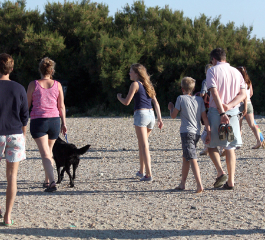
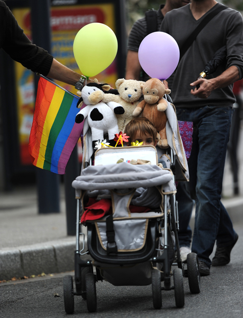

* Describe society’s current understanding of family
* Recognize changes in marriage and family patterns
* Differentiate between lines of decent and residence

<figure markdown="1" data-orient="horizontal">
<figcaption>
The modern concept of family is far more encompassing than in past decades. What do you think constitutes a family? (Photo (a) courtesy Gareth Williams/flickr; photo (b) courtesy Guillaume Paumier/ Wikimedia Commons)
</figcaption>
{:}

{:}

</figure>

Marriage and family are key structures in most societies. While the two institutions have historically been closely linked in American culture, their connection is becoming more complex. The relationship between marriage and family is an interesting topic of study to sociologists.

What is marriage? Different people define it in different ways. Not even sociologists are able to agree on a single meaning. For our purposes, we’ll define **marriage**{: data-type="term" #import-auto-id1169033121709} as a legally recognized social contract between two people, traditionally based on a sexual relationship and implying a permanence of the union. In practicing cultural relativism, we should also consider variations, such as whether a legal union is required (think of “common law” marriage and its equivalents), or whether more than two people can be involved (consider polygamy). Other variations on the definition of marriage might include whether spouses are of opposite sexes or the same sex, and how one of the traditional expectations of marriage (to produce children) is understood today.

Sociologists are interested in the relationship between the institution of marriage and the institution of family because, historically, marriages are what create a family, and families are the most basic social unit upon which society is built. Both marriage and family create status roles that are sanctioned by society.

So what is a family? A husband, a wife, and two children—maybe even a pet—has served as the model for the traditional American family for most of the 20th century. But what about families that deviate from this model, such as a single-parent household or a homosexual couple without children? Should they be considered families as well?

The question of what constitutes a family is a prime area of debate in family sociology, as well as in politics and religion. Social conservatives tend to define the family in terms of structure with each family member filling a certain role (like father, mother, or child). Sociologists, on the other hand, tend to define family more in terms of the manner in which members relate to one another than on a strict configuration of status roles. Here, we’ll define **family**{: data-type="term" #import-auto-id1169033056813} as a socially recognized group (usually joined by blood, marriage, or adoption) that forms an emotional connection and serves as an economic unit of society. Sociologists identify different types of families based on how one enters into them. A **family of orientation**{: data-type="term" #import-auto-id1169033100832} refers to the family into which a person is born. A **family of procreation**{: data-type="term" #import-auto-id1169033127596} describes one that is formed through marriage. These distinctions have cultural significance related to issues of lineage.

Drawing on two sociological paradigms, the sociological understanding of what constitutes a family can be explained by symbolic interactionism as well as functionalism. These two theories indicate that families are groups in which participants view themselves as family members and act accordingly. In other words, families are groups in which people come together to form a strong primary group connection, maintaining emotional ties to one another over a long period of time. Such families may include groups of close friends or teammates. In addition, the functionalist perspective views families as groups that perform vital roles for society—both internally (for the family itself) and externally (for society as a whole). Families provide for one another’s physical, emotional, and social well-being. Parents care for and socialize children. Later in life, adult children often care for elderly parents. While interactionism helps us to understand the subjective experience of belonging to a “family,” functionalism illuminates the many purposes of families and their role in the maintenance of a balanced society (Parsons and Bales 1956). We will go into more detail about how these theories apply to family in.

### Challenges Families Face

Americans, as a nation, are somewhat divided when it comes to determining what does and what does not constitute a family. In a 2010 survey conducted by professors at the University of Indiana, nearly all participants (99.8 percent) agreed that a husband, wife, and children constitute a family. Ninety-two percent stated that a husband and a wife without children still constitute a family. The numbers drop for less traditional structures: unmarried couples with children (83 percent), unmarried couples without children (39.6 percent), gay male couples with children (64 percent), and gay male couples without children (33 percent) (Powell et al. 2010). This survey revealed that children tend to be the key indicator in establishing “family” status: the percentage of individuals who agreed that unmarried couples and gay couples constitute a family nearly doubled when children were added.

The study also revealed that 60 percent of Americans agreed that if you consider yourself a family, you are a family (a concept that reinforces an interactionist perspective) (Powell 2010). The government, however, is not so flexible in its definition of “family.” The U.S. Census Bureau defines a family as “a group of two people or more (one of whom is the householder) related by birth, marriage, or adoption and residing together” (U.S. Census Bureau 2010). While this structured definition can be used as a means to consistently track family-related patterns over several years, it excludes individuals such as cohabitating unmarried heterosexual and homosexual couples. Legality aside, sociologists would argue that the general concept of family is more diverse and less structured than in years past. Society has given more leeway to the design of a family making room for what works for its members (Jayson 2010).

Family is, indeed, a subjective concept, but it is a fairly objective fact that family (whatever one’s concept of it may be) is very important to Americans. In a 2010 survey by Pew Research Center in Washington, D.C., 76 percent of adults surveyed stated that family is “the most important” element of their life—just one percent said it was “not important” (Pew Research Center 2010). It is also very important to society. President Ronald Regan notably stated, “The family has always been the cornerstone of American society. Our families nurture, preserve, and pass on to each succeeding generation the values we share and cherish, values that are the foundation of our freedoms” (Lee 2009). While the design of the family may have changed in recent years, the fundamentals of emotional closeness and support are still present. Most responders to the Pew survey stated that their family today is at least as close (45 percent) or closer (40 percent) than the family with which they grew up (Pew Research Center 2010).

Alongside the debate surrounding what constitutes a family is the question of what Americans believe constitutes a marriage. Many religious and social conservatives believe that marriage can only exist between man and a woman, citing religious scripture and the basics of human reproduction as support. Social liberals and progressives, on the other hand, believe that marriage can exist between two consenting adults—be they a man and a woman, or a woman and a woman—and that it would be discriminatory to deny such a couple the civil, social, and economic benefits of marriage.

### Marriage Patterns

With single parenting and **cohabitation**{: data-type="term" #import-auto-id1169033070987} (when a couple shares a residence but not a marriage) becoming more acceptable in recent years, people may be less motivated to get married. In a recent survey, 39 percent of respondents answered “yes” when asked whether marriage is becoming obsolete (Pew Research Center 2010). The institution of marriage is likely to continue, but some previous patterns of marriage will become outdated as new patterns emerge. In this context, cohabitation contributes to the phenomenon of people getting married for the first time at a later age than was typical in earlier generations (Glezer 1991). Furthermore, marriage will continue to be delayed as more people place education and career ahead of “settling down.”

#### One Partner or Many?

Americans typically equate marriage with **monogamy**{: data-type="term" #import-auto-id1169033120525}, when someone is married to only one person at a time. In many countries and cultures around the world, however, having one spouse is not the only form of marriage. In a majority of cultures (78 percent), **polygamy**{: data-type="term" #import-auto-id1169033064679}, or being married to more than one person at a time, is accepted (Murdock 1967), with most polygamous societies existing in northern Africa and east Asia (Altman and Ginat 1996). Instances of polygamy are almost exclusively in the form of polygyny. **Polygyny**{: data-type="term" #import-auto-id1169033067883} refers to a man being married to more than one woman at the same time. The reverse, when a woman is married to more than one man at the same time, is called **polyandry**{: data-type="term" #import-auto-id1169033070130}. It is far less common and only occurs in about one percent of the world’s cultures (Altman and Ginat 1996). The reasons for the overwhelming prevalence of polygamous societies are varied but they often include issues of population growth, religious ideologies, and social status.

While the majority of societies accept polygyny, the majority of people do not practice it. Often fewer than 10 percent (and no more than 25–35 percent) of men in polygamous cultures have more than one wife; these husbands are often older, wealthy, high-status men (Altman and Ginat 1996). The average plural marriage involves no more than three wives. Negev Bedouin men in Israel, for example, typically have two wives, although it is acceptable to have up to four (Griver 2008). As urbanization increases in these cultures, polygamy is likely to decrease as a result of greater access to mass media, technology, and education (Altman and Ginat 1996).

In the United States, polygamy is considered by most to be socially unacceptable and it is illegal. The act of entering into marriage while still married to another person is referred to as **bigamy**{: data-type="term" #import-auto-id1169033057411} and is considered a felony in most states. Polygamy in America is often associated with those of the Mormon faith, although in 1890 the Mormon Church officially renounced polygamy. Fundamentalist Mormons, such as those in the Fundamentalist Church of Jesus Christ of Latter Day Saints (FLDS), on the other hand, still hold tightly to the historic Mormon beliefs and practices and allow polygamy in their sect.

The prevalence of polygamy among Mormons is often overestimated due to sensational media stories such as the Yearning for Zion ranch raid in Texas in 2008 and popular television shows such as HBO’s *Big Love* and TLC’s *Sister Wives*. It is estimated that there are about 37,500 fundamentalist Mormons involved in polygamy in the United States, Canada, and Mexico, but that number has shown a steady decrease in the last 100 years (Useem 2007).

American Muslims, however, are an emerging group with an estimated 20,000 practicing polygamy. Again, polygamy among American-Muslims is uncommon and occurs only in approximately one percent of the population (Useem 2007). For now polygamy among American Muslims has gone fairly unnoticed by mainstream society, but like fundamentalist Mormons whose practices were off the public’s radar for decades, they may someday find themselves at the center of social debate.

 "){: #import-auto-id1169033121116}

### Residency and Lines of Descent   {#eip-698}

When considering one’s lineage, most Americans look to both their father’s and mother’s sides. Both paternal and maternal ancestors are considered part of one’s family. This pattern of tracing kinship is called **bilateral descent**{: data-type="term"}. Note that **kinship**{: data-type="term"}, or one’s traceable ancestry, can be based on blood or marriage or adoption. Sixty percent of societies, mostly modernized nations, follow a bilateral descent pattern. **Unilateral descent**{: data-type="term"} (the tracing of kinship through one parent only) is practiced in the other 40 percent of the world’s societies, with high concentration in pastoral cultures (O’Neal 2006).

There are three types of unilateral descent: **patrilineal**{: data-type="term"}, which follows the father’s line only; **matrilineal**{: data-type="term"}, which follows the mother’s side only; and **ambilineal**{: data-type="term"}, which follows either the father’s only or the mother’s side only, depending on the situation. In partrilineal societies, such as those in rural China and India, only males carry on the family surname. This gives males the prestige of permanent family membership while females are seen as only temporary members (Harrell 2001). American society assumes some aspects of partrilineal decent. For instance, most children assume their father’s last name even if the mother retains her birth name.

In matrilineal societies, inheritance and family ties are traced to women. Matrilineal descent is common in Native American societies, notably the Crow and Cherokee tribes. In these societies, children are seen as belonging to the women and, therefore, one’s kinship is traced to one’s mother, grandmother, great grandmother, and so on (Mails 1996). In ambilineal societies, which are most common in Southeast Asian countries, parents may choose to associate their children with the kinship of either the mother or the father. This choice maybe based on the desire to follow stronger or more prestigious kinship lines or on cultural customs such as men following their father’s side and women following their mother’s side (Lambert 2009).

Tracing one’s line of descent to one parent rather than the other can be relevant to the issue of residence. In many cultures, newly married couples move in with, or near to, family members. In a **patrilocal residence**{: data-type="term"} system it is customary for the wife to live with (or near) her husband’s blood relatives (or family or orientation). Patrilocal systems can be traced back thousands of years. In a DNA analysis of 4,600-year-old bones found in Germany, scientists found indicators of patrilocal living arrangements (Haak et al 2008). Patrilocal residence is thought to be disadvantageous to women because it makes them outsiders in the home and community; it also keeps them disconnected from their own blood relatives. In China, where patrilocal and patrilineal customs are common, the written symbols for maternal grandmother (*wáipá*) are separately translated to mean “outsider” and “women” (Cohen 2011).

Similarly, in **matrilocal residence**{: data-type="term"} systems, where it is customary for the husband to live with his wife’s blood relatives (or her family of orientation), the husband can feel disconnected and can be labeled as an outsider. The Minangkabau people, a matrilocal society that is indigenous to the highlands of West Sumatra in Indonesia, believe that home is the place of women and they give men little power in issues relating to the home or family (Joseph and Najmabadi 2003). Most societies that use patrilocal and patrilineal systems are patriarchal, but very few societies that use matrilocal and matrilineal systems are matriarchal, as family life is often considered an important part of the culture for women, regardless of their power relative to men.

### Stages of Family Life

As we’ve established, the concept of family has changed greatly in recent decades. Historically, it was often thought that most (certainly many) families evolved through a series of predictable stages. Developmental or “stage” theories used to play a prominent role in family sociology (Strong and DeVault 1992). Today, however, these models have been criticized for their linear and conventional assumptions as well as for their failure to capture the diversity of family forms. While reviewing some of these once-popular theories, it is important to identify their strengths and weaknesses.

The set of predictable steps and patterns families experience over time is referred to as the **family life cycle**{: data-type="term" #import-auto-id1169033099279}. One of the first designs of the family life cycle was developed by Paul Glick in 1955. In Glick’s original design, he asserted that most people will grow up, establish families, rear and launch their children, experience an “empty nest” period, and come to the end of their lives. This cycle will then continue with each subsequent generation (Glick 1989). Glick’s colleague, Evelyn Duvall, elaborated on the family life cycle by developing these classic stages of family (Strong and DeVault 1992):

<table id="import-auto-id1169033113916" summary="A table summarizing the different stages of the family, from marriage family to empty nest family."><caption>Stage TheoryThis table shows one example of how a “stage” theory might categorize the phases a family goes through.</caption><thead>
                                <tr>
                                    <th>Stage</th>
                                    <th>Family Type</th>
                                    <th>Children</th>
                                </tr>
                            </thead><tbody>
                                <tr>
                                    <td>1</td>
                                    <td>Marriage Family</td>
                                    <td>Childless</td>
                                </tr>
                                <tr>
                                    <td>2</td>
                                    <td>Procreation Family</td>
                                    <td>Children ages 0 to 2.5</td>
                                </tr>
                                <tr>
                                    <td>3</td>
                                    <td>Preschooler Family</td>
                                    <td>Children ages 2.5 to 6</td>
                                </tr>
                                <tr>
                                    <td>4</td>
                                    <td>School-age Family</td>
                                    <td>Children ages 6–13</td>
                                </tr>
                                <tr>
                                    <td>5</td>
                                    <td>Teenage Family</td>
                                    <td>Children ages 13–20</td>
                                </tr>
                                <tr>
                                    <td>6</td>
                                    <td>Launching Family</td>
                                    <td>Children begin to leave home</td>
                                </tr>
                                <tr>
                                    <td>7</td>
                                    <td>Empty Nest Family</td>
                                    <td>“Empty nest”; adult children have left home</td>
                                </tr>
                            </tbody></table>

The family life cycle was used to explain the different processes that occur in families over time. Sociologists view each stage as having its own structure with different challenges, achievements, and accomplishments that transition the family from one stage to the next. For example, the problems and challenges that a family experiences in Stage 1 as a married couple with no children are likely much different than those experienced in Stage 5 as a married couple with teenagers. The success of a family can be measured by how well they adapt to these challenges and transition into each stage. While sociologists use the family life cycle to study the dynamics of family overtime, consumer and marketing researchers have used it to determine what goods and services families need as they progress through each stage (Murphy and Staples 1979).

As early “stage” theories have been criticized for generalizing family life and not accounting for differences in gender, ethnicity, culture, and lifestyle, less rigid models of the family life cycle have been developed. One example is the **family life course**{: data-type="term" #import-auto-id1169033055749}, which recognizes the events that occur in the lives of families but views them as parting terms of a fluid course rather than in consecutive stages (Strong and DeVault 1992). This type of model accounts for changes in family development, such as the fact that in today’s society, childbearing does not always occur with marriage. It also sheds light on other shifts in the way family life is practiced. Society’s modern understanding of family rejects rigid “stage” theories and is more accepting of new, fluid models.

The Evolution of Television Families

Whether you grew up watching the Cleavers, the Waltons, the Huxtables, or the Simpsons, most of the iconic families you saw in television sitcoms included a father, a mother, and children cavorting under the same roof while comedy ensued. The 1960s was the height of the suburban American nuclear family on television with shows such as *The Donna Reed Show* and *Father Knows Best*. While some shows of this era portrayed single parents (*My Three Sons* and *Bonanza*, for instance), the single status almost always resulted from being widowed, not divorced or unwed.

Although family dynamics in real American homes were changing, the expectations for families portrayed on television were not. America’s first reality show, *An American Family* (which aired on PBS in 1973) chronicled Bill and Pat Loud and their children as a “typical” American family. During the series, the oldest son, Lance, announced to the family that he was gay, and at the series’ conclusion, Bill and Pat decided to divorce. Although the Loud’s union was among the 30 percent of marriages that ended in divorce in 1973, the family was featured on the cover of the March 12 issue of *Newsweek* with the title “The Broken Family” (Ruoff 2002).

Less traditional family structures in sitcoms gained popularity in the 1980s with shows such as *Diff’rent Strokes* (a widowed man with two adopted African-American sons) and *One Day at a Time* (a divorced woman with two teenage daughters). Still, traditional families such as those in *Family Ties* and *The Cosby Show* dominated the ratings. The late 1980s and the 1990s saw the introduction of the dysfunctional family. Shows such as *Roseanne*, *Married with Children*, and *The Simpsons* portrayed traditional nuclear families, but in a much less flattering light than those from the 1960s did (Museum of Broadcast Communications 2011).

Over the past 10 years, the nontraditional family has become somewhat of a tradition in television. While most situation comedies focus on single men and women without children, those that do portray families often stray from the classic structure: they include unmarried and divorced parents, adopted children, gay couples, and multigenerational households. Even those that do feature traditional family structures may show less-traditional characters in supporting roles, such as the brothers in the highly rated shows *Everybody Loves Raymond* and *Two and Half Men*. Even wildly popular children’s programs as Disney’s *Hannah Montana* and *The Suite Life of Zack &amp; Cody* feature single parents.

In 2009, ABC premiered an intensely nontraditional family with the broadcast of *Modern Family*. The show follows an extended family that includes a divorced and remarried father with one stepchild, and his biological adult children—one of who is in a traditional two-parent household, and the other who is a gay man in a committed relationship raising an adopted daughter. While this dynamic may be more complicated than the typical “modern” family, its elements may resonate with many of today’s viewers. “The families on the shows aren\'t as idealistic, but they remain relatable,” states television critic Maureen Ryan. “The most successful shows, comedies especially, have families that you can look at and see parts of your family in them” (Respers France 2010).

#### Summary

Sociologists view marriage and families as societal institutions that help create the basic unit of social structure. Both marriage and a family may be defined differently—and practiced differently—in cultures across the world. Families and marriages, like other institutions, adapt to social change.

#### Section Quiz

Sociologists tend to define family in terms of

1.  how a given society sanctions the relationships of people who are connected through blood, marriage, or adoption
2.  the connection of bloodlines
3.  the status roles that exist in a family structure
4.  how closely members adhere to social norms
{: data-number-style="lower-alpha"}

Answer

A

Research suggests that people generally feel that their current family is \_\_\_\_\_\_\_ than the family they grew up with.

1.  less close
2.  more close
3.  at least as close
4.  none of the above
{: data-number-style="lower-alpha"}

Answer

C

A woman being married to two men would be an example of:

1.  monogamy
2.  polygyny
3.  polyandry
4.  cohabitation
{: data-number-style="lower-alpha"}

Answer

C

A child who associates his line of descent with his father’s side only is part of a \_\_\_\_\_ society.

1.  matrilocal
2.  bilateral
3.  matrilineal
4.  patrilineal
{: data-number-style="lower-alpha"}

Answer

D

Which of the following is a criticism of the family life cycle model?

1.  It is too broad and accounts for too many aspects of family.
2.  It is too narrowly focused on a sequence of stages.
3.  It does not serve a practical purpose for studying family behavior.
4.  It is not based on comprehensive research.
{: data-number-style="lower-alpha"}

Answer

B

#### Short Answer

According to research, what are American’s general thoughts on family? How do they view nontraditional family structures? How do you think these views might change in 20 years?

Explain the difference between bilateral and unilateral descent. Using your own association with kinship, explain which type of descent applies to you?

#### Further Research

For more information on family development and lines of descent, visit the New England Historical Genealogical Society’s website, American Ancestors, and find out how genealogies have been established and recorded since 1845. [http://openstaxcollege.org/l/American\\\_Ancestors][1]

#### References

Altman, Irwin and Joseph Ginat. 1996. *Polygamous Families in Contemporary Society*. New York: Cambridge University Press.

Cohen, Philip. 2011. “Chinese: Maternal Grandmothers, Outside Women.” *FamilyInequality.com*, Retrieved February 13, 2012 ([http://familyinequality.wordpress.com/2011/11/16/chinese-maternal-grandmothers-outside-women/][2]).

Glezer, Helen. 1991. “Cohabitation.” *Family Matters* 30:24–27.

Glick, Paul. 1989. “The Family Life Cycle and Social Change.” *Family Relations* 38(2):123–129.

Griver, Simon. 2008. “One Wife Isn’t Enough … So They Take Two or Three.” *The Jewish Chronicle Online*, April 24. Retrieved February 13, 2012 ([http://www.thejc.com/lifestyle/lifestyle-features/one-wife-isn’t-enough-so-they-take-two-or-three][3]).

Haak, Wolfgang et al. 2008. “Ancient DNA Reveals Male Diffusion through the Neolithic Mediterranean Route.” *Proceedings of the National Association of Sciences*, November 17. Retrieved February 13, 2012 ([http://www.pnas.org/content/105/47/18226][4]).

Harrell, Stevan. 2001. “Mountain Patterns: The Survival of Nuosu Culture in China.” *Journal of American Folklore* 114:451.

Jayson, Sharon. 2010. “What Does a ‘Family’ Look Like Nowadays?” *USA Today*, November 25. Retrieved February 13, 2012 ([http://www.usatoday.com/yourlife/sex-relationships/marriage/2010-11-18-pew18\\\_ST\\\_N.htm][5]).

Joseph, Suad and Afsaneh Najmabadi. 2003. “Kinship and State: Southeast Asia, East Asia, Australia and the Pacific.” Pp. 351–355 in *Encyclopedia of Women and Islamic Cultures: Family, Law, and Politics*. Leiden, The Netherlands: Brill Academic Publishers.

Lambert, Bernd. 2009. “Ambilineal Descent Groups in the Northern Gilbert Islands.” *American Anthropologist* 68(3):641–664.

Lee, Richard. 2009. *The American Patriot’s Bible: The Word of God and the Shaping of America*. Nashville, TN: Thomas Nelson.

Mails, Thomas E. 1996. *The Cherokee People: The Story of the Cherokees from Earliest Origins to Contemporary Times*. New York: Marlowe &amp; Co.

Murdock, George P. 1967. *Ethnographic Atlas: A Summary*. Pittsburgh, PA: University of Pittsburgh Press.

Murphy, Patrick and William Staples. 1979. “A Modernized Family Life Cycle.” *Journal of Consumer Research* 6(1):12–22.

Museum of Broadcast Communications. 2010. “Family on Television.” Retrieved January 16, 2012.

O’Neal, Dennis. 2006. “Nature of Kinship.” Palomar College. Retrieved January 16, 2012 ([http://anthro.palomar.edu/kinship/kinship\\\_2.htm][6]).

Parsons, Talcott and Robert Bales. 1955. *Family Socialization and Interaction Process*. London: Routledge.

Pew Research Center. 2010. “The Decline of Marriage and Rise of New Families.” November 18. Retrieved February 13, 2012 ([http://pewresearch.org/pubs/1802/decline-marriage-rise-new-families][7]).

Powell, Brian, Catherine Bolzendahl, Claudia Geist, and Lala Carr Steelman. 2010. *Counted Out: Same-Sex Relations and Americans’ Definitions of Family*. New York: Russell Sage Foundation.

Respers France, Lisa. 2010. “The Evolution of the TV Family.” *CNN*, September 1. Retrieved February 13, 2012 ([http://www.cnn.com/2010/SHOWBIZ/TV/09/01/families.on.tv/index.html][8]).

Ruoff, Jeffrey. 2002. *An American Family: A Televised Life*. Minneapolis: University of Minnesota Press.

Strong, B. and C. DeVault. 1992. *The Marriage and Family Experience*. 5th ed. St. Paul, MN: West Publishing Company.

U.S. Census Bureau. 2010. “Current Population Survey (CPS).” Retrieved January 16, 2012 ([http://www.census.gov/population/www/cps/cpsdef.html][9]).

Useem, Andrea. 2007. “What to Expect When You’re Expecting a Co-Wife.” *Slate*, July 24. Retrieved January 16, 2012 ([http://www.slate.com/articles/life/faithbased/2007/07/what\\\_to\\\_expect\\\_when\\\_youre\\\_expecting\\\_a\\\_cowife.html][10]).

### Glossary
{: data-type="glossary-title"}

ambilineal
: a type of unilateral descent that follows either the father’s or the mother’s side exclusively
{: #import-auto-id1169033064594}

bilateral descent
: the tracing of kinship through both parents’ ancestral lines
{: #import-auto-id1169033072339}

bigamy
: the act of entering into marriage while still married to another person
{: #import-auto-id1169033057304}

cohabitation
: when a couple shares a residence but is not married
{: #import-auto-id1169033070466}

family
: socially recognized groups of individuals who may be joined by blood, marriage, or adoption and who form an emotional connection and an economic unit of society
{: #import-auto-id1169033064599}

family life course
: a sociological model of family that sees the progression of events as fluid rather than as occurring in strict stages
{: #import-auto-id1169033134873}

family life cycle
: a set of predictable steps and patterns families experience over time
{: #import-auto-id1169033122254}

family of orientation
: the family into which one is born
{: #import-auto-id1169033060652}

family of procreation
: a family that is formed through marriage
{: #import-auto-id1169033129074}

kinship
: a person’s traceable ancestry (by blood, marriage, and/or adoption)
{: #import-auto-id1169033102916}

marriage
: a legally recognized contract between two or more people in a sexual relationship who have an expectation of permanence about their relationship
{: #import-auto-id1169033067496}

matrilineal descent
: a type of unilateral descent that follows the mother’s side only
{: #import-auto-id1169033066805}

matrilocal residence
: a system in which it is customary for a husband to live with the his wife’s family
{: #import-auto-id1169033062343}

monogamy
: when someone is married to only one person at a time
{: #import-auto-id1169033061649}

patrilineal descent
: a type of unilateral descent that follows the father’s line only
{: #import-auto-id1169033138166}

patrilocal residence
: a system in which it is customary for the a wife to live with (or near) the her husband’s family
{: #import-auto-id1169033113271}

polyandry
: a form of marriage in which one woman is married to more than one man at one time
{: #import-auto-id1169033066345}

polygamy
: the state of being committed or married to more than one person at a time
{: #import-auto-id1169033056433}

polygyny
: a form of marriage in which one man is married to more than one woman at one time
{: #import-auto-id1169033120820}

unilateral descent
: the tracing of kinship through one parent only.
{: #import-auto-id1169033057962}

[1]: http://openstaxcollege.org/l/American_Ancestors
[2]: http://familyinequality.wordpress.com/2011/11/16/chinese-maternal-grandmothers-outside-women/
[3]: http://www.thejc.com/lifestyle/lifestyle-features/one-wife-isn&#x2019;t-enough-so-they-take-two-or-three
[4]: http://www.pnas.org/content/105/47/18226
[5]: http://www.usatoday.com/yourlife/sex-relationships/marriage/2010-11-18-pew18_ST_N.htm
[6]: http://anthro.palomar.edu/kinship/kinship_2.htm
[7]: http://pewresearch.org/pubs/1802/decline-marriage-rise-new-families
[8]: http://www.cnn.com/2010/SHOWBIZ/TV/09/01/families.on.tv/index.html
[9]: http://www.census.gov/population/www/cps/cpsdef.html
[10]: http://www.slate.com/articles/life/faithbased/2007/07/what_to_expect_when_youre_expecting_a_cowife.html
