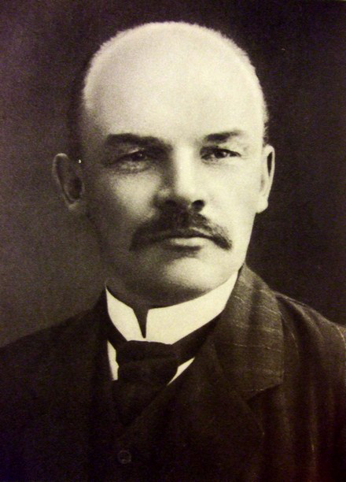
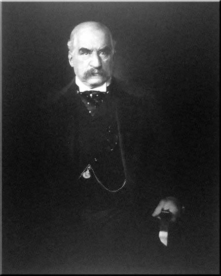
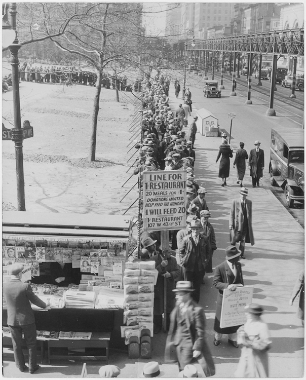

* Understand types of economic systems and their historical development
* Describe capitalism and socialism both in theory and in practice
* Discussion how functionalists, conflict theorists, and symbolic interactionists view the economy and work

<figure markdown="1" data-orient="horizontal">
<figcaption>
Vladimir Ilyich Lenin was one of the founders of Russian communism. J.P. Morgan was one of the most influential capitalists in history. They have very different views on how economies should be run. (Photos (a) and (b) courtesy of Wikimedia Commons)
</figcaption>
{:}

{:}

</figure>

The dominant economic systems of the modern era have been capitalism and socialism, and there have been many variations of each system across the globe. Countries have switched systems as their rulers and economic fortunes have changed. For example, Russia has been transitioning to a market-based economy since the fall of communism in that region of the world. Vietnam, where the economy was devastated by the Vietnam War, restructured to a state-run economy in response, and more recently has been moving toward a socialist-style market economy. In the past, other economic systems reflected the societies that formed them. Many of these earlier systems lasted centuries. These changes in economies raise many questions for sociologists. What are these older economic systems? How did they develop? Why did they fade away? What are the similarities and differences between older economic systems and modern ones?

### Economics of Agricultural, Industrial, and Postindustrial Societies

<figure markdown="1" data-orient="horizontal">
<figcaption>
In an agricultural economy, crops are the most important commodity. In a postindustrial society, the most valuable resource is information. (Photo (a) courtesy Wikimedia Commons; Photo (b) courtesy AntanaBhadraLamichhane/flickr)
</figcaption>
{:}

{:}

</figure>

Our earliest ancestors lived as hunter-gatherers. Small groups of extended families roamed from place to place looking for means to subsist. They would settle in an area for a brief time when there were abundant resources. They hunted animals for their meat and gathered wild fruits, vegetables, and cereals. They ate what they caught or gathered as soon as possible because they had no way of preserving or transporting it. Once the resources of an area ran low, the group had to move on, and everything they owned had to travel with them. Food reserves only consisted of what they could carry. Many sociologists contend that hunter-gatherers did not have a true economy because groups did not typically trade with other groups due to the scarcity of goods.

#### The Agricultural Revolution

The first true economies arrived when people started raising crops and domesticating animals. Although there is still a great deal of disagreement among archeologists as to the exact timeline, research indicates that agriculture began independently and at different times in several places around the world. The earliest agriculture was in the Fertile Crescent in the Middle East around 11,000–10,000 years ago. Next were the valleys of the Indus, Yangtze, and Yellow rivers in India and China, between 10,000 and 9,000 years ago. The people living in the highlands of New Guinea developed agriculture between 9,000 and 6,000 years ago, while people were farming in Sub-Saharan Africa between 5,000 and 4,000 years ago. Agriculture developed later in the western hemisphere, arising in what would become the eastern United States, central Mexico, and northern South America between 5,000 and 3,000 years ago (Diamond 2003).

 "){:}

Agriculture began with the simplest of technologies—for example, a pointed stick to break up the soil—but really took off when people harnessed animals to pull an even more efficient tool for the same task: a plow. With this new technology, one family could grow enough crops not only to feed themselves but others as well. Knowing there would be abundant food each year as long as crops were tended led people to abandon the nomadic life of hunter-gatherers and settle down to farm.

The improved efficiency in food production meant that not everyone had to toil all day in the fields. As agriculture grew, new jobs emerged, along with new technologies. Excess crops needed to be stored, processed, protected, and transported. Farming equipment and irrigation systems needed to be built and maintained. Wild animals needed to be domesticated and herds shepherded. Economies begin to develop because people now had goods and services to trade.

As more people specialized in nonfarming jobs, villages grew into towns and then into cities. Urban areas created the need for administrators and public servants. Disputes over ownership, payments, debts, compensation for damages, and the like led to the need for laws and courts—and the judges, clerks, lawyers, and police who administered and enforced those laws.

At first, most goods and services were traded as gifts or through bartering between small social groups (Mauss 1922). Exchanging one form of goods or services for another was known as **bartering**{: data-type="term"}. This system only works when one person happens to have something the other person needs at the same time. To solve this problem, people developed the idea of a means of exchange that could be used at any time: that is, money. **Money**{: data-type="term" #import-auto-id3078853} refers to an object that a society agrees to assign a value to so it can be exchanged for payment. In early economies, money was often objects like cowry shells, rice, barley, or even rum. Precious metals quickly became the preferred means of exchange in many cultures because of their durability and portability. The first coins were minted in Lydia in what is now Turkey around 650–600 B.C.E. (Goldsborough 2010). Early legal codes established the value of money and the rates of exchange for various commodities. They also established the rules for inheritance, fines as penalties for crimes, and how property was to be divided and taxed (Horne 1915). A symbolic interactionist would note that bartering and money are systems of symbolic exchange. Monetary objects took on a symbolic meaning, one that carries into our modern-day use of checks and debit cards.

The Lady Who Lives without Money

Imagine having no money. If you wanted some french fries, needed a new pair of shoes, or were due to get an oil change for your car, how would you get those goods and services?

This isn’t just a theoretical question. Think about it. What do those on the outskirts of society do in these situations? Think of someone escaping domestic abuse who gave up everything and has no resources. Or an immigrant who wants to build a new life but who had to leave another life behind to find that opportunity. Or a homeless person who simply wants a meal to eat.

This last example, homelessness, is what caused Heidemarie Schwermer to give up money. A divorced high school teacher in Germany, Schwermer’s life took a turn when she relocated her children to a rural town with a significant homeless population. She began to question what serves as currency in a society and decided to try something new.

Schwermer founded a business called *Gib und Nimm*—in English, “give and take.” It operated on a moneyless basis and strived to facilitate people swapping goods and services for other goods and services—no cash allowed (Schwermer 2007). What began as a short experiment has become a new way of life. Schwermer says the change has helped her focus on people’s inner value instead of their outward wealth. It has also led to two books telling her story (she’s donated all proceeds to charity) and, most importantly, a richness in her life she was unable to attain with money.

How might our three sociological perspectives view her actions? What would most interest them about her nonconventional ways? Would a functionalist consider her aberration of norms a social dysfunction that upsets the normal balance? How would a conflict theorist place her in the social hierarchy? What might a symbolic interactionist make of her choice not to use money—such an important symbol in the modern world?

What do *you* make of *Gib und Nimm*?

As city-states grew into countries and countries grew into empires, their economies grew as well. When large empires broke up, their economies broke up too. The governments of newly formed nations sought to protect and increase their markets. They financed voyages of discovery to find new markets and resources all over the world, ushering in a rapid progression of economic development.

Colonies were established to secure these markets, and wars were financed to take over territory. These ventures were funded in part by raising capital from investors who were paid back from the goods obtained. Governments and private citizens also set up large trading companies that financed their enterprises around the world by selling stocks and bonds.

Governments tried to protect their share of the markets by developing a system called mercantilism. **Mercantilism**{: data-type="term" #import-auto-id2903197} is an economic policy based on accumulating silver and gold by controlling colonial and foreign markets through taxes and other charges. The resulting restrictive practices and exacting demands included monopolies, bans on certain goods, high tariffs, and exclusivity requirements. Mercantilistic governments also promoted manufacturing and, with the ability to fund technological improvements, they helped create the equipment that led to the Industrial Revolution.

#### The Industrial Revolution

Up until the end of the 18th century, most manufacturing was done using manual labor. This changed as research led to machines that could be used to manufacture goods. A small number of innovations led to a large number of changes in the British economy. In the textile industries, the spinning of cotton, worsted yarn, and flax could be done more quickly and less expensively using new machines with names like the Spinning Jenny and the Spinning Mule (Bond 2003). Another important innovation was made in the production of iron: Coke from coal could now be used in all stages of smelting rather than charcoal from wood, dramatically lowering the cost of iron production while increasing availability (Bond 2003). James Watt ushered in what many scholars recognize as the greatest change, revolutionizing transportation and, thereby, the entire production of goods with his improved steam engine.

As people moved to cities to fill factory jobs, factory production also changed. Workers did their jobs in assembly lines and were trained to complete only one or two steps in the manufacturing process. These advances meant that more finished goods could be manufactured with more efficiency and speed than ever before.

The Industrial Revolution also changed agricultural practices. Until that time, many people practiced **subsistence farming**{: data-type="term" #import-auto-id2287445} in which they produced only enough to feed themselves and pay their taxes. New technology introduced gasoline-powered farm tools such as tractors, seed drills, threshers, and combine harvesters. Farmers were encouraged to plant large fields of a single crop to maximize profits. With improved transportation and the invention of refrigeration, produce could be shipped safely all over the world.

The Industrial Revolution modernized the world. With growing resources came growing societies and economies. Between 1800 and 2000, the world’s population grew sixfold, while per capita income saw a tenfold jump (Maddison 2003).

While many people\'s lives were improving, the Industrial Revolution also birthed many societal problems. There were inequalities in the system. Owners amassed vast fortunes while laborers, including young children, toiled for long hours in unsafe conditions. Workers’ rights, wage protection, and safe work environments are issues that arose during this period and remain concerns today.

#### Postindustrial Societies and the Information Age

Postindustrial societies, also known as information societies, have evolved in modernized nations. One of the most valuable goods of the modern era is information. Those who have the means to produce, store, and disseminate information are leaders in this type of society.

One way scholars understand the development of different types of societies (like agricultural, industrial, and postindustrial) is by examining their economies in terms of four sectors: primary, secondary, tertiary, and quaternary. Each has a different focus. The primary sector extracts and produces raw materials (like metals and crops). The secondary sector turns those raw materials into finished goods. The tertiary sector provides services: child care, health care, and money management. Finally, the quaternary sector produces ideas; these include the research that leads to new technologies, the management of information, and a society’s highest levels of education and the arts (Kenessey 1987).

In underdeveloped countries, the majority of the people work in the primary sector. As economies develop, more and more people are employed in the secondary sector. In well-developed economies, such as those in the United States, Japan, and Western Europe, the majority of the workforce is employed in service industries. In the United States, for example, almost 80 percent of the workforce is employed in the tertiary sector (U.S. Bureau of Labor Statistics 2011).

The rapid increase in computer use in all aspects of daily life is a main reason for the transition to an information economy. Fewer people are needed to work in factories because computerized robots now handle many of the tasks. Other manufacturing jobs have been outsourced to less-developed countries as a result of the developing global economy. The growth of the internet has created industries that exist almost entirely online. Within industries, technology continues to change how goods are produced. For instance, the music and film industries used to produce physical products like CDs and DVDs for distribution. Now those goods are increasingly produced digitally and streamed or downloaded at a much lower physical manufacturing cost. Information and the wherewithal to use it creatively become commodities in a postindustrial economy.

### Capitalism

 "){: #import-auto-id3630806}

Scholars don’t always agree on a single definition of capitalism. For our purposes, we will define **capitalism**{: data-type="term" #import-auto-id2692261} as an economic system in which there is private ownership (as opposed to state ownership) and where there is an impetus to produce profit, and thereby wealth. This is the type of economy in place in the United States today. Under capitalism, people invest capital (money or property invested in a business venture) in a business to produce a product or service that can be sold in a market to consumers. The investors in the company are generally entitled to a share of any profit made on sales after the costs of production and distribution are taken out. These investors often reinvest their profits to improve and expand the business or acquire new ones. To illustrate how this works, consider this example. Sarah, Antonio, and Chris each invest $250,000 into a start-up company offering an innovative baby product. When the company nets $1 million in profits its first year, a portion of that profit goes back to Sarah, Antonio, and Chris as a return on their investment. Sarah reinvests with the same company to fund the development of a second product line, Antonio uses his return to help another start-up in the technology sector, and Chris buys a small yacht for vacations. The goal for all parties is to maximize profits.

To provide their product or service, owners hire workers, to whom they pay wages. The cost of raw materials, the retail price they charge consumers, and the amount they pay in wages are determined through the law of supply and demand and by competition. When demand exceeds supply, prices tend to rise. When supply exceeds demand, prices tend to fall. When multiple businesses market similar products and services to the same buyers, there is competition. Competition can be good for consumers because it can lead to lower prices and higher quality as businesses try to get consumers to buy from them rather than from their competitors.

Wages tend to be set in a similar way. People who have talents, skills, education, or training that is in short supply and is needed by businesses tend to earn more than people without comparable skills. Competition in the workforce helps determine how much people will be paid. In times when many people are unemployed and jobs are scarce, people are often willing to accept less than they would when their services are in high demand. In this scenario, businesses are able to maintain or increase profits by not paying increasing wages.

#### Capitalism in Practice

As capitalists began to dominate the economies of many countries during the Industrial Revolution, the rapid growth of businesses and their tremendous profitability gave some owners the capital they needed to create enormous corporations that could monopolize an entire industry. Many companies controlled all aspects of the production cycle for their industry, from the raw materials to the production to the stores in which they were sold. These companies were able to use their wealth to buy out or stifle any competition.

In the United States, the predatory tactics used by these large monopolies caused the government to take action. Starting in the late 1800s, the government passed a series of laws that broke up monopolies and regulated how key industries—such as transportation, steel production, and oil and gas exploration and refining—could conduct business.

The United States is considered a capitalist country. However, the U.S. government has a great deal of influence on private companies through the laws it passes and the regulations enforced by government agencies. Through taxes, regulations on wages, guidelines to protect worker safety and the environment, plus financial rules for banks and investment firms, the government exerts a certain amount of control over how all companies do business. State and federal governments also own, operate, or control large parts of certain industries, such as the post office, schools, hospitals, highways and railroads, and many water, sewer, and power utilities. Debate over the extent to which the government should be involved in the economy remains an issue of contention today. Some criticize such involvements as socialism (a type of state-run economy), while others believe intervention is necessary to protect the rights of workers and the well-being of the general population.

### Socialism

"){: #import-auto-id3630807}

**Socialism**{: data-type="term" #import-auto-id1390802} is an economic system in which there is government ownership (often referred to as “state run”) of goods and their production, with an impetus to share work and wealth equally among the members of a society. Under socialism, everything that people produce, including services, is considered a social product. Everyone who contributes to the production of a good or to providing a service is entitled to a share in any benefits that come from its sale or use. To make sure all members of society get their fair share, government must be able to control property, production, and distribution.

The focus in socialism is on benefitting society, whereas capitalism seeks to benefit the individual. Socialists claim that a capitalistic economy leads to inequality, with unfair distribution of wealth and individuals who use their power at the expense of society. Socialism strives, ideally, to control the economy to avoid the problems inherent in capitalism.

Within socialism, there are diverging views on the extent to which the economy should be controlled. One extreme believes all but the most personal items are public property. Other socialists believe only essential services such as health care, education, and utilities (electrical power, telecommunications, and sewage) need direct control. Under this form of socialism, farms, small shops, and businesses can be privately owned but are subject to government regulation.

<figure markdown="1" id="import-auto-id2669476" data-orient="horizontal">
<figcaption>
Capitalists criticize socialism, saying equal distribution of resources is an unachievable ideal. Socialists, on the other hand, criticize the way capitalism concentrates wealth in the hands of a few at the expense of many. (Photos (a), (b) and (c) courtesy of Wikimedia Commons)
</figcaption>
{: #eip-id2624341}

{: #eip-id2324206}

{: #eip-id1828966}

</figure>

The other area on which socialists disagree is on what level society should exert its control. In communist countries like the former Soviet Union, China, Vietnam, and North Korea, the national government exerts control over the economy centrally. They had the power to tell all businesses what to produce, how much to produce, and what to charge for it. Other socialists believe control should be decentralized so it can be exerted by those most affected by the industries being controlled. An example of this would be a town collectively owning and managing the businesses on which its populace depends.

Because of challenges in their economies, several of these communist countries have moved from central planning to letting market forces help determine many production and pricing decisions. **Market socialism**{: data-type="term" #import-auto-id1497568} describes a subtype of socialism that adopts certain traits of capitalism, like allowing limited private ownership or consulting market demands. This could involve situations like profits generated by a company going directly to the employees of the company or being used as public funds (Gregory and Stuart 2003). Many Eastern European and some South American countries have mixed economies. Key industries are nationalized and directly controlled by the government; however, most businesses are privately owned and regulated by the government.

Organized socialism never became powerful in the United States. The success of labor unions and the government in securing workers’ rights, joined with the high standard of living enjoyed by most of the workforce, made socialism less appealing than the controlled capitalism practiced here.

 "){: #import-auto-id3630808}

#### Socialism in Practice

As with capitalism, the basic ideas behind socialism go far back in history. Plato, in ancient Greece, suggested a republic in which people shared their material goods. Early Christian communities believed in common ownership, as did the systems of monasteries set up by various religious orders. Many of the leaders of the French Revolution called for the abolition of all private property, not just the estates of the aristocracy they had overthrown. Thomas More\'s *Utopia*, published in 1516, imagined a society with little private property and mandatory labor on a communal farm. Most experimental utopian communities had the abolition of private property as a founding principle.

Modern socialism really began as a reaction to the excesses of uncontrolled industrial capitalism in the 1800s and 1900s. The enormous wealth and lavish lifestyles enjoyed by owners contrasted sharply with the miserable conditions of the workers.

Some of the first great sociological thinkers studied the rise of socialism. Max Weber admired some aspects of socialism, especially its rationalism and how it could help social reform, but he worried that letting the government have complete control could result in an \"iron cage of future bondage\" (Greisman and Ritzer 1981).

Pierre-Joseph Proudon (1809−1865) was another early socialist who thought socialism could be used to create utopian communities. In his 1840 book, *What Is Property?*, he famously stated that “property is theft” (Proudon 1840). By this he meant that if an owner did not work to produce or earn the property, then the owner was stealing it from those who did. Proudon believed economies could work using a principle called **mutualism**{: data-type="term" #import-auto-id2740177}, under which individuals and cooperative groups would exchange products with one another on the basis of mutually satisfactory contracts (Proudon 1840).

By far the most important influential thinker on socialism was Karl Marx. Through his own writings and those with his collaborator, industrialist Friedrich Engels, Marx used a scientific analytical process to show that throughout history the resolution of class struggles caused changes in economies. He saw the relationships evolving from slave and owner, to serf and lord, to journeyman and master, to worker and owner. Neither Marx nor Engels thought socialism could be used to set up small utopian communities. Rather, they believed a socialist society would be created after workers rebelled against capitalistic owners and seized the means of production. They felt industrial capitalism was a necessary step that raised the level of production in society to a point it could progress to a socialist state (Marx and Engels 1848). These ideas formed the basis of the sociological perspective of social conflict theory.

Obama and Socialism: A Few Definitions

In the 2008 presidential election, the Republican Party latched onto what is often considered a dirty word to describe then-Senator Barack Obama’s politics: socialist. It may have been because the president was campaigning by telling workers it’s good for everybody when wealth gets spread around. But whatever the reason, the label became a weapon of choice for Republicans during and after the campaign. In 2012, Republican presidential contender Rick Perry continued this battle cry. A *New York Times* article quotes him as telling a group of Republicans in Texas that President Obama is “hell bent on taking America towards a socialist country” (Wheaton 2011). Meanwhile, during the first few years of his presidency, Obama worked to create universal health care coverage and pushed forth a partial takeover of the nation’s failing automotive industry. So does this make him a socialist? What does that really mean, anyway?

There is more than one definition of socialism, but it generally refers to an economic or political theory that advocates for shared or governmental ownership and administration of production and distribution of goods. Often held up in counterpoint to capitalism, which encourages private ownership and production, socialism is not typically an all-or-nothing plan. For example, both the United Kingdom and France, as well as other European countries, have socialized medicine, meaning that medical services are run nationally to reach as many people as possible. These nations are, of course, still essentially capitalist countries with free-market economies.

So is Obama a socialist because he wants universal health care? Or is the word a lightning rod for conservatives who associate it with a lack of personal freedom? By almost any measure, the answer is more the latter. A look at the politics of President Obama and Democrats in general shows that there is, compared to most other free-market countries, very little limitation on private ownership and production. What this is, instead, is an attempt to ensure that the United States, like all other core nations, has a safety net for its poorest and most vulnerable. Although it might be in Perry’s best interest to label this socialism, a study of the term makes it clear that it is untrue. Voters can go to the polls confident that, whoever their choice of candidate may be, socialism is far from finding a home in the United States.

### Convergence Theory

We have seen how the economies of some capitalist countries such as the United States have features that are very similar to socialism. Some industries, particularly utilities, are either owned by the government or controlled through regulations. Public programs such as welfare, Medicare, and Social Security exist to provide public funds for private needs. We have also seen how several large communist (or formerly communist) countries such as Russia, China, and Vietnam have moved from state-controlled socialism with central planning to market socialism, which allows market forces to dictate prices and wages, and for some business to be privately owned. In many formerly communist countries, these changes have led to economic growth compared to the stagnation they experienced under communism (Fidrmuc 2002).

In studying the economies of developing countries to see if they go through the same stages as previously developed nations did, sociologists have observed a pattern they call convergence. This describes the theory that societies move toward similarity over time as their economies develop.

**Convergence theory**{: data-type="term"} explains that as a country\'s economy grows, its societal organization changes to become more like that of an industrialized society. Rather than staying in one job for a lifetime, people begin to move from job to job as conditions improve and opportunities arise. This means the workforce needs continual training and retraining. Workers move from rural areas to cities as they become centers of economic activity, and the government takes a larger role in providing expanded public services (Kerr et al. 1960).

Supporters of the theory point to Germany, France, and Japan—countries that rapidly rebuilt their economies after World War II. They point out how, in the 1960s and 1970s, East Asian countries like Singapore, South Korea, and Taiwan converged with countries with developed economies. They are now considered developed countries themselves.

 "){: #eip-id1169761189120}

The theory is also known as the *catch-up effect* because the economies of poor countries that have capital invested in them will generally grow faster than countries that are already wealthy. This allows the income of poorer countries to \"catch up\" under the right conditions (“Catch-up Effect” 2011). To experience this rapid growth, the economies of developing countries must to be able to attract inexpensive capital to invest in new businesses and to improve traditionally low productivity. They need access to new, international markets for buying the goods. If these characteristics are not in place, then their economies cannot catch up. This is why the economies of some countries are diverging rather than converging (Abramovitz 1986).

Another key characteristic of economic growth regards the implementation of technology. A developing country can bypass some steps of implementing technology that other nations faced earlier. Television and telephone systems are a good example. While developed countries spent significant time and money establishing elaborate system infrastructures based on metal wires or fiber-optic cables, developing countries today can go directly to cell phone and satellite transmission with much less investment.

Another factor affects convergence concerning social structure. Early in their development, countries such as Brazil and Cuba had economies based on cash crops (coffee or sugarcane, for instance) grown on large plantations by unskilled workers. The elite ran the plantations and the government, with little interest in training and educating the populace for other endeavors. This retarded economic growth until the power of the wealthy plantation owners was challenged (Sokoloff and Engerman 2000). Improved economies generally lead to wider social improvement. Society benefits from improved educational systems, allowing people more time to devote to learning and leisure.

### Theoretical Perspectives on the Economy

Now that we’ve developed an understanding of the history and basic components of economies, let’s turn to theory. How might social scientists study these topics? What questions do they ask? What theories do they develop to add to the body of sociological knowledge?

#### Functionalist Perspective

Someone taking a functional perspective will most likely view work and the economy as a well-oiled machine, designed for maximum efficiency. The Davis-Moore thesis, for example, suggests that some social stratification is a social necessity. The need for certain highly skilled positions combined with the relative difficulty of the occupation and the length of time it takes to qualify will result in a higher reward for that job, providing a financial motivation to engage in more education and a more difficult profession (Davis and Moore 1945). This theory can be used to explain the prestige and salaries that go to those with doctorates or medical degrees.

Like any theory, this is subject to criticism. For example, the thesis fails to take into account the many people who spend years on their education only to pursue work at a lower-paying position in a nonprofit organization, or who teach high school after pursuing a PhD. It also fails to acknowledge the effect of life changes and social networks on individual opportunities.

The functionalist perspective would assume that the continued health of the economy is vital to the health of the nation, as it ensures the distribution of goods and services. For example, we need food to travel from farms (high-functioning and efficient agricultural systems) via roads (safe and effective trucking and rail routes) to urban centers (high-density areas where workers can gather). However, sometimes a dysfunction––a function with the potential to disrupt social institutions or organization (Merton 1968)––in the economy occurs, usually because some institutions fail to adapt quickly enough to changing social conditions. This lesson has been driven home recently with the bursting of the housing bubble. Due to irresponsible lending practices and an underregulated financial market, we are currently living with the after-effects of a major dysfunction.

Some of this is cyclical. Markets produce goods as they are supposed to, but eventually the market is saturated and the supply of goods exceeds the demands. Typically the market goes through phases of surplus, or excess, inflation, where the money in your pocket today buys less than it did yesterday, and **recession**{: data-type="term"}, which occurs when there are two or more consecutive quarters of economic decline. The functionalist would say to let market forces fluctuate in a cycle through these stages. In reality, to control the risk of an economic **depression**{: data-type="term"} (a sustained recession across several economic sectors), the U.S. government will often adjust interest rates to encourage more spending. In short, letting the natural cycle fluctuate is not a gamble most governments are willing to take.

#### Conflict Perspective

For a conflict perspective theorist, the economy is not a source of stability for society. Instead, the economy reflects and reproduces economic inequality, particularly in a capitalist marketplace. The conflict perspective is classically Marxist, with the bourgeoisie (ruling class) accumulating wealth and power by exploiting the proletariat (workers), and regulating those who cannot work (the aged, the infirm) into the great mass of unemployed (Marx and Engels 1848). From the symbolic (though probably made up) statement of Marie Antoinette, who purportedly said “Let them eat cake” when told that the peasants were starving, to the Occupy Wall Street movement, the sense of inequity is almost unchanged. Both the people fighting in the French Revolution and those blogging from Zuccotti Park believe the same thing: wealth is concentrated in the hands of those who do not deserve it. As of 2007, 20 percent of Americans owned 80 percent of U.S. wealth (Domhoff 2011). While the inequality might not be as extreme as in pre-revolutionary France, it is enough to make many believe that the United States is not the meritocracy it seems to be.

#### Symbolic Interactionist Perspective

Those working in the symbolic interaction perspective take a microanalytical view of society, focusing on the way reality is socially constructed through day-to-day interaction and how society is composed of people communicating based on a shared understanding of symbols.

One important symbolic interactionist concept related to work and the economy is **career inheritance**{: data-type="term"}. This concept means simply that children tend to enter the same or similar occupation as their parents, a correlation that has been demonstrated in research studies (Antony 1998). For example, the children of police officers learn the norms and values that will help them succeed in law enforcement, and since they have a model career path to follow, they may find law enforcement even more attractive. Related to career inheritance is career socialization, learning the norms and values of a particular job.

Finally, a symbolic interactionist might study what contributes to job satisfaction. Melving Kohn and his fellow researchers (1990) determined that workers were most likely to be happy when they believed they controlled some part of their work, when they felt they were part of the decision-making processes associated with their work, when they have freedom from surveillance, and when they felt integral to the outcome of their work. Sunyal, Sunyal, and Yasin (2011) found that a greater sense of vulnerability to stress, the more stress experienced by a worker, and a greater amount of perceived risk consistently predicted a lower worker job satisfaction.

### Summary

Economy refers to the social institution through which a society’s resources (goods and services) are managed. The Agricultural Revolution led to development of the first economies that were based on trading goods. Mechanization of the manufacturing process led to the Industrial Revolution and gave rise to two major competing economic systems. Under capitalism, private owners invest their capital and that of others to produce goods and services they can sell in an open market. Prices and wages are set by supply and demand and competition. Under socialism, the means of production is commonly owned, and the economy is controlled centrally by government. Several countries’ economies exhibit a mix of both systems. Convergence theory seeks to explain the correlation between a country’s level of development and changes in its economic structure.

### Section Quiz

Which of these is an example of a commodity?

1.  Cooking
2.  Corn
3.  Teaching
4.  Writing
{: data-number-style="lower-alpha"}

Answer

B

When did the first economies begin to develop?

1.  When all of the hunter-gatherers died
2.  When money was invented
3.  When people began to grow crops and domesticate animals
4.  When the first cities were built
{: data-number-style="lower-alpha"}

Answer

C

What is the most important commodity in a postindustrial society?

1.  Electricity
2.  Money
3.  Information
4.  Computers
{: data-number-style="lower-alpha"}

Answer

C

In which sector of an economy would someone working as a software developer be?

1.  Primary
2.  Secondary
3.  Tertiary
4.  Quaternary
{: data-number-style="lower-alpha"}

Answer

D

Which is an economic policy based on national policies of accumulating silver and gold by controlling markets with colonies and other countries through taxes and customs charges?

1.  Capitalism
2.  Communism
3.  Mercantilism
4.  Mutualism
{: data-number-style="lower-alpha"}

Answer

C

Who was the leading theorist on the development of socialism?

1.  Karl Marx
2.  Alex Inkeles
3.  Emile Durkheim
4.  Adam Smith
{: data-number-style="lower-alpha"}

Answer

A

The type of socialism now carried on by Russia is a form of \_\_\_\_\_\_ socialism.

1.  centrally planned
2.  market
3.  utopian
4.  zero-sum
{: data-number-style="lower-alpha"}

Answer

B

Among the reasons socialism never developed into a political movement in the United States was that trade unions \_\_\_\_\_\_\_\_\_.

1.  secured workers’ rights
2.  guaranteed health care
3.  broke up monopolies
4.  diversified the workforce
{: data-number-style="lower-alpha"}

Answer

A

Which country serves as an example of convergence?

1.  Singapore
2.  North Korea
3.  England
4.  Canada
{: data-number-style="lower-alpha"}

Answer

A

### Short Answer

Explain the difference between state socialism with central planning and market socialism.

In what ways can capitalistic and socialistic economies converge?

Describe the impact a rapidly growing economy can have on families.

How do you think the United States economy will change as we move closer to a technology-driven service economy?

### Further Research

Green jobs have the potential to improve not only your prospects of getting a good job, but the environment as well. To learn more about the green revolution in jobs go to [http://openstaxcollege.org/l/greenjobs][1]

One alternative to traditional capitalism is to have the workers own the company for which they work. To learn more about company-owned businesses check out: [http://openstaxcollege.org/l/company-owned][2]

### References

Abramovitz, Moses. 1986. “Catching Up, Forging Ahead and Falling Behind.” *Journal of Economic History* 46(2):385–406. Retrieved February 6, 2012 ([http://www.jstor.org/pss/2122171][3]).

Antony, James. 1998. “Exploring the Factors that Influence Men and Women to Form Medical Career Aspirations.” *Journal of College Student Development* 39:417–426.

Bond, Eric, Sheena Gingerich, Oliver Archer-Antonsen, Liam Purcell, and Elizabeth Macklem. 2003. *The Industrial Revolution—Innovations*. Retrieved February 6, 2012 ([http://industrialrevolution.sea.ca/innovations.html][4]).

“Catch-up Effect.” 2011. *The Economist*. Retrieved February 5, 2012 ([http://www.economist.com/economics-a-to-z/c#node-21529531][5]).

Davis, Kingsley and Wilbert Moore. 1945. “Some Principles of Stratification.” *American Sociological Review* 10:242–249.

Diamond, J. and P. Bellwood. 2003. “Farmers and Their Languages: The First Expansions.” *Science* April 25, pp. 597-603.

Domhoff, G. William. 2011. “Wealth Income and Power.” Who Rules America. Retrieved January 25, 2012 ([http://www2.ucsc.edu/whorulesamerica/power/wealth.html][6]).

Fidrmuc, Jan. 2002. “Economic Reform, Democracy and Growth During Post-Communist Transition.” *European Journal of Political Economy* 19(30):583–604. Retrieved February 6, 2012 ([http://siteresources.worldbank.org/INTDECINEQ/Resources/fidrmuc.pdf][7]).

Goldsborough, Reid. 2010. \"World\'s First Coin.\" Retrieved February 6, 2012 ([http://rg.ancients.info/lion/article.html][8]).

Gregory, Paul R. and Robert C. Stuart. 2003. *Comparing Economic Systems in the Twenty-First Century*. Boston, MA: South-Western College Publishing.

Greisman, Harvey C. and George Ritzer. 1981 “Max Weber ,Critical Theory, and the Administered World.” *Qualitative Sociology* 4(1):34–55. Retrieved February 6, 2012 ([http://www.springerlink.com/content/k14085t403m33701/][9]).

Horne, Charles F. 1915. *The Code of Hammurabi : Introduction*.Yale University. Retrieved ([http://avalon.law.yale.edu/subject\\\_menus/hammenu.asp][10]).

Kenessey, Zoltan. 1987. “The Primary, Secondary, Tertiary and Quaternary Sectors of the Economy.” *The Review of Income and Wealth* 33(4):359–386.

Kerr, Clark, John T. Dunlap, Frederick H. Harbison, and Charles A. Myers. 1960. *Industrialism and Industrial Man*. Cambridge, MA: Harvard University Press.

Kohn, Melvin, Atsushi Naoi, Carrie Schoenbach, Carmi Schooler, and Kazimierz Slomczynski. 1990. “Position in the Class Structure and Psychological Functioning in the United States, Japan, and Poland.” *American Journal of Sociology* 95:964–1008.

Maddison, Angus. 2003. *The World Economy: Historical Statistics*. Paris: Development Centre, OECD. Retrieved February 6, 2012 ([http://www.theworldeconomy.org/][11]).

Marx, Karl and Friedrich Engels.1998 \[1848\]. *The Communist Manifesto*. New York: Penguin.

Marx, Karl and Friedrich Engels. 1988 \[1844\]. *Economic and Philosophic Manuscripts of 1844 and the Communist Manifesto*, translated by M. Milligan. New York: Prometheus Books.

Mauss, Marcel. 1990 \[1922\]. *The Gift: The Form and Reason for Exchange in Archaic Societies*, London: Routledge.

Merton, Robert. 1968. Social Theory and Social Structure. New York: Free Press.

Proudhon, Pierre-Joseph. 2010 \[1840\]. *Property Is Theft! A Pierre-Joseph Proudhon Anthology*. Iain McKay Ed. Retrieved February 15, 2012 ([http://anarchism.pageabode.com/pjproudhon/property-is-theft][12]).

Schwermer, Heidemarie. 2007. “Gib und Nimm.” Retrieved January 22, 2012 ([http://www.heidemarieschwermer.com/][13]).

Schwermer, Heidemarie. 2011. Living Without Money. Retrieved January 22, 2012 ([http://www.livingwithoutmoney.org][14]).

Sokoloff, Kenneth L. and Stanley L. Engerman. 2000. “History Lessons: Institutions, Factor Endowments, and Paths of Development in the New World.” *Journal of Economic Perspectives* 14(3)3:217–232.

Sunyal, Ayda, Onur Sunyal and Fatma Yasin. 2011. “A Comparison of Workers Employed in Hazardous Jobs in Terms of Job Satisfaction, Perceived Job Risk and Stress: Turkish Jean Sandblasting Workers, Dock Workers, Factory Workers and Miners.” *Social Indicators Research* 102:265–273.

U.S. Bureau of Labor Statistics. 2011. “Employment by Major Industry Sector.” Retrieved February 6, 2012 ([http://www.bls.gov/emp/ep\\\_table\\\_201.htm][15]).

### Glossary
{: data-type="glossary-title"}

bartering
: when people exchange one form of goods or services for another
{: #import-auto-id1395681}

capitalism
: an economic system in which there is private ownership (as opposed to state ownership) and where there is an impetus to produce profit, and thereby wealth
{: #import-auto-id3112614}

career inheritance
: when children tend to enter the same or similar occupation as their parents
{: #import-auto-id2735781}

convergence theory
: a sociological theory to explain how and why societies move toward similarity over time as their economies develop
{: #import-auto-id2686572}

depression
: a sustained recession across several economic sectors
{: #import-auto-id1861136}

market socialism
: a subtype of socialism that adopts certain traits of capitalism, like allowing limited private ownership or consulting market demand
{: #import-auto-id2631380}

mercantilism
: an economic policy based on national policies of accumulating silver and gold by controlling markets with colonies and other countries through taxes and customs charges
{: #import-auto-id3631297}

money
: an object that a society agrees to assign a value to so it can be exchanged as payment
{: #import-auto-id1653247}

mutualism
: a form of socialism under which individuals and cooperative groups exchange products with one another on the basis of mutually satisfactory contracts
{: #import-auto-id2733008}

recession
: when there are two or more consecutive quarters of economic decline
{: #import-auto-id1059307}

socialism
: an economic system in which there is government ownership (often referred to as “state run”) of goods and their production, with an impetus to share work and wealth equally among the members of a society
{: #import-auto-id1377233}

subsistence farming
: when farmers grow only enough to feed themselves and their families
{: #import-auto-id2827184}

[1]: http://openstaxcollege.org/l/greenjobs
[2]: http://openstaxcollege.org/l/company-owned
[3]: http://www.jstor.org/pss/2122171
[4]: http://industrialrevolution.sea.ca/innovations.html
[5]: http://www.economist.com/economics-a-to-z/c#node-21529531
[6]: http://www2.ucsc.edu/whorulesamerica/power/wealth.html
[7]: http://siteresources.worldbank.org/INTDECINEQ/Resources/fidrmuc.pdf
[8]: http://rg.ancients.info/lion/article.html
[9]: http://www.springerlink.com/content/k14085t403m33701/
[10]: http://avalon.law.yale.edu/subject_menus/hammenu.asp
[11]: http://www.theworldeconomy.org/
[12]: http://anarchism.pageabode.com/pjproudhon/property-is-theft
[13]: http://www.heidemarieschwermer.com/
[14]: http://www.livingwithoutmoney.org
[15]: http://www.bls.gov/emp/ep_table_201.htm
