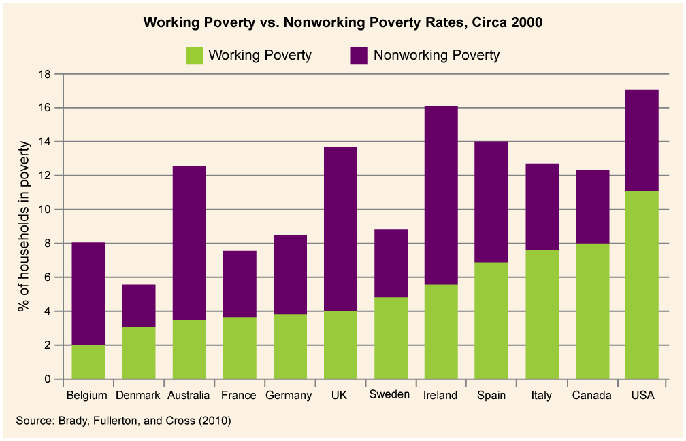

* Describe the current United States\' workforce and the trend of polarization
* Explain how women and immigrants have impacted the modern American workforce
* Understand the basic elements of poverty in the US today

 "){: #import-auto-id1215711 data-media-type="image/jpg"}

The American Dream has always been based on opportunity. There is a great deal of mythologizing about the energetic upstart who can climb to success based on hard work alone. Common wisdom states that if you study hard, develop good work habits, and graduate high school or, even better, college, then you\'ll have the opportunity to land a good job. That has long been seen as the key to a successful life. And although the reality has always been more complex than suggested by the myth, the worldwide recession that began in 2008 has made it harder than ever to play by the rules and win the game. The data are grim: From December 2007 through March 2010, 8.2 million workers in the United States lost their jobs, and the unemployment rate grew to almost 10 percent nationally, with some states showing much higher rates (Autor 2010). Times are very challenging for those in the workforce. For those looking to finish their schooling, often with enormous student-debt burdens, it is not just challenging—it is terrifying.

So where did all the jobs go? Will any of them be coming back, and if not, what new ones will there be? How do you find and keep a good job now? These are the kinds of questions people are currently asking about the job market in the United States.

Real Money, Virtual Worlds

"){: #import-auto-id820582 data-media-type="image/jpg"}

If you are not one of the tens of millions gamers who enjoy World of Warcraft or other online virtual world games, you might not even know what MMORPG stands for. But if you made a living playing MMORPGs, as a growing number of enterprising gamers do, then massive multiplayer online role-playing games might matter a bit more. According to an article in *Forbes* magazine, the online world of gaming has been yielding very real profits for entrepreneurs who are able to buy, sell, and manage online real estate, currency, and more for cash (Holland and Ewalt 2006). If it seems strange that people would pay real money for imaginary goods, consider that for serious gamers the online world is of equal importance to the real one.

These entrepreneurs can sell items because the gaming sites have introduced scarcity into the virtual worlds. The game makers have realized that MMORPGs lack tension without a level of scarcity for needed resources or highly desired items. In other words, if anyone can have a palace or a vault full of wealth, then what’s the fun?

So how does it work? One of the easiest ways to make such a living is called gold farming, which involves hours of repetitive and boring play, hunting and shooting animals like dragons that carry a lot of wealth. This virtual wealth can be sold on eBay for real money: a timesaver for players who don’t want to waste their playing time on boring pursuits. Players in parts of Asia engage in gold farming, playing eight hours a day or more, to sell their gold to players in Western Europe or North America. From virtual prostitutes to power levelers (people who play the game logged in as you so your characters get the wealth and power), to architects, merchants, and even beggars, online players can offer to sell any service or product that others want to buy. Whether buying a magic carpet in World of Warcraft or a stainless-steel kitchen appliance in Second Life, gamers have the same desire to acquire as the rest of us—never mind that their items are virtual. Once a gamer creates the code for an item, she can sell it again and again, for real money. And finally, you can sell yourself. According to *Forbes*, a University of Virginia computer science student sold his World of Warcraft character on eBay for $1,200, due to the high levels of powers and skills it had gained (Holland and Ewalt 2006).

So should you quit your day job to make a killing in online games? Probably not. Those who work hard might eke out a decent living, but for most people, grabbing up land that doesn’t really exist or selling your body in animated action scenes is probably not the best opportunity. Still, for some, it offers the ultimate in work-from-home flexibility, even if that home is a mountain cave in a virtual world.

# Polarization in the Workforce

The mix of jobs available in the United States began changing many years before the recession struck, and, as mentioned above, the American dream has not always been easy to follow. Geography, race, gender, and other factors have always played a role in the reality of success. More recently, the increased **outsourcing**{: data-type="term" #import-auto-id2266107} (or contracting a job or set of jobs to an outside source) of manufacturing jobs to developing nations has greatly diminished the number of high-paying, often unionized, blue-collar positions available. A similar problem has arisen in the white-collar sector, with many low-level clerical and support positions also being outsourced, as evidenced by the international technical-support call centers in Mumbai, India, and Newfoundland, Canada. The number of supervisory and managerial positions has been reduced as companies streamline their command structures and industries continue to consolidate through mergers. Even highly educated skilled workers such as computer programmers have seen their jobs vanish overseas.

The **automation**{: data-type="term" #import-auto-id600990} (replacing workers with technology) of the workplace is another cause of the changes in the job market. Computers can be programmed to do many routine tasks faster and less expensively than people who used to do such tasks. Jobs like bookkeeping, clerical work, and repetitive tasks on production assembly lines all lend themselves to automation. Think about the newer automated toll passes we can install in our cars. Toll collectors are just one of the many endangered jobs that will soon cease to exist.

Despite all this, the job market is actually growing in some areas, but in a very polarized fashion. **Polarization**{: data-type="term" #import-auto-id1587650} means that a gap has developed in the job market, with most employment opportunities at the lowest and highest levels and few jobs for those with midlevel skills and education. At one end, there has been strong demand for low-skilled, low-paying jobs in industries like food service and retail. On the other end, some research shows that in certain fields there has been a steadily increasing demand for highly skilled and educated professionals, technologists, and managers. These high-skilled positions also tend to be highly paid (Autor 2010).

The fact that some positions are highly paid while others are not is an example of the class system, an economic hierarchy in which movement (both upward and downward) between various rungs of the socioeconomic ladder is possible. Theoretically, at least, the class system as it is organized in the United States is an example of a meritocracy, an economic system that rewards merit––typically in the form of skill and hard work––with upward mobility. A theorist working in the functionalist perspective might point out that this system is designed to reward hard work, which encourages people to strive for excellence in pursuit of reward. A theorist working in the conflict perspective might counter with the thought that hard work does not guarantee success even in a meritocracy, because social capital––the accumulation of a network of social relationships and knowledge that will provide a platform from which to achieve financial success––in the form of connections or higher education are often required to access the high-paying jobs. Increasingly, we are realizing intelligence and hard work aren’t enough. If you lack knowledge of how to leverage the right names, connections, and players, you are unlikely to experience upward mobility.

With so many jobs being outsourced or eliminated by automation, what kind of jobs are there a demand for in the United States? While fishing and forestry jobs are in decline, in several markets jobs are increasing. These include community and social service, personal care and service, finance, computer and information services, and health care. The chart below, from the U.S. Bureau of Labor Statistics, illustrates areas of projected growth.

"){: #import-auto-id1522204 data-media-type="image/jpg"}

The professional and related jobs, which include any number of positions, typically require significant education and training and tend to be lucrative career choices. Service jobs, according to the Bureau of Labor Statistics, can include everything from jobs with the fire department to jobs scooping ice cream (Bureau of Labor Statistics 2010). There is a wide variety of training needed, and therefore an equally large wage potential discrepancy. One of the largest areas of growth by industry, rather than by occupational group (as seen above), is in the health field. This growth is across occupations, from associate-level nurse’s aides to management-level assisted-living staff. As baby boomers age, they are living longer than any generation before, and the growth of this population segment requires an increase in capacity throughout our country’s elder care system, from home health care nursing to geriatric nutrition.

Notably, jobs in farming are in decline. This is an area where those with less education traditionally could be assured of finding steady, if low-wage, work. With these jobs disappearing, more and more workers will find themselves untrained for the types of employment that are available.

Another projected trend in employment relates to the level of education and training required to gain and keep a job. As the chart below shows us, growth rates are higher for those with more education. Those with a professional degree or a master’s degree may expect job growth of 20 and 22 percent respectively, and jobs that require a bachelor’s degree are projected to grow 17 percent. At the other end of the spectrum, jobs that require a high school diploma or equivalent are projected to grow at only 12 percent, while jobs that require less than a high school diploma will grow 14 percent. Quite simply, without a degree, it will be more difficult to find a job. It is worth noting that these projections are based on overall growth across all occupation categories, so obviously there will be variations within different occupational areas. However, once again, those who are the least educated will be the ones least able to fulfill the American Dream.

. (Graph courtesy of the Bureau of Labor Statistics Occupational Outlook Handbook)"){: #import-auto-id820181 data-media-type="image/jpg"}

In the past, rising education levels in the United States had been able to keep pace with the rise in the number of education-dependent jobs. However, since the late 1970s, men have been enrolling in college at a lower rate than women, and graduating at a rate of almost 10 percent less. The lack of male candidates reaching the education levels needed for skilled positions has opened opportunities for women, minorities, and immigrants (Wang 2011).

# Women in the Workforce

Women have been entering the workforce in ever-increasing numbers for several decades. They have also been finishing college and going on to earn higher degrees at higher rate than men do. This has resulted in many women being better positioned to obtain high-paying, high-skill jobs (Autor 2010).

While women are getting more and better jobs and their wages are rising more quickly than men\'s wages are, U.S. Census statistics show that they are still earning only 77 percent of what men are for the same positions (U.S. Census Bureau 2010).

# Immigration and the Workforce

Simply put, people will move from where there are few or no jobs to places where there are jobs, unless something prevents them from doing so. The process of moving to a country is called immigration. Due to its reputation as the land of opportunity, the United States has long been the destination of all skill levels of workers. While the rate decreased somewhat during the economic slowdown of 2008, immigrants, both legal and illegal, continue to be a major part of the U.S. workforce.

In 2005, before the recession arrived, immigrants made up a historic high of 14.7 percent of the workforce (Lowell et al. 2006). During the 1970s through 2000s, the United States experienced both an increase in college-educated immigrants and in immigrants who lacked a high school diploma. With this range across the spectrum, immigrants are well positioned for both the higher-paid jobs and the low-wage low-skill jobs that are predicted to grow in the next decade (Lowell et al. 2006). In the early 2000s, it certainly seemed that the United States was continuing to live up to its reputation of opportunity. But what about during the recession of 2008, when so many jobs were lost and unemployment hovered close to 10 percent? How did immigrant workers fare then?

The answer is that as of June 2009, when the National Bureau of Economic Research (NEBR) declared the recession officially over, “foreign-born workers gained 656,000 jobs while native-born workers lost 1.2 million jobs” (Kochhar 2010). As these numbers suggest, the unemployment rate that year decreased for immigrant workers and increased for native workers. The reasons for this trend are not entirely clear. Some Pew research suggests immigrants tend to have greater flexibility to move from job to job and that the immigrant population may have been early victims of the recession, and thus were quicker to rebound (Kochhar 2010). Regardless of the reasons, the 2009 job gains are far from enough to keep them inured from the country’s economic woes. Immigrant earnings are in decline, even as the number of jobs increases, and some theorize that increase in employment may come from a willingness to accept significantly lower wages and benefits.

While the political debate is often fueled by conversations about low-wage-earning immigrants, there are actually as many highly skilled––and high-earning––immigrant workers as well. Many immigrants are sponsored by their employers who claim they possess talents, education, and training that are in short supply in the U.S. These sponsored immigrants account for 15 percent of all legal immigrants (Batalova and Terrazas 2010). Interestingly, the U.S. population generally supports these high-level workers, believing they will help lead to economic growth and not be a drain on government services (Hainmueller and Hiscox 2010). On the other hand, illegal immigrants tend to be trapped in extremely low-paying jobs in agriculture, service, and construction with few ways to improve their situation without risking exposure and deportation.

# Poverty in the United States   {#eip-id1286030}

When people lose their jobs during a recession or in a changing job market, it takes longer to find a new one, if they can find one at all. If they do, it is often at a much lower wage or not full time. This can force people into poverty. In the United States, we tend to have what is called relative poverty, defined as being unable to live the lifestyle of the average person in your country. This must be contrasted with the absolute poverty that can be found in underdeveloped countries, defined as being barely able, or unable, to afford basic necessities such as food (Byrns 2011).

We cannot even rely on unemployment statistics to provide a clear picture of total unemployment in the United States. First, unemployment statistics do not take into account **underemployment**{: data-type="term" #import-auto-id1662724}, a state in which a person accepts a lower paying, lower status job than their education and experience qualifies them to perform. Second, unemployment statistics only count those:

1.  who are actively looking for work
2.  who have not earned income from a job in the past four weeks
3.  who are ready, willing, and able to work

The unemployment statistics provided by the U.S. government are rarely accurate, because many of the unemployed become discouraged and stop looking for work. Not only that, but these statistics undercount the youngest and oldest workers, the chronically unemployed (e.g., homeless), and seasonal and migrant workers.

A certain amount of unemployment is a direct result of the relative inflexibility of the labor market, considered **structural unemployment**{: data-type="term"}, which describes when there is a societal level of disjuncture between people seeking jobs and the available jobs. This mismatch can be geographic (they are hiring in California, but most unemployed live in Alabama), technological (skilled workers are replaced by machines, as in the auto industry), or can result from any sudden change in the types of jobs people are seeking versus the types of companies that are hiring.

Because of the high standard of living in the United States, many people are working at full-time jobs but are still poor by the standards of relative poverty. They are the working poor. The United States has a higher percentage of working poor than many other developed countries (Brady, Fullerton and Cross 2010). In terms of employment, the Bureau of Labor Statistics defines the working poor as those who have spent at least 27 weeks working or looking for work, and yet remain below the poverty line. Many of the facts about the working poor are as expected: Those who work only part time are more likely to be classified as working poor than those with full-time employment; higher levels of education lead to less likelihood of being among the working poor; and those with children under 18 are four times more likely than those without children to fall into this category. In 2009, the working poor included 10.4 million Americans, up almost 17 percent from 2008 (U.S. Bureau of Labor Statistics 2011).

 {: #import-auto-id2627522 data-media-type="image/jpg"}

"){: #import-auto-id1308908 data-media-type="image/jpg" data-title="Poverty Rates by Age: 1959 to 2010 "}

Most developed countries such as the United States protect their citizens from absolute poverty by providing different levels of social services such as unemployment insurance, welfare, food stamps, and so on. They may also provide job training and retraining so that people can reenter the job market. In the past, the elderly were particularly vulnerable to falling into poverty after they stopped working; however, pensions, retirement plans, and Social Security were designed to help prevent this. A major concern in the United States is the rising number of young people growing up in poverty. Growing up poor can cut off access to the education and services people need to move out of poverty and into stable employment. As we saw, more education was often a key to stability, and those raised in poverty are the ones least able to find well-paying work, perpetuating a cycle.

There is great debate about how much support local, state, and federal governments should give to help the unemployed and underemployed. The decisions made on these issues will have a profound effect on working in the United States.

# Summary

The job market in the United States is meant to be a meritocracy that creates social stratifications based on individual achievement. Economic forces, such as outsourcing and automation, are polarizing the workforce, with most job opportunities being either low-level, low-paying manual jobs or high-level, high-paying jobs based on abstract skills. Women\'s role in the workforce has increased, although they have not yet achieved full equality. Immigrants play an important role in the U.S. labor market. The changing economy has forced more people into poverty even if they are working. Welfare, Social Security, and other social programs exist to protect people from the worst effects of poverty.

# Section Quiz

Which is evidence that the United States workforce is largely a meritocracy?

1.  Job opportunities are increasing for highly skilled jobs.
2.  Job opportunities are decreasing for midlevel jobs.
3.  Highly skilled jobs pay better than low-skill jobs.
4.  Women tend to make less than men do for the same job.
{: data-number-style="lower-alpha"}

Answer

C

If someone does not earn enough money to pay for the essentials of life he or she is said to be \_\_\_\_\_ poor.

1.  absolutely
2.  essentially
3.  really
4.  working
{: data-number-style="lower-alpha"}

Answer

A

About what percentage of the workforce in the United States are legal immigrants?

1.  Less than 1%
2.  1%
3.  16%
4.  66%
{: data-number-style="lower-alpha"}

Answer

C

# Short Answer

As polarization occurs in the U.S. job market, this will affect other social institutions. For example, if midlevel education won’t lead to employment, we could see polarization in educational levels as well. Use the sociological imagination to consider what social institutions may be impacted, and how.

Do you believe we have a true meritocracy in the United States? Why or why not?

# Further Research

The role of women in the workplace is constantly changing. To learn more check out [http://openstaxcollege.org/l/women\\\_workplace][1]

The Employment Projections Program of the U.S. Bureau of Labor Statistics looks at a 10-year projection for jobs and employment. To see some trends for the next decade check out [http://openstaxcollege.org/l/BLS][2]

# References

Autor, David. 2010. “The Polarization of Job Opportunities in the U.S. Labor Market Implications for Employment and Earnings.” MIT Department of Economics and National Bureau of Economic Research, April. Retrieved February 15, 2012 ([http://econ-www.mit.edu/files/5554][3]).

Batalova, Jeanne, and Aaron Terrazas. 2010. “Frequently Requested Statistics on Immigrants and Immigration in the United States.” Migration Policy Institute. Retrieved February 6, 2012 ([http://www.migrationinformation.org/USfocus/display.cfm?id=818][4]).

Brady, David, Andrew Fullerton, and Jennifer Moren Cross. 2010. “More Than Just Nickels and Dimes: A Cross-National Analysis of Working Poverty in Affluent Democracies.” *Social Problems* 57:559–585. Retrieved February 15, 2012 ([http://www.soc.duke.edu/~brady/web/Bradyetal2010.pdf][5]).

Hainmueller, Jens, and Michael J. Hiscox. 2010. “Attitudes Toward Highly Skilled and Low-Skilled Immigration: Evidence from a Survey Experiment.” *American Political Science Review* 104:61–84.

Holland, Laurence H.M. and David M. Ewalt. 2006. “Making Real Money in Virtual Worlds,” *Forbes*, August 7. Retrieved January 30, 2012 ([http://www.forbes.com/2006/08/07/virtual-world-jobs\\\_cx\\\_de\\\_0807virtualjobs.html][6]).

Kochhar, Rokesh. 2010. “After the Great Recession: Foreign Born Gain Jobs; Native Born Lose Jobs.” Pew Hispanic Center, October 29. Retrieved January 29, 2012 ([http://pewresearch.org/pubs/1784/great-recession-foreign-born-gain-jobs-native-born-lose-jobs][7]).

Lowell, Lindsay B., Julia Gelatt, and Jeanne Batalova. 2006. “Immigrants and Labor Force Trends: the Future, Past, and Present.” *Migration Policy Institute Insight* No. 17. Retrieved February 6, 2012 ([http://www.migrationpolicy.org/ITFIAF/TF17\\\_Lowell.pdf][8]).

U.S. Bureau of Labor Statistics. 2010. *Occupational Outlook Handbook*, 2006–2007 ed. Retrieved from February 15, 2012 ([www.bls.gov/oco](www.bls.gov/oco)).

U.S. Bureau of Labor Statistics. 2010. “Overview of the 2008-2018 Projections.” *Occupational Outlook Handbook*, 2010–2011 ed. Retrieved February 15, 2012 ([http://www.bls.gov/oco/oco2003.htm#industry][9]).

U.S. Bureau of Labor Statistics. 2011. “A Profile of the Working Poor, 2009.” Retrieved January 25, 2012 ([www.bls.gov/cps/cpswp2009.pdf](www.bls.gov/cps/cpswp2009.pdf)).

U.S. Census Bureau. 2010. “Income, Poverty, and Health Insurance Coverage in the United States.” Retrieved February 15, 2012 ([http://www.census.gov/prod/2011pubs/p60-239.pdf][10]).

Wang, Wendy and Kim Parker. 2011. “Women See Value and Benefit of College; Men Lag Behind on Both Fronts.” Pew Social and Demographic Trends, August 17. Retrieved January 30, 2012 ([http://www.pewsocialtrends.org/2011/08/17/women-see-value-and-benefits-of-college-men-lag-on-both-fronts-survey-finds/5/#iv-by-the-numbers-gender-race-and-education][11]).

Wheaton, Sarah. 2011. “Perry Repeats Socialist Charge Against Obama Policies.” *New York Times*, September 15. Retrieved January 30, 2012 ([http://thecaucus.blogs.nytimes.com/2011/09/15/perry-repeats-socialist-charge-against-obama-policies][12]).

[1]: http://openstaxcollege.org/l/women_workplace
[2]: http://openstaxcollege.org/l/BLS
[3]: http://econ-www.mit.edu/files/5554
[4]: http://www.migrationinformation.org/USfocus/display.cfm?id=818
[5]: http://www.soc.duke.edu/~brady/web/Bradyetal2010.pdf
[6]: http://www.forbes.com/2006/08/07/virtual-world-jobs_cx_de_0807virtualjobs.html
[7]: http://pewresearch.org/pubs/1784/great-recession-foreign-born-gain-jobs-native-born-lose-jobs
[8]: http://www.migrationpolicy.org/ITFIAF/TF17_Lowell.pdf
[9]: http://www.bls.gov/oco/oco2003.htm#industry
[10]: http://www.census.gov/prod/2011pubs/p60-239.pdf
[11]: http://www.pewsocialtrends.org/2011/08/17/women-see-value-and-benefits-of-college-men-lag-on-both-fronts-survey-finds/5/#iv-by-the-numbers-gender-race-and-education
[12]: http://thecaucus.blogs.nytimes.com/2011/09/15/perry-repeats-socialist-charge-against-obama-policies
