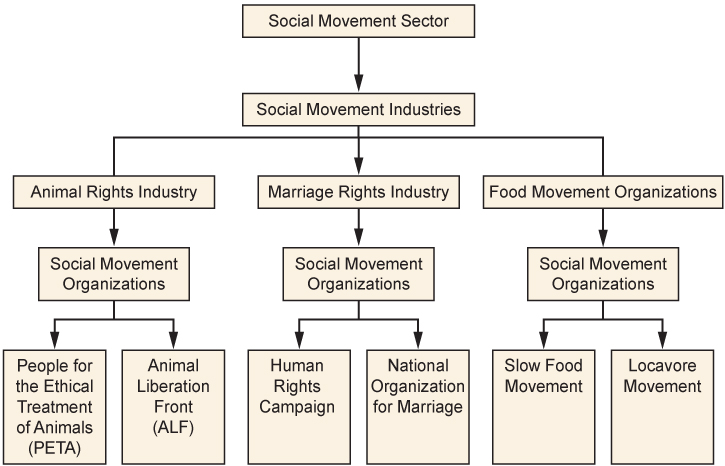
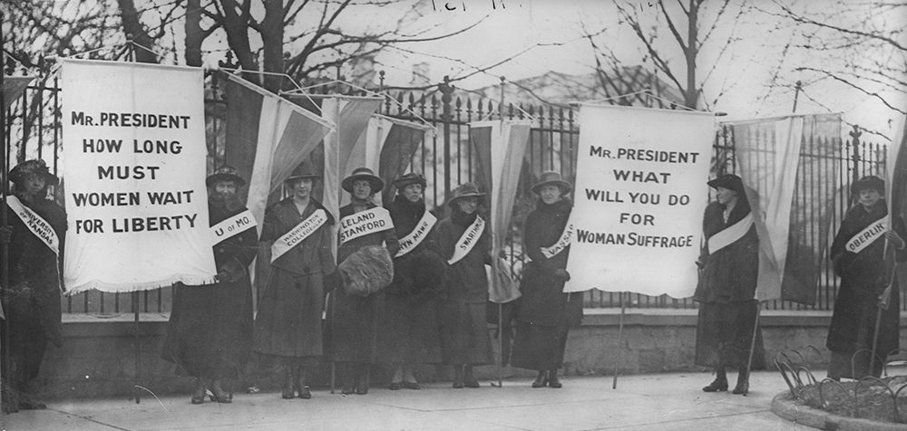
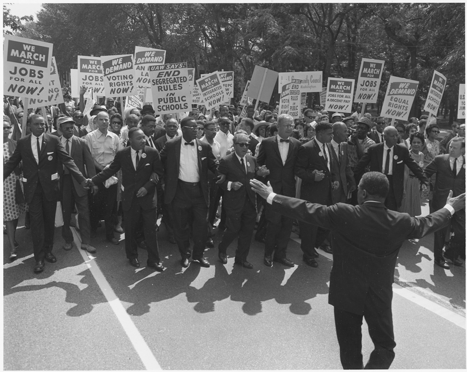
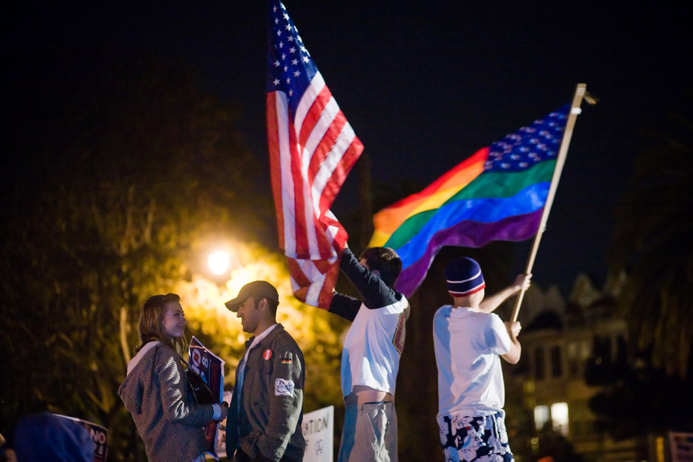

* Demonstrate awareness of social movements on a state, national, and global level
* Distinguish between different types of social movements
* Identify stages of social movements
* Discuss theoretical perspectives on social movements, like resource mobilization, framing, and new social movement theory

**Social movements**{: data-type="term" #import-auto-id1332018} are purposeful, organized groups striving to work toward a common social goal. While most of us learned about social movements in history classes, we tend to take for granted the fundamental changes they caused —and we may be completely unfamiliar with the trend toward global social movement. But from the anti-tobacco movement that has worked to outlaw smoking in public buildings and raise the cost of cigarettes, to uprisings throughout the Arab world, movements are creating social change on a global scale.

# Levels of Social Movements

Movements happen in our towns, in our nation, and around the world. Let’s take a look at examples of social movements, from local to global. No doubt you can think of others on all of these levels, especially since modern technology has allowed us a near-constant stream of information about the quest for social change around the world.

## Local

Chicago is a city of highs and lows, from corrupt politicians and failing schools to innovative education programs and a thriving arts scene. Not surprisingly, it has been home to a number of social movements over time. Currently, AREA Chicago is a social movement focused on “building a socially just city” (AREA Chicago 2011). The organization seeks to “create relationships and sustain community through art, research, education, and activism” (AREA Chicago 2011). The movement offers online tools like the Radicalendar––a calendar for getting radical and connected–– and events such as an alternative to the traditional Independence Day picnic. Through its offerings, AREA Chicago gives local residents a chance to engage in a movement to help build a socially just city.

## State

  "){: #import-auto-id1344692}

At the other end of the political spectrum from AREA Chicago, there is a social movement across the country in Texas. There, the statewide Texas Secede! organization promotes the idea that Texas can and should secede from the United States to become an independent republic. The organization, which has 3,400 “likes” on Facebook, references both Texas and national history in promoting secession. The movement encourages Texans to return to their rugged and individualistic roots, and to stand up to what proponents believe is the theft of their rights and property by the U.S. government (Texas Secede! 2009).

## National

A polarizing national issue which has helped spawn many activist groups is gay marriage. While the legal battle is being played out state-by-state, the issue is a national one and crops up in presidential debates quite frequently. There are ardent supporters on both sides of the issue.

The Human Rights Campaign, a nationwide organization that advocates for LGBT civil rights, has been around for over 30 years and claims more than a million members. One focus of the organization is their Americans for Marriage Equality campaign. Using public celebrities such as athletes, musicians, and political figures, the campaigns seeks to engage the public in the issue of equal rights under the law. The campaign raises awareness of the over 1,100 different rights, benefits, and protections provided on the basis of marital status under federal law, and seeks to educate the public on why they believe these protections are due to committed couples, regardless of gender (Human Rights Campaign 2011).

A movement on the opposite end would be the National Organization for Marriage, an organization that funds campaigns to stop same-sex marriage (National Organization for Marriage 2011). Both of these organizations work on the national stage and seek to engage people through grassroots efforts to push their message.

 "){: #import-auto-id1779384}

## Global

Despite their successes in bringing forth change on controversial topics, social movements are not always about volatile politicized issues. For example, let’s look at the global movement called Slow Food. Slow Food, with the slogan “Good, Clean, Fair Food,” is a global grassroots movement claiming supporters in 150 countries. The movement links community and environmental issues back to the question of what is on our plates and where it came from. Founded in 1989 in response to the increasing existence of fast food in communities that used to treasure their culinary traditions, Slow Food works to raise awareness of food choices (Slow Food 2011). With more than 100,000 members in 1,300 local chapters, Slow Food is a movement that crosses political, age, and regional lines.

# Types of Social Movements

We know that social movements can occur on the local, national, or even global stage. Are there other patterns or classifications that can help us understand them? Sociologist David Aberle (1966) addresses this question, developing categories that distinguish among social movements based on what they want to change and how much change they want. **Reform movements**{: data-type="term" #import-auto-id1415893} seek to change something specific about the social structure. Examples include anti-nuclear groups, Mothers Against Drunk Driving (MADD), and the Human Rights Campaign’s advocacy for Marriage Equality. **Revolutionary movements**{: data-type="term" #import-auto-id1521965} seek to completely change every aspect of society. These would include the 1960’s counterculture movement, as well as anarchist collectives. Texas Secede! is a revolutionary movement. **Religious/Redemptive movements**{: data-type="term" #import-auto-id1453930} are “meaning seeking,” and their goal is to provoke inner change or spiritual growth in individuals. Organizations pushing these movements might include Heaven’s Gate or the Branch Davidians. **Alternative movements**{: data-type="term" #import-auto-id935115} are focused on self-improvement and limited, specific changes to individual beliefs and behavior. These include trends like transcendental meditation or a macrobiotic diet. **Resistance movements**{: data-type="term" #import-auto-id1462692} seek to prevent or undo change to the social structure. The Ku Klux Klan and pro-life movements fall into this category.

# Stages of Social Movements

Later sociologists studied the lifecycle of social movements—how they emerge, grow, and in some cases, die out. Blumer (1969) and Tilly (1978) outline a four-stage process. In the *preliminary stage*, people become aware of an issue and leaders emerge. This is followed by the *coalescence stage* when people join together and organize in order to publicize the issue and raise awareness. In the *institutionalization stage*, the movement no longer requires grassroots volunteerism: it is an established organization, typically peopled with a paid staff. When people fall away, adopt a new movement, the movement successfully brings about the change it sought, or people no longer take the issue seriously, the movement falls into the *decline stage*. Each social movement discussed earlier belongs in one of these four stages. Where would you put them on the list?

Social Media and Social Change: A Match Made in Heaven

"){: #import-auto-id2841996}

Chances are you have been asked to tweet, friend, like, or donate online for a cause. Maybe you were one of the many people who, in 2010, helped raise over $3 million in relief efforts for Haiti through cell phone text donations. Or maybe you follow presidential candidates on Twitter and retweet their messages to your followers. Perhaps you have “liked” a local nonprofit on Facebook, prompted by one of your neighbors or friends liking it too. Nowadays, woven throughout our social media activities, are social movements. After all, social movements start by activating people.

Referring to the ideal type stages discussed above, you can see that social media has the potential to dramatically transform how people get involved. Look at stage one, the *preliminary stage*\: people become aware of an issue and leaders emerge. Imagine how social media speeds up this step. Suddenly, a shrewd user of Twitter can alert his thousands of followers about an emerging cause or an issue on his mind. Issue awareness can spread at the speed of a click, with thousands of people across the globe becoming informed at the same time. In a similar vein, those who are savvy and engaged with social media emerge as leaders. Suddenly, you don’t need to be a powerful public speaker. You don’t even need to leave your house. You can build an audience through social media without ever meeting the people you are inspiring.

At the next stage, the *coalescence stage*, social media also is transformative. Coalescence is the point when people join together to publicize the issue and get organized. President Obama’s 2008 campaign was a case study in organizing through social media. Using Twitter and other online tools, the campaign engaged volunteers who had typically not bothered with politics, and empowered those who were more active to generate still more activity. It is no coincidence that Obama’s earlier work experience included grassroots community organizing. What is the difference between his campaign and the work he did in Chicago neighborhoods decades earlier? The ability to organize without regard to geographical boundaries by using social media. In 2009, when student protests erupted in Tehran, social media was considered so important to the organizing effort that the U.S. State Department actually asked Twitter to suspend scheduled maintenance so that a vital tool would not be disabled during the demonstrations.

So what is the real impact of this technology on the world? Did Twitter bring down Mubarak in Egypt? Author Malcolm Gladwell (2010) doesn’t think so. In an article in *New Yorker* magazine, Gladwell tackles what he considers the myth that social media gets people more engaged. He points out that most of the tweets relating to the Iran protests were in English and sent from Western accounts (instead of people on the ground). Rather than increasing engagement, he contends that social media only increases participation; after all, the cost of participation is so much lower than the cost of engagement. Instead of risking being arrested, shot with rubber bullets, or sprayed with fire hoses, social media activists can click “like” or retweet a message from the comfort and safety of their desk (Gladwell 2010).

Sociologists have identified high-risk activism, such as the civil rights movement, as a “strong-tie” phenomenon, meaning that people are far more likely to stay engaged and not run home to safety if they have close friends who are also engaged. The people who dropped out of the movement––who went home after the danger got too great––did not display any less ideological commitment. But they lacked the strong-tie connection to other people who were staying. Social media, by its very makeup, is “weak-tie” (McAdam and Paulsen 1993). People follow or friend people they have never met. But while these online acquaintances are a source of information and inspiration, the lack of engaged personal contact limits the level of risk we’ll take on their behalf.

"){: #import-auto-id2739995}

# Theoretical Perspectives on Social Movements

Most theories of social movements are called collective action theories, indicating the purposeful nature of this form of collective behavior. The following three theories are but a few of the many classic and modern theories developed by social scientists.

## Resource Mobilization

Social movements will always be a part of society, and people will always weigh their options and make rational choices about which movements to follow. As long as social movements wish to thrive, they must find resources (such as money, people, and plans) for how to meet their goals. Not only will social movements compete for our attention with many other concerns—from the basic (our jobs or our need to feed ourselves) to the broad (video games, sports, or television), but they also compete with each other. For any individual, it may be a simple matter to decide you want to spend your time and money on animal shelters and Republican politics versus homeless shelters and Democrats. But which animal shelter, and which Republican candidate? Social movements are competing for a piece of finite resources, and the field is growing more crowded all the time.

McCarthy and Zald (1977) conceptualize **resource mobilization theory**{: data-type="term" #import-auto-id3034833} as a way to explain movement success in terms of its ability to acquire resources and mobilize individuals. For example, PETA, a social movement organization, is in competition with Greenpeace and the Animal Liberation Front (ALF), two other social movement organizations. Taken together, along with all other social movement organizations working on animals rights issues, these similar organizations constitute a **social movement industry**{: data-type="term" #import-auto-id1148636}. Multiple social movement industries in a society, though they may have widely different constituencies and goals, constitute a society\'s **social movement sector**{: data-type="term" #import-auto-id317057}. Every **social movement organization**{: data-type="term" #import-auto-id1390714} (a single social movement group) within the social movement sector is competing for your attention, your time, and your resources. The chart below shows the relationship between these components.

 {: #eip-id1851082}

## Framing/Frame Analysis

Over the past several decades, sociologists have developed the concept of frames to explain how individuals identify and understand social events and which norms they should follow in any given situation (Goffman 1974; Snow et al. 1986; Benford and Snow 2000). Imagine entering a restaurant. Your “frame” immediately provides you with a behavior template. It probably does not occur to you to wear pajamas to a fine dining establishment, throw food at other patrons, or spit your drink onto the table. However, eating food at a sleepover pizza party provides you with an entirely different behavior template. It might be perfectly acceptable to eat in your pajamas, and maybe even throw popcorn at others or guzzle drinks from cans.

Successful social movements use three kinds of frames (Snow and Benford 1988) to further their goals. The first type, **diagnostic framing**{: data-type="term" #import-auto-id3112581}, states the problem in a clear, easily understood way. When applying diagnostic frames, there are no shades of gray: instead, there is the belief that what “they” do is wrong and this is how “we” will fix it. The anti-gay marriage movement is an example of diagnostic framing with its uncompromising insistence that marriage is only between a man and a woman. **Prognostic framing**{: data-type="term" #import-auto-id3126608}, the second type, offers a solution and states how it will be implemented. Some examples of this frame, when looking at the issue of marriage equality as framed by the anti-gay marriage movement, include the plan to restrict marriage to “one man/one woman” or to allow only “civil unions” instead of marriage. As you can see, there may be many competing prognostic frames even within social movements adhering to similar diagnostic frames. Finally, **motivational framing**{: data-type="term" #import-auto-id1975435} is the call to action: what should you do once you agree with the diagnostic frame and believe in the prognostic frame? These frames are action-oriented. In the gay marriage movement, a call to action might encourage you to vote “no” on Proposition 8 in California (a move to limit marriage to male-female couples), or conversely, to contact your local congressperson to express your viewpoint that marriage should be restricted to opposite-sex couples.

With so many similar diagnostic frames, some groups find it best to join together to maximize their impact. When social movements link their goals to the goals of other social movements and merge into a single group, a **frame alignment process**{: data-type="term" #import-auto-id1759575} (Snow et al. 1986) occurs—an ongoing and intentional means of recruiting participants to the movement.

This frame alignment process involves four aspects: bridging, amplification, extension, and transformation. *Bridging* describes a “bridge” that connects uninvolved individuals and unorganized or ineffective groups with social movements that, though structurally unconnected, nonetheless share similar interests or goals. These organizations join together creating a new, stronger social movement organization. Can you think of examples of different organizations with a similar goal that have banded together?

In the *amplification* model, organizations seek to expand their core ideas to gain a wider, more universal appeal. By expanding their ideas to include a broader range, they can mobilize more people for their cause. For example, the Slow Food movement extends its arguments in support of local food to encompass reduced energy consumption and reduced pollution, plus reduced obesity from eating more healthfully, and other benefits.

In *extension*, social movements agree to mutually promote each other, even when the two social movement organization’s goals don’t necessarily relate to each other’s immediate goals. This often occurs when organizations are sympathetic to each others’ causes, even if they are not directly aligned, such as women’s equal rights and the civil rights movement.

<figure markdown="1" id="import-auto-id2621644" data-orient="vertical">
<figcaption>
Extension occurs when social movements have sympathetic causes. Women’s rights, racial equality, and LGBT advocacy are all human rights issues. (Photos (a) and (b) courtesy of Wikimedia Commons; Photo (c) courtesy of Charlie Nguyen/flickr)
</figcaption>
{: #eip-id1169762685795}

{: #eip-id1796083}

{: #eip-id948045}

</figure>

*Transformation* involves a complete revision of goals. Once a movement has succeeded, it risks losing relevance. If it wants to remain active, the movement has to change with the transformation or risk becoming obsolete. For instance, when the women’s suffrage movement gained women the right to vote, they turned their attention to equal rights and campaigning to elect women. In short, it is an evolution to the existing diagnostic or prognostic frames generally involving a total conversion of movement.

## New Social Movement Theory

**New social movement theory**{: data-type="term" #import-auto-id2189577}, a development of European social scientists in the 1950s and 1960s, attempts to explain the proliferation of post-industrial and post-modern movements that are difficult to analyze using traditional social movement theories. Rather than being one specific theory, it is more of a perspective that revolves around understanding movements as they relate to politics, identity, culture, and social change. Some of these more complex interrelated movements include ecofeminism, which focuses on the patriarchal society as the source of environmental problems, and the transgender rights movement. Sociologist Steven Buechler (2000) suggests that we should be looking at the bigger picture in which these movements arise—shifting to a macro-level, global analysis of social movements.

# Summary

Social movements are purposeful, organized groups, either with the goal of pushing toward change, giving political voice to those without it, or gathering for some other common purpose. Social movements intersect with environmental changes, technological innovations, and other external factors to create social change. There are a myriad of catalysts that create social movements, and the reasons that people join are as varied as the participants themselves. Sociologists look at both the macro- and microanalytical reasons that social movements occur, take root, and ultimately succeed or fail.

# Section Quiz

If we divide social movements according to their position among all social movements in a society, we are using the \_\_\_\_\_\_\_\_\_\_ theory to understand social movements.

1.  framing
2.  new social movement
3.  resource mobilization
4.  value-added
{: data-number-style="lower-alpha"}

Answer

C

While PETA is a social movement organization, taken together, the animal rights social movement organizations PETA, ALF, and Greenpeace are a(n) \_\_\_\_\_\_\_\_\_\_.

1.  social movement industry
2.  social movement sector
3.  social movement party
4.  social industry
{: data-number-style="lower-alpha"}

Answer

A

Social movements are:

1.  disruptive and chaotic challenges to the government
2.  ineffective mass movements
3.  the collective action of individuals working together in an attempt to establish new norms beliefs, or values
4.  the singular activities of a collection of groups working to challenge the status quo
{: data-number-style="lower-alpha"}

Answer

C

When the League of Women Voters successfully achieved its goal of women being allowed to vote, they had to undergo frame \_\_\_\_\_\_\_\_\_\_, a means of completely changing their goals to ensure continuing relevance.

1.  extension
2.  amplification
3.  bridging
4.  transformation
{: data-number-style="lower-alpha"}

Answer

D

If a movement claims that the best way to reverse climate change is to reduce carbon emissions by outlawing privately owned cars, “outlawing cars” is the \_\_\_\_\_\_\_\_.

1.  prognostic framing
2.  diagnostic framing
3.  motivational framing
4.  frame transformation
{: data-number-style="lower-alpha"}

Answer

A

# Short Answer

Think about a social movement industry dealing with a cause that is important to you. How do the different social movement organizations of this industry seek to engage you? Which techniques do you respond to? Why?

Do you think social media is an important tool in creating social change? Why or why not? Defend your opinion.

Describe a social movement in the decline stage. What is its issue? Why has it reached this stage?

# References

Aberle, David. 1966. *The Peyote Religion among the Navaho*. Chicago: Aldine.

Area Chicago. 2011. “About Area Chicago.” Retrieved December 28, 2011 ([http://www.areachicago.org][1]).

Benford, Robert, and David Snow. 2000. “Framing Processes and Social Movements: An Overview and Assessment.” *Annual Review of Sociology* 26:611–639.

Blumer, Herbert. 1969. “Collective Behavior.” Pp. 67–121 in *Principles of Sociology*, edited by A.M. Lee. New York: Barnes and Noble.

Buechler, Steven. 2000. *Social Movement in Advanced Capitalism: The Political Economy and Social Construction of Social Activism*. New York: Oxford University Press.

Gladwell, Malcolm. 2010. “Small Change: Why the Revolution Will Not Be Tweeted.” *The New Yorker*, October 4. Retrieved December 23, 2011 ([http://www.newyorker.com/reporting/2010/10/04/101004fa\\\_fact\\\_gladwell?currentPage=all][2]).

Goffman, Erving. 1974. *Frame Analysis: An Essay on the Organization of Experience*. Cambridge, MA: Harvard University Press.

Human Rights Campaign. 2011. Retrieved December 28, 2011 ([http://www.hrc.org][3]).

McAdam, Doug and Ronnelle Paulsen. 1993. “Specifying the Relationship between Social Ties and Activism.” *American Journal of Sociology* 99:640–667.

McCarthy, John D. and Mayer N. Zald. 1977. “Resource Mobilization and Social Movements: A Partial Theory.” *American Journal of Sociology* 82:1212–1241.

National Organization for Marriage. 2011. “About NOM.” Retrieved January 28, 2012 ([http://www.nationformarriage.org][4]).

Slow Food. 2011. “Slow Food International: Good, Clean, and Fair Food.” Retrieved December 28, 2011 ([http://www.slowfood.com][5]).

Snow, David, E. Burke Rochford, Jr., Steven , and Robert Benford. 1986. “Frame Alignment Processes, Micromobilization, and Movement Participation.” *American Sociological Review* 51:464–481.

Snow, David A. and Robert D. Benford 1988. “Ideology, Frame Resonance, and Participant Mobilization.” *International Social Movement Research* 1:197–217.

Texas Secede! 2009. “Texas Secession Facts.” Retrieved December 28, 2011 ([http://www.texassecede.com][6]).

Tilly, Charles. 1978. *From Mobilization to Revolution*. New York: Mcgraw-Hill College.

[1]: http://www.areachicago.org
[2]: http://www.newyorker.com/reporting/2010/10/04/101004fa_fact_gladwell?currentPage=all
[3]: http://www.hrc.org
[4]: http://www.nationformarriage.org/
[5]: http://www.slowfood.com
[6]: http://www.texassecede.com
