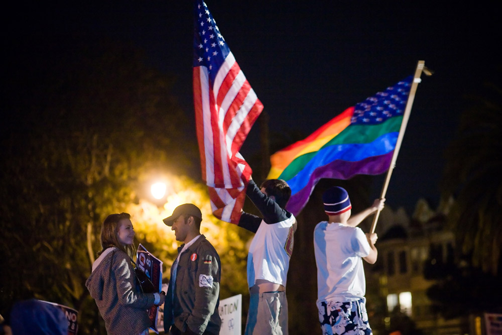

* Demonstrate awareness of social movements on a state, national, and global level
* Distinguish between different types of social movements
* Identify stages of social movements
* Discuss theoretical perspectives on social movements, like resource mobilization, framing, and new social movement theory

**Social movements**{: data-type="term" #import-auto-id1332018} are purposeful, organized groups that strive to work toward a common social goal. While most of us learned about social movements in history classes, we tend to take for granted the fundamental changes they caused —and we may be completely unfamiliar with the trend toward global social movements. But from the antitobacco movement that has worked to outlaw smoking in public buildings and raise the cost of cigarettes, to political uprisings throughout the Arab world, movements are creating social change on a global scale.

### Levels of Social Movements

Movements happen in our towns, in our nation, and around the world. Let’s take a look at examples of social movements, from local to global. No doubt you can think of others on all of these levels, especially since modern technology has allowed us a near-constant stream of information about the quest for social change around the world.

#### Local

Chicago is a city of highs and lows, from corrupt politicians and failing schools to innovative education programs and a thriving arts scene. Not surprisingly, it has been home to a number of social movements over time. Currently, AREA Chicago is a social movement focused on “building a socially just city” (AREA Chicago 2011). The organization seeks to “create relationships and sustain community through art, research, education, and activism” (AREA Chicago 2011). The movement offers online tools like the Radicalendar––a calendar for getting radical and connected––and events such as an alternative to the traditional Independence Day picnic. Through its offerings, AREA Chicago gives local residents a chance to engage in a movement to help build a socially just city.

#### State

  "){: #import-auto-id1344692}

At the other end of the political spectrum from AREA Chicago is the Texas Secede! social movement in Texas. This statewide organization promotes the idea that Texas can and should secede from the United States to become an independent republic. The organization, which as of 2014 has over 6,000 “likes” on Facebook, references both Texas and national history in promoting secession. The movement encourages Texans to return to their rugged and individualistic roots, and to stand up to what proponents believe is the theft of their rights and property by the U.S. government (Texas Secede! 2009).

#### National

A polarizing national issue that has helped spawn many activist groups is gay marriage. While the legal battle is being played out state by state, the issue is a national one.

The Human Rights Campaign, a nationwide organization that advocates for LGBT civil rights, has been active for over thirty years and claims more than a million members. One focus of the organization is its Americans for Marriage Equality campaign. Using public celebrities such as athletes, musicians, and political figures, it seeks to engage the public in the issue of equal rights under the law. The campaign raises awareness of the over 1,100 different rights, benefits, and protections provided on the basis of marital status under federal law and seeks to educate the public about why these protections should be available to all committed couples regardless of gender (Human Rights Campaign 2014).

A movement on the opposite end is the National Organization for Marriage, an organization that funds campaigns to stop same-sex marriage (National Organization for Marriage 2014). Both these organizations work on the national stage and seek to engage people through grassroots efforts to push their message. In February 2011, U.S. Attorney General Eric Holder released a statement saying President Barack Obama had concluded that “due to a number of factors, including a documented history of discrimination, classification based on sexual orientation should be subject to a more heightened standard of scrutiny.” The statement said, “Section 3 of DOMA \[the Defense of Marriage Act of 1993\], as applied to legally married same-sex couples, fails to meet that standard and is therefore unconstitutional.” With that the Department was instructed not to defend the statute in such cases (Department of Justice, Office of Public Affairs 2011; AP/Huffington Post 2011).

. (Photo courtesy of Jose Antonio Navas/flickr)."){: #import-auto-id1779384}

#### Global

Social organizations worldwide take stands on such general areas of concern as poverty, sex trafficking, and the use of genetically modified organisms (GMOs) in food. **Nongovernmental organizations (NGOs)**{: data-type="term"} are sometimes formed to support such movements, such as the International Federation of Organic Agriculture Movement (FOAM). Global efforts to reduce poverty are represented by the Oxford Committee for Famine Relief (OXFAM), among others. The Fair Trade movement exists to protect and support food producers in developing countries. Occupy Wall Street, although initially a local movement, also went global throughout Europe and, as the chapter’s introductory photo shows, the Middle East.

### Types of Social Movements

We know that social movements can occur on the local, national, or even global stage. Are there other patterns or classifications that can help us understand them? Sociologist David Aberle (1966) addresses this question by developing categories that distinguish among social movements based on what they want to change and how much change they want. **Reform movements**{: data-type="term" #import-auto-id1415893} seek to change something specific about the social structure. Examples include antinuclear groups, Mothers Against Drunk Driving (MADD), the Dreamers movement for immigration reform, and the Human Rights Campaign’s advocacy for Marriage Equality. **Revolutionary movements**{: data-type="term" #import-auto-id1521965} seek to completely change every aspect of society. These include the 1960s counterculture movement, including the revolutionary group The Weather Underground, as well as anarchist collectives. Texas Secede! is a revolutionary movement. **Religious/Redemptive movements**{: data-type="term" #import-auto-id1453930} are “meaning seeking,” and their goal is to provoke inner change or spiritual growth in individuals. Organizations pushing these movements include Heaven’s Gate or the Branch Davidians. The latter is still in existence despite government involvement that led to the deaths of numerous Branch Davidian members in 1993. **Alternative movements**{: data-type="term" #import-auto-id935115} are focused on self-improvement and limited, specific changes to individual beliefs and behavior. These include trends like transcendental meditation or a macrobiotic diet. **Resistance movements**{: data-type="term" #import-auto-id1462692} seek to prevent or undo change to the social structure. The Ku Klux Klan, the Minutemen, and pro-life movements fall into this category.

### Stages of Social Movements

Later sociologists studied the lifecycle of social movements—how they emerge, grow, and in some cases, die out. Blumer (1969) and Tilly (1978) outline a four-stage process. In the *preliminary stage*, people become aware of an issue, and leaders emerge. This is followed by the *coalescence stage* when people join together and organize in order to publicize the issue and raise awareness. In the *institutionalization stage*, the movement no longer requires grassroots volunteerism: it is an established organization, typically with a paid staff. When people fall away and adopt a new movement, the movement successfully brings about the change it sought, or when people no longer take the issue seriously, the movement falls into the *decline stage*. Each social movement discussed earlier belongs in one of these four stages. Where would you put them on the list?

Social Media and Social Change: A Match Made in Heaven

"){: #import-auto-id2841996}

Chances are you have been asked to tweet, friend, like, or donate online for a cause. Maybe you were one of the many people who, in 2010, helped raise over $3 million in relief efforts for Haiti through cell phone text donations. Or maybe you follow presidential candidates on Twitter and retweet their messages to your followers. Perhaps you have “liked” a local nonprofit on Facebook, prompted by one of your neighbors or friends liking it too. Nowadays, social movements are woven throughout our social media activities. After all, social movements start by activating people.

Referring to the ideal type stages discussed above, you can see that social media has the potential to dramatically transform how people get involved. Look at stage one, the *preliminary stage*\: people become aware of an issue, and leaders emerge. Imagine how social media speeds up this step. Suddenly, a shrewd user of Twitter can alert his thousands of followers about an emerging cause or an issue on his mind. Issue awareness can spread at the speed of a click, with thousands of people across the globe becoming informed at the same time. In a similar vein, those who are savvy and engaged with social media emerge as leaders. Suddenly, you don’t need to be a powerful public speaker. You don’t even need to leave your house. You can build an audience through social media without ever meeting the people you are inspiring.

At the next stage, the *coalescence stage*, social media also is transformative. Coalescence is the point when people join together to publicize the issue and get organized. President Obama’s 2008 campaign was a case study in organizing through social media. Using Twitter and other online tools, the campaign engaged volunteers who had typically not bothered with politics and empowered those who were more active to generate still more activity. It is no coincidence that Obama’s earlier work experience included grassroots community organizing. What is the difference between his campaign and the work he did in Chicago neighborhoods decades earlier? The ability to organize without regard to geographical boundaries by using social media. In 2009, when student protests erupted in Tehran, social media was considered so important to the organizing effort that the U.S. State Department actually asked Twitter to suspend scheduled maintenance so that a vital tool would not be disabled during the demonstrations.

So what is the real impact of this technology on the world? Did Twitter bring down Mubarak in Egypt? Author Malcolm Gladwell (2010) doesn’t think so. In an article in *New Yorker* magazine, Gladwell tackles what he considers the myth that social media gets people more engaged. He points out that most of the tweets relating to the Iran protests were in English and sent from Western accounts (instead of people on the ground). Rather than increasing engagement, he contends that social media only increases participation; after all, the cost of participation is so much lower than the cost of engagement. Instead of risking being arrested, shot with rubber bullets, or sprayed with fire hoses, social media activists can click “like” or retweet a message from the comfort and safety of their desk (Gladwell 2010).

There are, though, good cases to be made for the power of social media in propelling social movements. In the article, “Parrhesia and Democracy: Truth-telling, WikiLeaks and the Arab Spring,” Theresa Sauter and Gavin Kendall (2011) describe the importance of social media in the Arab Spring uprisings. Parrhesia means “the practice of truth-telling,” which describes the protestors’ use of social media to make up for the lack of coverage and even misrepresentation of events by state-controlled media. The Tunisian blogger Lina Ben Mhenni posted photographs and videos on Facebook and Twitter of events exposing the violence committed by the government. In Egypt the journalist Asmaa Mahfouz used Facebook to gather large numbers of people in Tahrir Square in the capital city of Cairo. Sauter and Kendall maintain that it was the use of Web 2.0 technologies that allowed activists not only to share events with the world but also to organize the actions.

When the Egyptian government shut down the Internet to stop the use of social media, the group Anonymous, a hacking organization noted for online acts of civil disobedience initiated \"Operation Egypt\" and sent thousands of faxes to keep the public informed of their government\'s activities (CBS Interactive Inc. 2014) as well as attacking the government\'s web site (Wagensiel 2011). In its Facebook press release the group stated the following: \"Anonymous wants you to offer free access to uncensored media in your entire country. When you ignore this message, not only will we attack your government websites, Anonymous will also make sure that the international media sees the horrid reality you impose upon your people.\"

Sociologists have identified high-risk activism, such as the civil rights movement, as a “strong-tie” phenomenon, meaning that people are far more likely to stay engaged and not run home to safety if they have close friends who are also engaged. The people who dropped out of the movement––who went home after the danger got too great––did not display any less ideological commitment. But they lacked the strong-tie connection to other people who were staying. Social media, by its very makeup, is “weak-tie” (McAdam and Paulsen 1993). People follow or friend people they have never met. But while these online acquaintances are a source of information and inspiration, the lack of engaged personal contact limits the level of risk we’ll take on their behalf.

"){: #import-auto-id2739995}

### Theoretical Perspectives on Social Movements

Most theories of social movements are called collective action theories, indicating the purposeful nature of this form of collective behavior. The following three theories are but a few of the many classic and modern theories developed by social scientists.

#### Resource Mobilization

McCarthy and Zald (1977) conceptualize **resource mobilization theory**{: data-type="term"} as a way to explain movement success in terms of the ability to acquire resources and mobilize individuals. Resources are primarily time and money, and the more of both, the greater the power of organized movements. Numbers of social movement organizations (SMOs), which are single social movement groups, with the same goals constitute a social movement industry (SMI). Together they create what McCarthy and Zald (1977) refer to as \"the sum of all social movements in a society.\"

##### Resource Mobilization and the Civil Rights Movement

An example of resource mobilization theory is activity of the civil rights movement in the decade between the mid 1950s and the mid 1960s. Social movements had existed before, notably the Women\'s Suffrage Movement and a long line of labor movements, thus constituting an **existing social movement sector**{: data-type="term"}, which is the multiple social movement industries in a society, even if they have widely varying constituents and goals. The civil rights movement had also existed well before Rosa Parks refused to give up her bus seat to a white man. Less known is that Parks was a member of the NAACP and trained in leadership (A&amp;E Television Networks, LLC. 2014). But her action that day was spontaneous and unplanned (Schmitz 2014). Her arrest triggered a public outcry that led to the famous Montgomery bus boycott, turning the movement into what we now think of as the \"civil rights movement\" (Schmitz 2014).

Mobilization had to begin immediately. Boycotting the bus made other means of transportation necessary, which was provided through car pools. Churches and their ministers joined the struggle, and the protest organization In Friendship was formed as well as The Friendly Club and the Club From Nowhere. A **social movement industry**{: data-type="term"}, which is the collection of the social movement organizations that are striving toward similar goals, was growing.

Martin Luther King Jr. emerged during these events to become the charismatic leader of the movement, gained respect from elites in the federal government, and aided by even more emerging SMOs such as the Student Non-Violent Coordinating Committee (SNCC), the Congress of Racial Equality (CORE), the National Association for the Advancement of Colored People (NAACP), and the Southern Christian Leadership Conference (SCLC), among others. Several still exist today. Although the movement in that period was an overall success, and laws were changed (even if not attitudes), the \"movement\" continues. So do struggles to keep the gains that were made, even as the U.S. Supreme Court has recently weakened the Voter Rights Act of 1965, once again making it more difficult for black Americans and other minorities to vote.

![Pictured is a flow chart showing the tiers of the Social Movement Sector. At the top of the chart is the social movement sector. Below that box is the social movement industries. Three boxes come from that one; and, they are the animal right industry, the marriage rights industry, and the food movement industry. One box comes from the animal rights industry box; and, it is social movement organization. Two boxes come from the social movement organization box; and, they are People for the Ethical Treatment of Animals (PETA) and Animal Liberation Front (ALF). One box comes from the marriage rights industry; and, it is social movement organizations. Two more boxes come from the social movement organizations box; and, they are the Human Rights Campaign, and the National Organization for Marriage. One box come from the food movement industry box; and, it is social movement organizations. Two more boxes come from the social movement organizations box; and, they are the Slow Food Movement, and the Locavore Movement.](../resources/Figure_21_02_05a.jpg "Multiple social movement organizations concerned about the same issue form a social movement industry. A society&#x2019;s many social movement industries comprise its social movement sector. With so many options, to whom will you give your time and money?"){: #eip-id1851082}

#### Framing/Frame Analysis

Over the past several decades, sociologists have developed the concept of frames to explain how individuals identify and understand social events and which norms they should follow in any given situation (Goffman 1974; Snow et al. 1986; Benford and Snow 2000). Imagine entering a restaurant. Your “frame” immediately provides you with a behavior template. It probably does not occur to you to wear pajamas to a fine-dining establishment, throw food at other patrons, or spit your drink onto the table. However, eating food at a sleepover pizza party provides you with an entirely different behavior template. It might be perfectly acceptable to eat in your pajamas and maybe even throw popcorn at others or guzzle drinks from cans.

Successful social movements use three kinds of frames (Snow and Benford 1988) to further their goals. The first type, **diagnostic framing**{: data-type="term" #import-auto-id3112581}, states the problem in a clear, easily understood way. When applying diagnostic frames, there are no shades of gray: instead, there is the belief that what “they” do is wrong and this is how “we” will fix it. The anti-gay marriage movement is an example of diagnostic framing with its uncompromising insistence that marriage is only between a man and a woman. **Prognostic framing**{: data-type="term" #import-auto-id3126608}, the second type, offers a solution and states how it will be implemented. Some examples of this frame, when looking at the issue of marriage equality as framed by the anti-gay marriage movement, include the plan to restrict marriage to “one man/one woman” or to allow only “civil unions” instead of marriages. As you can see, there may be many competing prognostic frames even within social movements adhering to similar diagnostic frames. Finally, **motivational framing**{: data-type="term" #import-auto-id1975435} is the call to action: what should you do once you agree with the diagnostic frame and believe in the prognostic frame? These frames are action-oriented. In the gay marriage movement, a call to action might encourage you to vote “no” on Proposition 8 in California (a move to limit marriage to male-female couples), or conversely, to contact your local congressperson to express your viewpoint that marriage should be restricted to male-female couples.

With so many similar diagnostic frames, some groups find it best to join together to maximize their impact. When social movements link their goals to the goals of other social movements and merge into a single group, a **frame alignment process**{: data-type="term" #import-auto-id1759575} (Snow et al. 1986) occurs—an ongoing and intentional means of recruiting participants to the movement.

This frame alignment process has four aspects: bridging, amplification, extension, and transformation. *Bridging* describes a “bridge” that connects uninvolved individuals and unorganized or ineffective groups with social movements that, though structurally unconnected, nonetheless share similar interests or goals. These organizations join together to create a new, stronger social movement organization. Can you think of examples of different organizations with a similar goal that have banded together?

In the *amplification* model, organizations seek to expand their core ideas to gain a wider, more universal appeal. By expanding their ideas to include a broader range, they can mobilize more people for their cause. For example, the Slow Food movement extends its arguments in support of local food to encompass reduced energy consumption, pollution, obesity from eating more healthfully, and more.

In *extension*, social movements agree to mutually promote each other, even when the two social movement organization’s goals don’t necessarily relate to each other’s immediate goals. This often occurs when organizations are sympathetic to each others’ causes, even if they are not directly aligned, such as women’s equal rights and the civil rights movement.

<figure markdown="1" id="import-auto-id2621644" data-orient="vertical">
<figcaption>
Extension occurs when social movements have sympathetic causes. Women’s rights, racial equality, and LGBT advocacy are all human rights issues. (Photos (a) and (b) courtesy of Wikimedia Commons; Photo (c) courtesy of Charlie Nguyen/flickr)
</figcaption>
{: #eip-id1169762685795}

{: #eip-id1796083}

{: #eip-id948045}

</figure>

*Transformation* means a complete revision of goals. Once a movement has succeeded, it risks losing relevance. If it wants to remain active, the movement has to change with the transformation or risk becoming obsolete. For instance, when the women’s suffrage movement gained women the right to vote, members turned their attention to advocating equal rights and campaigning to elect women to office. In short, transformation is an evolution in the existing diagnostic or prognostic frames that generally achieves a total conversion of the movement.

#### New Social Movement Theory

**New social movement theory**{: data-type="term" #import-auto-id2189577}, a development of European social scientists in the 1950s and 1960s, attempts to explain the proliferation of postindustrial and postmodern movements that are difficult to analyze using traditional social movement theories. Rather than being one specific theory, it is more of a perspective that revolves around understanding movements as they relate to politics, identity, culture, and social change. Some of these more complex interrelated movements include ecofeminism, which focuses on the patriarchal society as the source of environmental problems, and the transgender rights movement. Sociologist Steven Buechler (2000) suggests that we should be looking at the bigger picture in which these movements arise—shifting to a macro-level, global analysis of social movements.

##### The Movement to Legalize Marijuana

The early history of marijuana in the United States includes its use as an over-the-counter medicine as well as various industrial applications. Its recreational use eventually became a focus of regulatory concern. Public opinion, swayed by a powerful propaganda campaign by the Federal Bureau of Narcotics in the 1930s, remained firmly opposed to the use of marijuana for decades. In the 1936 church-financed propaganda film \"Reefer Madness,\" marijuana was portrayed as a dangerous drug that caused insanity and violent behavior.

One reason for the recent shift in public attitudes about marijuana, and the social movement pushing for its decriminalization, is a more-informed understanding of its effects that largely contradict its earlier characterization. The public has also become aware that penalties for possession have been significantly disproportionate along racial lines. U.S. Census and FBI data reveal that blacks in the United States are between two to eight times more likely than whites to be arrested for possession of marijuana (Urbina 2013; Matthews 2013). Further, the resulting incarceration costs and prison overcrowding are causing states to look closely at decriminalization and legalization.

In 2012, marijuana was legalized for recreational purposes in Washington and Colorado through ballot initiatives approved by voters. While it remains a Schedule One controlled substance under federal law, the federal government has indicated that it will not intervene in state decisions to ease marijuana laws.

### Summary

Social movements are purposeful, organized groups, either with the goal of pushing toward change, giving political voice to those without it, or gathering for some other common purpose. Social movements intersect with environmental changes, technological innovations, and other external factors to create social change. There are a myriad of catalysts that create social movements, and the reasons that people join are as varied as the participants themselves. Sociologists look at both the macro- and microanalytical reasons that social movements occur, take root, and ultimately succeed or fail.

### Section Quiz

If we divide social movements according to their positions among all social movements in a society, we are using the \_\_\_\_\_\_\_\_\_\_ theory to understand social movements.

1.  framing
2.  new social movement
3.  resource mobilization
4.  value-added
{: type="a"}

Answer

C

While PETA is a social movement organization, taken together, the animal rights social movement organizations PETA, ALF, and Greenpeace are a \_\_\_\_\_\_\_\_\_\_.

1.  social movement industry
2.  social movement sector
3.  social movement party
4.  social industry
{: type="a"}

Answer

A

Social movements are:

1.  disruptive and chaotic challenges to the government
2.  ineffective mass movements
3.  the collective action of individuals working together in an attempt to establish new norms beliefs, or values
4.  the singular activities of a collection of groups working to challenge the status quo
{: type="a"}

Answer

C

When the League of Women Voters successfully achieved its goal of women being allowed to vote, they had to undergo frame \_\_\_\_\_\_\_\_\_\_, a means of completely changing their goals to ensure continuing relevance.

1.  extension
2.  amplification
3.  bridging
4.  transformation
{: type="a"}

Answer

D

If a movement claims that the best way to reverse climate change is to reduce carbon emissions by outlawing privately owned cars, “outlawing cars” is the \_\_\_\_\_\_\_\_.

1.  prognostic framing
2.  diagnostic framing
3.  motivational framing
4.  frame transformation
{: type="a"}

Answer

A

### Short Answer

Think about a social movement industry dealing with a cause that is important to you. How do the different social movement organizations of this industry seek to engage you? Which techniques do you respond to? Why?

Do you think social media is an important tool in creating social change? Why, or why not? Defend your opinion.

Describe a social movement in the decline stage. What is its issue? Why has it reached this stage?

### References

A&amp;E Television Networks, LLC. 2014. \"Civil Rights Movement.\" Retrieved December 17, 2014 ([http://www.history.com/topics/black-history/civil-rights-movement][1]).

Aberle, David. 1966. *The Peyote Religion among the Navaho*. Chicago: Aldine.

AP/The Huffington Post. 2014. \"Obama: DOMA Unconstitutional, DOJ Should Stop Defending in Court.\" The Huffington Post. Retrieved December 17, 2014. ([http://www.huffingtonpost.com/2011/02/23/obama-doma-unconstitutional\\\_n\\\_827134.html][2]).

Area Chicago. 2011. “About Area Chicago.” Retrieved December 28, 2011 ([http://www.areachicago.org][3]).

Benford, Robert, and David Snow. 2000. “Framing Processes and Social Movements: An Overview and Assessment.” *Annual Review of Sociology* 26:611–639.

Blumer, Herbert. 1969. “Collective Behavior.” Pp. 67–121 in *Principles of Sociology*, edited by A.M. Lee. New York: Barnes and Noble.

Buechler, Steven. 2000. *Social Movement in Advanced Capitalism: The Political Economy and Social Construction of Social Activism*. New York: Oxford University Press.

CNN U.S. 2014. \"Same-Sex Marriage in the United States.\" Retrieved December 17, 2014 ([http://www.cnn.com/interactive/us/map-same-sex-marriage/][4]).

CBS Interactive Inc. 2014. \"Anonymous\' Most Memorable Hacks.\" Retrieved December 17, 2014 ([http://www.cbsnews.com/pictures/anonymous-most-memorable-hacks/9/][5]).

Department of Justice, Office of Public Affairs. 2011. \"Letter from the Attorney General to Congress on Litigation Involving the Defense of Marriage Act.\" Retrieved December 17, 2014 ([http://www.justice.gov/opa/pr/letter-attorney-general-congress-litigation-involving-defense-marriage-act][6]).

Gladwell, Malcolm. 2010. “Small Change: Why the Revolution Will Not Be Tweeted.” *The New Yorker*, October 4. Retrieved December 23, 2011 ([http://www.newyorker.com/reporting/2010/10/04/101004fa\\\_fact\\\_gladwell?currentPage=all][7]).

Goffman, Erving. 1974. *Frame Analysis: An Essay on the Organization of Experience*. Cambridge, MA: Harvard University Press.

Human Rights Campaign. 2011. Retrieved December 28, 2011 ([http://www.hrc.org][8]).

McAdam, Doug, and Ronnelle Paulsen. 1993. “Specifying the Relationship between Social Ties and Activism.” *American Journal of Sociology* 99:640–667.

McCarthy, John D., and Mayer N. Zald. 1977. “Resource Mobilization and Social Movements: A Partial Theory.” *American Journal of Sociology* 82:1212–1241.

National Organization for Marriage. 2014. “About NOM.” Retrieved January 28, 2012 ([http://www.nationformarriage.org][9]).

Sauter, Theresa, and Gavin Kendall. 2011. \"Parrhesia and Democracy: Truthtelling, WikiLeaks and the Arab Spring.\" Social Alternatives 30, no.3: 10–14.

Schmitz, Paul. 2014. \"How Change Happens: The Real Story of Mrs. Rosa Parks &amp; the Montgomery Bus Boycott.\" Huffington Post. Retrieved December 17, 2014 ([http://www.huffingtonpost.com/paul-schmitz/how-change-happens-the-re\\\_b\\\_6237544.html][10]).

Slow Food. 2011. “Slow Food International: Good, Clean, and Fair Food.” Retrieved December 28, 2011 ([http://www.slowfood.com][11]).

Snow, David, E. Burke Rochford, Jr., Steven , and Robert Benford. 1986. “Frame Alignment Processes, Micromobilization, and Movement Participation.” *American Sociological Review* 51:464–481.

Snow, David A., and Robert D. Benford 1988. “Ideology, Frame Resonance, and Participant Mobilization.” *International Social Movement Research* 1:197–217.

Technopedia. 2014. \"Anonymous.\" Retrieved December 17, 2014 ([http://www.techopedia.com/definition/27213/anonymous-hacking][12]).

Texas Secede! 2009. “Texas Secession Facts.” Retrieved December 28, 2011 ([http://www.texassecede.com][13]).

Tilly, Charles. 1978. *From Mobilization to Revolution*. New York: Mcgraw-Hill College.

Wagenseil, Paul. 2011. \"Anonymous \'hacktivists\' attack Egyptian websites.\" NBC News. Retrieved December 17, 2014 ([http://www.nbcnews.com/id/41280813/ns/technology\\\_and\\\_science-security/t/anonymous-hacktivists-attack-egyptian-websites/#.VJHmuivF-Sq][14]).

### Glossary
{: data-type="glossary-title"}

alternative movements
: social movements that limit themselves to self-improvement changes in individuals
{: #import-auto-id2682385}

diagnostic framing
: a the social problem that is stated in a clear, easily understood manner
{: #import-auto-id2729010}

frame alignment process
: using bridging, amplification, extension, and transformation as an ongoing and intentional means of recruiting participants to a movement
{: #import-auto-id1662150}

motivational framing
: a call to action
{: #import-auto-id1330218}

new social movement theory
: a theory that attempts to explain the proliferation of postindustrial and postmodern movements that are difficult to understand using traditional social movement theories
{: #import-auto-id1518156}

NGO
: nongovernmental organizations working globally for numerous humanitarian and environmental causes
^

prognostic framing
: social movements that state a clear solution and a means of implementation
{: #import-auto-id1331558}

reform movements
: movements that seek to change something specific about the social structure
{: #import-auto-id1203068}

religious/redemptive movements
: movements that work to promote inner change or spiritual growth in individuals
{: #import-auto-id1083550}

resistance movements
: those who seek to prevent or undo change to the social structure
{: #import-auto-id1365209}

resource mobilization theory
: a theory that explains social movements’ success in terms of their ability to acquire resources and mobilize individuals
{: #import-auto-id3662294}

revolutionary movements
: movements that seek to completely change every aspect of society
{: #import-auto-id1455308}

social movement industry
: the collection of the social movement organizations that are striving toward similar goals
{: #import-auto-id2094241}

social movement organization
: a single social movement group
{: #import-auto-id2314539}

social movement sector
: the multiple social movement industries in a society, even if they have widely varying constituents and goals
{: #import-auto-id2907069}

social movement
: a purposeful organized group hoping to work toward a common social goal
{: #import-auto-id1191351}

[1]: http://www.history.com/topics/black-history/civil-rights-movement
[2]: http://www.huffingtonpost.com/2011/02/23/obama-doma-unconstitutional_n_827134.html
[3]: http://www.areachicago.org
[4]: http://www.cnn.com/interactive/us/map-same-sex-marriage/
[5]: http://www.cbsnews.com/pictures/anonymous-most-memorable-hacks/9/
[6]: http://www.justice.gov/opa/pr/letter-attorney-general-congress-litigation-involving-defense-marriage-act
[7]: http://www.newyorker.com/reporting/2010/10/04/101004fa_fact_gladwell?currentPage=all
[8]: http://www.hrc.org
[9]: http://www.nationformarriage.org/
[10]: http://www.huffingtonpost.com/paul-schmitz/how-change-happens-the-re_b_6237544.html
[11]: http://www.slowfood.com
[12]: http://www.techopedia.com/definition/27213/anonymous-hacking
[13]: http://www.texassecede.com
[14]: http://www.nbcnews.com/id/41280813/ns/technology_and_science-security/t/anonymous-hacktivists-attack-egyptian-websites/#.VJHmuivF-Sq
