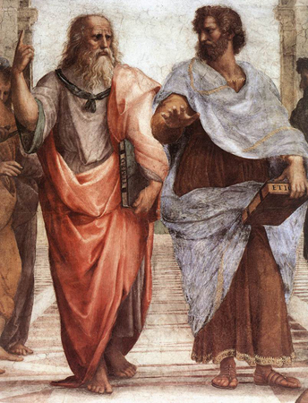

* Explain why sociology emerged when it did
* Describe how sociology became a separate academic discipline

<figure markdown="1" id="import-auto-id909878" data-orient="horizontal">
<figcaption>
People have been thinking like sociologists long before sociology became a separate academic discipline: Plato and Aristotle, Confucius, Khaldun, and Voltaire all set the stage for modern sociology. (Photos (a),(b),(d) courtesy of Wikimedia Commons; Photo (c) courtesy of Moumou82/Wikimedia Commons)
</figcaption>
{:}

{:}

{:}

{:}

</figure>

Since ancient times, people have been fascinated by the relationship between individuals and the societies to which they belong. Many topics studied in modern sociology were also studied by ancient philosophers in their desire to describe an ideal society, including theories of social conflict, economics, social cohesion, and power (Hannoum 2003).

In the thirteenth century, Ma Tuan-Lin, a Chinese historian, first recognized social dynamics as an underlying component of historical development in his seminal encyclopedia, *General Study of Literary Remains*. The next century saw the emergence of the historian some consider to be the world’s first sociologist: Ibn Khaldun (1332–1406) of Tunisia. He wrote about many topics of interest today, setting a foundation for both modern sociology and economics, including a theory of social conflict, a comparison of nomadic and sedentary life, a description of political economy, and a study connecting a tribe’s social cohesion to its capacity for power (Hannoum 2003).

In the eighteenth century, Age of Enlightenment philosophers developed general principles that could be used to explain social life. Thinkers such as John Locke, Voltaire, Immanuel Kant, and Thomas Hobbes responded to what they saw as social ills by writing on topics that they hoped would lead to social reform. Mary Wollstonecraft (1759–1797) wrote about women’s conditions in society. Her works were long ignored by the male academic structure, but since the 1970s, Wollstonecraft has been widely considered the first feminist thinker of consequence.

The early nineteenth century saw great changes with the Industrial Revolution, increased mobility, and new kinds of employment. It was also a time of great social and political upheaval with the rise of empires that exposed many people—for the first time—to societies and cultures other than their own. Millions of people moved into cities and many people turned away from their traditional religious beliefs.

### Creating a Discipline

#### Auguste Comte (1798–1857)

"){: #import-auto-id2744412}

The term sociology was first coined in 1780 by the French essayist Emmanuel-Joseph Sieyès (1748–1836) in an unpublished manuscript (Fauré et al. 1999). In 1838, the term was reinvented by Auguste Comte (1798–1857). Comte originally studied to be an engineer, but later became a pupil of social philosopher Claude Henri de Rouvroy Comte de Saint-Simon (1760–1825). They both thought that social scientists could study society using the same scientific methods utilized in natural sciences. Comte also believed in the potential of social scientists to work toward the betterment of society. He held that once scholars identified the laws that governed society, sociologists could address problems such as poor education and poverty (Abercrombie et al. 2000).

Comte named the scientific study of social patterns **positivism**{: data-type="term" #import-auto-id2298441}. He described his philosophy in a series of books called *The Course in Positive Philosophy* (1830–1842) and *A General View of Positivism* (1848). He believed that using scientific methods to reveal the laws by which societies and individuals interact would usher in a new “positivist” age of history. While the field and its terminology have grown, sociologists still believe in the positive impact of their work.

#### Harriet Martineau (1802–1876)—the First Woman Sociologist   {#eip-396}

Harriet Martineau was a writer who addressed a wide range of social science issues. She was an early observer of social practices, including economics, social class, religion, suicide, government, and women’s rights. Her writing career began in 1832 with a series of stories titled *Illustrations of Political Economy*, in which she tried to educate ordinary people about the principles of economics (Johnson 2003).

Martineau was the first to translate Comte’s writing from French to English and thereby introduced sociology to English-speaking scholars (Hill 1991). She is also credited with the first systematic methodological international comparisons of social institutions in two of her most famous sociological works: *Society in America* (1837) and *Retrospect of Western Travel* (1838). Martineau found the workings of capitalism at odds with the professed moral principles of people in the United States; she pointed out the faults with the free enterprise system in which workers were exploited and impoverished while business owners became wealthy. She further noted that the belief in all being created equal was inconsistent with the lack of women’s rights. Much like Mary Wollstonecraft, Martineau was often discounted in her own time by the male domination of academic sociology.

#### Karl Marx (1818–1883)

 "){: #id2744413}

Karl Marx (1818–1883) was a German philosopher and economist. In 1848 he and Friedrich Engels (1820–1895) coauthored the *Communist Manifesto*. This book is one of the most influential political manuscripts in history. It also presents Marx\'s theory of society, which differed from what Comte proposed.

Marx rejected Comte\'s positivism. He believed that societies grew and changed as a result of the struggles of different social classes over the means of production. At the time he was developing his theories, the Industrial Revolution and the rise of capitalism led to great disparities in wealth between the owners of the factories and workers. Capitalism, an economic system characterized by private or corporate ownership of goods and the means to produce them, grew in many nations.

Marx predicted that inequalities of capitalism would become so extreme that workers would eventually revolt. This would lead to the collapse of capitalism, which would be replaced by communism. Communism is an economic system under which there is no private or corporate ownership: everything is owned communally and distributed as needed. Marx believed that communism was a more equitable system than capitalism.

While his economic predictions may not have come true in the time frame he predicted, Marx’s idea that social conflict leads to change in society is still one of the major theories used in modern sociology.

#### Herbert Spencer (1820–1903)

In 1873, the English philosopher Herbert Spencer published *The Study of Sociology*, the first book with the term “sociology” in the title. Spencer rejected much of Comte’s philosophy as well as Marx\'s theory of class struggle and his support of communism. Instead, he favored a form of government that allowed market forces to control capitalism. His work influenced many early sociologists including Émile Durkheim (1858–1917).

#### Georg Simmel (1858–1918)   {#eip-919}

Georg Simmel was a German art critic who wrote widely on social and political issues as well. Simmel took an anti-positivism stance and addressed topics such as social conflict, the function of money, individual identity in city life, and the European fear of outsiders (Stapley 2010). Much of his work focused on the micro-level theories, and it analyzed the dynamics of two-person and three-person groups. His work also emphasized individual culture as the creative capacities of individuals. Simmel’s contributions to sociology are not often included in academic histories of the discipline, perhaps overshadowed by his contemporaries Durkheim, Mead, and Weber (Ritzer and Goodman 2004).

#### Émile Durkheim (1858–1917)   {#eip-id1170985915840}

Durkheim helped establish sociology as a formal academic discipline by establishing the first European department of sociology at the University of Bordeaux in 1895 and by publishing his *Rules of the Sociological Method* in 1895. In another important work, *Division of Labour in Society* (1893), Durkheim laid out his theory on how societies transformed from a primitive state into a capitalist, industrial society. According to Durkheim, people rise to their proper levels in society based on belief in a meritocracy.

Durkheim believed that sociologists could study objective “social facts” (Poggi 2000). He also believed that through such studies it would be possible to determine if a society was “healthy” or “pathological.” He saw healthy societies as stable, while pathological societies experienced a breakdown in social norms between individuals and society.

In 1897, Durkheim attempted to demonstrate the effectiveness of his rules of social research when he published a work titled *Suicide*. Durkheim examined suicide statistics in different police districts to research differences between Catholic and Protestant communities. He attributed the differences to socioreligious forces rather than to individual or psychological causes.

#### George Herbert Mead (1863–1931)   {#eip-id1169402148869}

George Herbert Mead was a philosopher and sociologist whose work focused on the ways in which the mind and the self were developed as a result of social processes (Cronk n.d.). He argued that how an individual comes to view himself or herself is based to a very large extent on interactions with others. Mead called specific individuals that impacted a person’s life **significant others,**{: data-type="term"} and he also conceptualized “**generalized others**{: data-type="term"}” as the organized and generalized attitude of a social group. Mead’s work is closely associated with the symbolic interactionist approach and emphasizes the micro-level of analysis.

#### Max Weber (1864–1920)    {#eip-id1169418601065}

Prominent sociologist Max Weber established a sociology department in Germany at the Ludwig Maximilians University of Munich in 1919. Weber wrote on many topics related to sociology including political change in Russia and social forces that affect factory workers. He is known best for his 1904 book, *The Protestant Ethic and the Spirit of Capitalism*. The theory that Weber sets forth in this book is still controversial. Some believe that Weber argued that the beliefs of many Protestants, especially Calvinists, led to the creation of capitalism. Others interpret it as simply claiming that the ideologies of capitalism and Protestantism are complementary.

Weber believed that it was difficult, if not impossible, to use standard scientific methods to accurately predict the behavior of groups as people hoped to do. They argued that the influence of culture on human behavior had to be taken into account. This even applied to the researchers themselves, who, they believed, should be aware of how their own cultural biases could influence their research. To deal with this problem, Weber and Dilthey introduced the concept of ***verstehen***{: data-type="term" #import-auto-id1510093}, a German word that means to understand in a deep way. In seeking verstehen, outside observers of a social world—an entire culture or a small setting—attempt to understand it from an insider’s point of view.

In his book *The Nature of Social Action* (1922), Weber described sociology as striving to \"interpret the meaning of social action and thereby give a causal explanation of the way in which action proceeds and the effects it produces.\" He and other like-minded sociologists proposed a philosophy of **antipositivism**{: data-type="term" #import-auto-id1311983} whereby social researchers would strive for subjectivity as they worked to represent social processes, cultural norms, and societal values. This approach led to some research methods whose aim was not to generalize or predict (traditional in science), but to systematically gain an in-depth understanding of social worlds.

The different approaches to research based on positivism or antipositivism are often considered the foundation for the differences found today between quantitative sociology and qualitative sociology. **Quantitative sociology**{: data-type="term" #import-auto-id1663681} uses statistical methods such as surveys with large numbers of participants. Researchers analyze data using statistical techniques to see if they can uncover patterns of human behavior. **Qualitative sociology**{: data-type="term" #import-auto-id1588657} seeks to understand human behavior by learning about it through in-depth interviews, focus groups, and analysis of content sources (like books, magazines, journals, and popular media).

Should We Raise the Minimum Wage?

In the 2014 State of the Union Address, President Obama called on Congress to raise the national minimum wage, and he signed an executive order putting this into effect for individuals working on new federal service contracts. Congress did not pass legislation to change the national minimum wage more broadly. The result has become a national controversy, with various economists taking different sides on the issue, and public protests being staged by several groups of minimum-wage workers.

Opponents of raising the minimum wage argue that some workers would get larger paychecks while others would lose their jobs, and companies would be less likely to hire new workers because of the increased cost of paying them (Bernstein 2014; cited in CNN).

Proponents of raising the minimum wage contend that some job loss would be greatly offset by the positive effects on the economy of low-wage workers having more income (Hassett 2014; cited in CNN).

Sociologists may consider the minimum wage issue from differing perspectives as well. How much of an impact would a minimum wage raise have for a single mother? Some might study the economic effects, such as her ability to pay bills and keep food on the table. Others might look at how reduced economic stress could improve family relationships. Some sociologists might research the impact on the status of small business owners. These could all be examples of public sociology, a branch of sociology that strives to bring sociological dialogue to public forums. The goals of public sociology are to increase understanding of the social factors that underlie social problems and assist in finding solutions. According to Michael Burawoy (2005), the challenge of public sociology is to engage multiple publics in multiple ways.

### Summary

Sociology was developed as a way to study and try to understand the changes to society brought on by the Industrial Revolution in the eighteenth and nineteenth centuries. Some of the earliest sociologists thought that societies and individuals’ roles in society could be studied using the same scientific methodologies that were used in the natural sciences, while others believed that is was impossible to predict human behavior scientifically, and still others debated the value of such predictions. Those perspectives continue to be represented within sociology today.

### Section Quiz

Which of the following was a topic of study in early sociology?

1.  Astrology
2.  Economics
3.  Physics
4.  History
{: type="a"}

Answers

B

Which founder of sociology believed societies changed due to class struggle?

1.  Émile Comte
2.  Karl Marx
3.  Plato
4.  Herbert Spencer
{: type="a"}

Answers

B

The difference between positivism and antipositivism relates to:

1.  whether individuals like or dislike their society
2.  whether research methods use statistical data or person-to-person research
3.  whether sociological studies can predict or improve society
4.  all of the above
{: type="a"}

Answers

C

Which would a quantitative sociologists use to gather data?

1.  A large survey
2.  A literature search
3.  An in-depth interview
4.  A review of television programs
{: type="a"}

Answers

A

Weber believed humans could not be studied purely objectively because they were influenced by:

1.  drugs
2.  their culture
3.  their genetic makeup
4.  the researcher
{: type="a"}

Answers

B

### Short Answer

What do you make of Karl Marx’s contributions to sociology? What perceptions of Marx have you been exposed to in your society, and how do those perceptions influence your views?

Do you tend to place more value on qualitative or quantitative research? Why? Does it matter what topic you are studying?

### Further Research

Many sociologists helped shape the discipline. To learn more about prominent sociologists and how they changed sociology check out [http://www.macionis.com/gallery-of-sociologists/ferdinand-toennies/][1].

### References

Abercrombie, Nicholas, Stephen Hill, and Bryan S. Turner. 2000. *The Penguin Dictionary of Sociology*. London: Penguin.

Buroway, Michael. 2005. \"2004 Presidential Address: For Public Sociology.\" *American Sociological Review* 70 (February): 4–28. Retrieved December 30, 2014 (http://burawoy.berkeley.edu/Public%20Sociology,%20Live/Burawoy.pdf).

Cable Network News (CNN). 2014. \"Should the minimum wage be raised?\" CNN Money. Retrieved December 30, 2014 (http://money.cnn.com/infographic/pf/low-wage-worker/).

Cronk, George. n.d. “George Herbert Mead.” *Internet Encyclopedia of Philosophy: A Peer-Reviewed Academic Resource*. Retrieved October 14, 2014 (http://www.iep.utm.edu/mead/).

Durkheim, Émile. 1964 \[1895\]. *The Rules of Sociological Method*, edited by J. Mueller, E. George and E. Caitlin. 8th ed. Translated by S. Solovay. New York: Free Press.

Fauré, Christine, Jacques Guilhaumou, Jacques Vallier, and Françoise Weil. 2007 \[1999\]. *Des Manuscrits de Sieyès, 1773–1799*, Volumes I and II. Paris: Champion.

Hannoum, Abdelmajid. 2003. *Translation and the Colonial Imaginary: Ibn Khaldun Orientalist*. Middletown, CT: Wesleyan University. Retrieved January 19, 2012 ([http://www.jstor.org/pss/3590803][2]).

Hill, Michael. 1991. “Harriet Martineau.” *Women in Sociology: A Bio-Bibliographic Sourcebook*, edited by Mary Jo Deegan. New York: Greenwood Press.

Johnson, Bethany. 2003. “Harriet Martineau: Theories and Contributions to Sociology.” *Education Portal*. Retrieved October 14, 2014 (http://education-portal.com/academy/lesson/harriet-martineau-theories-and-contributions-to-sociology.html#lesson).

Poggi, Gianfranco. 2000. *Durkheim*. Oxford, United Kingdom: Oxford University Press.

Ritzer, George, and Goodman, Douglas. 2004. *Sociological Theory, 6th Edition*. New York: McGraw Hill Education.

Stapley, Pierre. 2010. “Georg Simmel.” Cardiff University School of Social Sciences. Retrieved October 21, 2014 (http://www.cf.ac.uk/socsi/undergraduate/introsoc/simmel.html).

U.S. Congress Joint Economic Committee. 2010. *Women and the Economy, 2010: 25 Years of Progress But Challenges Remain*. August. Washington, DC: Congressional Printing Office. Retrieved January 19, 2012 ([http://jec.senate.gov/public/?a=Files.Serve&amp;File\\\_id=8be22cb0-8ed0-4a1a-841b-aa91dc55fa81][3]).

### Glossary
{: data-type="glossary-title"}

antipositivism
: the view that social researchers should strive for subjectivity as they worked to represent social processes, cultural norms, and societal values
{: #import-auto-id1383216}

generalized others
: the organized and generalized attitude of a social group
^

positivism
: the scientific study of social patterns
{: #import-auto-id2110123}

qualitative sociology
: in-depth interviews, focus groups, and/or analysis of content sources as the source of its data
{: #import-auto-id1361826}

quantitative sociology
: statistical methods such as surveys with large numbers of participants
^

significant others
: specific individuals that impact a person\'s life
^

verstehen
: a German word that means to understand in a deep way
{: #import-auto-id1205323}

[1]: http://www.macionis.com/gallery-of-sociologists/ferdinand-toennies/
[2]: http://www.jstor.org/pss/3590803
[3]: http://jec.senate.gov/public/?a=Files.Serve&amp;File_id=8be22cb0-8ed0-4a1a-841b-aa91dc55fa81
