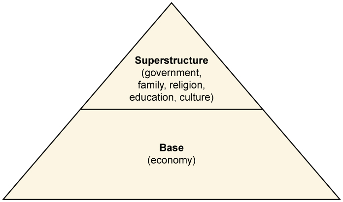
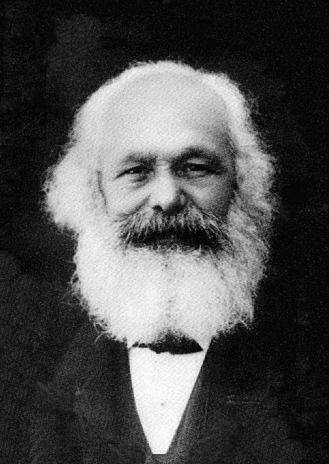

* Describe Durkhiem’s functionalist view of society
* Understand the conflict theorist view of society
* Explain Marx’s concepts of class and alienation
* Identify how symbolic interactionists understand society

 "){: #import-auto-id2101621}

While many sociologists have contributed to research on society and social interaction, three thinkers form the base of modern-day perspectives. Émile Durkheim, Karl Marx, and Max Weber developed different theoretical approaches to help us understand the way societies function.

### Émile Durkheim and Functionalism   {#h2_01}

As a functionalist, Émile Durkheim’s (1858–1917) perspective on society stressed the necessary interconnectivity of all of its elements. To Durkheim, society was greater than the sum of its parts. He asserted that individual behavior was not the same as collective behavior and that studying collective behavior was quite different from studying an individual’s actions. Durkheim called the communal beliefs, morals, and attitudes of a society the **collective conscience**{: data-type="term" #import-auto-id1684729}. In his quest to understand what causes individuals to act in similar and predictable ways, he wrote, “If I do not submit to the conventions of society, if in my dress I do not conform to the customs observed in my country and in my class, the ridicule I provoke, the social isolation in which I am kept, produce, although in an attenuated form, the same effects as punishment” (Durkheim 1895). Durkheim also believed that **social integration**{: data-type="term" #import-auto-id2105149}, or the strength of ties that people have to their social groups, was a key factor in social life.

Following the ideas of Comte and Spencer, Durkheim likened society to a living organism, in which each organ plays a necessary role in keeping the being alive. Even the socially deviant members of society are necessary, Durkheim argued, as punishments for deviance affirm established cultural values and norms. That is, punishment of a crime reaffirms our moral consciousness. “A crime is a crime because we condemn it,” Durkheim wrote in 1893. “An act offends the common consciousness not because it is criminal, but it is criminal because it offends that consciousness” (Durkheim 1893). Durkheim called these elements of society “social facts.” By this, he meant that social forces were to be considered real and existed outside the individual.

As an observer of his social world, Durkheim was not entirely satisfied with the direction of society in his day. His primary concern was that the cultural glue that held society together was failing, and people were becoming more divided. In his book *The Division of Labor in Society* (1893), Durkheim argued that as society grew more complex, social order made the transition from mechanical to organic.

Preindustrial societies, Durkheim explained, were held together by **mechanical solidarity**{: data-type="term" #import-auto-id1814214}, a type of social order maintained by the collective consciousness of a culture. Societies with mechanical solidarity act in a mechanical fashion; things are done mostly because they have always been done that way. This type of thinking was common in preindustrial societies where strong bonds of kinship and a low division of labor created shared morals and values among people, such as hunter-gatherer groups. When people tend to do the same type of work, Durkheim argued, they tend to think and act alike.

In industrial societies, mechanical solidarity is replaced with **organic solidarity**{: data-type="term" #import-auto-id2797848}, which is social order based around an acceptance of economic and social differences. In capitalist societies, Durkheim wrote, division of labor becomes so specialized that everyone is doing different things. Instead of punishing members of a society for failure to assimilate to common values, organic solidarity allows people with differing values to coexist. Laws exist as formalized morals and are based on restitution rather than revenge.

While the transition from mechanical to organic solidarity is, in the long run, advantageous for a society, Durkheim noted that it can be a time of chaos and “normlessness.” One of the outcomes of the transition is something he called social **anomie**{: data-type="term" #import-auto-id1220228}. Anomie—literally, “without law”—is a situation in which society no longer has the support of a firm collective consciousness. Collective norms are weakened. People, while more interdependent to accomplish complex tasks, are also alienated from each other. Anomie is experienced in times of social uncertainty, such as war or a great upturn or downturn in the economy. As societies reach an advanced stage of organic solidarity, they avoid anomie by redeveloping a set of shared norms. According to Durkheim, once a society achieves organic solidarity, it has finished its development.

### Karl Marx and Conflict Theory   {#h2_02}

Karl Marx (1818–1883) is certainly among the most significant social thinkers in recent history. While there are many critics of his work, it is still widely respected and influential. For Marx, society’s constructions were predicated upon the idea of “base and superstructure.” This term refers to the idea that a society’s economic character forms its base, upon which rests the culture and social institutions, the superstructure. For Marx, it is the base (economy) that determines what a society will be like.

 {: #fig0402_02}

Additionally, Marx saw conflict in society as the primary means of change. Economically, he saw conflict existing between the owners of the means of production—the **bourgeoisie**{: data-type="term" #import-auto-id1489449}—and the laborers, called the **proletariat**{: data-type="term" #import-auto-id1735628}.

Marx maintained that these conflicts appeared consistently throughout history during times of social revolution. These revolutions or “class antagonisms” as he called them, were a result of one class dominating another. Most recently, with the end of feudalism, a new revolutionary class he called the bourgeoisie dominated the proletariat laborers. The bourgeoisie were revolutionary in the sense that they represented a radical change in the structure of society. In Marx’s words, “Society as a whole is more and more splitting up into two great hostile camps, into two great classes directly facing each other—Bourgeoisie and Proletariat” (Marx and Engels 1848).

In the mid-nineteenth century, as industrialization was booming, industrial employers, the \"owners of the means of production\" in Marx\'s terms, became more and more exploitative toward the working class. The large manufacturers of steel were particularly ruthless, and their facilities became popularly dubbed “satanic mills” based on a poem by William Blake. Marx’s colleague and friend, Frederick Engels, wrote *The Condition of the Working-Class in England* in 1844, which described in detail the horrid conditions.

<q>Such is the Old Town of Manchester, and on re-reading my description, I am forced to admit that instead of being exaggerated, it is far from black enough to convey a true impression of the filth, ruin, and uninhabitableness, the defiance of all considerations of cleanliness, ventilation, and health which characterise the construction of this single district, containing at least twenty to thirty thousand inhabitants. And such a district exists in the heart of the second city of England, the first manufacturing city of the world.</q>

Add to that the long hours, the use of child labor, and exposure to extreme conditions of heat, cold, and toxic chemicals, and it is no wonder that Marx and Engels referred to **capitalism**{: data-type="term"}, which is a way of organizing an economy so that the things that are used to make and transport products (such as land, oil, factories, ships, etc.) are owned by individual people and companies rather than by the government, as the “dictatorship of the bourgeoisie.”

<figure markdown="1" id="import-auto-id2020419">
<figcaption>
Karl Marx (left) and Friedrich Engels (right) analyzed differences in social power between “have” and “have-not” groups. (Photo (a) courtesy of Wikimedia Commons; Photo (b) courtesy of George Lester/Wikimedia Commons)
</figcaption>
{: #eip-id1427592}

{: #eip-id1854942}

</figure>

For Marx, what we do defines who we are. In historical terms, in spite of the persistent nature of one class dominating another, some element of humanity existed. There was at least some connection between the worker and the product, augmented by the natural conditions of seasons and the rise and fall of the sun, such as we see in an agricultural society. But with the bourgeoisie revolution and the rise of industry and capitalism, the worker now worked for wages alone. His relationship to his efforts was no longer of a human nature, but based on artificial conditions.

Marx described modern society in terms of alienation. **Alienation**{: data-type="term" #import-auto-id1362409} refers to the condition in which the individual is isolated and divorced from his or her society, work, or the sense of self. Marx defined four specific types of alienation.

*Alienation from the product of one’s labor.* An industrial worker does not have the opportunity to relate to the product he labors on. Instead of training for years as a watchmaker, an unskilled worker can get a job at a watch factory pressing buttons to seal pieces together. The worker does not care if he is making watches or cars, simply that the job exists. In the same way, a worker may not even know or care what product to which he is contributing. A worker on a Ford assembly line may spend all day installing windows on car doors without ever seeing the rest of the car. A cannery worker can spend a lifetime cleaning fish without ever knowing what product they are used for.

*Alienation from the process of one’s labor.* A worker does not control the conditions of her job because she does not own the means of production. If a person is hired to work in a fast food restaurant, she is expected to make the food the way she is taught. All ingredients must be combined in a particular order and in a particular quantity; there is no room for creativity or change. An employee at Burger King cannot decide to change the spices used on the fries in the same way that an employee on a Ford assembly line cannot decide to place a car’s headlights in a different position. Everything is decided by the bourgeoisie who then dictate orders to the laborers.

*Alienation from others.* Workers compete, rather than cooperate. Employees vie for time slots, bonuses, and job security. Even when a worker clocks out at night and goes home, the competition does not end. As Marx commented in *The Communist Manifesto* (1848), “No sooner is the exploitation of the laborer by the manufacturer, so far at an end, that he receives his wages in cash, than he is set upon by the other portion of the bourgeoisie, the landlord, the shopkeeper, the pawnbroker.”

*Alienation from one’s self.* A final outcome of industrialization is a loss of connectivity between a worker and her occupation. Because there is nothing that ties a worker to her labor, there is no longer a sense of self. Instead of being able to take pride in an identity such as being a watchmaker, automobile builder, or chef, a person is simply a cog in the machine.

Taken as a whole, then, alienation in modern society means that an individual has no control over his life. Even in feudal societies, a person controlled the manner of his labor as to when and how it was carried out. But why, then, does the modern working class not rise up and rebel? (Indeed, Marx predicted that this would be the ultimate outcome and collapse of capitalism.)

Another idea that Marx developed is the concept of **false consciousness**{: data-type="term" #import-auto-id2851133}. False consciousness is a condition in which the beliefs, ideals, or ideology of a person are not in the person’s own best interest. In fact, it is the ideology of the dominant class (here, the bourgeoisie capitalists) that is imposed upon the proletariat. Ideas such as the emphasis of competition over cooperation, or of hard work being its own reward, clearly benefit the owners of industry. Therefore, workers are less likely to question their place in society and assume individual responsibility for existing conditions.

In order for society to overcome false consciousness, Marx proposed that it be replaced with **class consciousness**{: data-type="term" #import-auto-id1551262}, the awareness of one’s rank in society. Instead of existing as a “class in itself,” the proletariat must become a “class for itself” in order to produce social change (Marx and Engels 1848), meaning that instead of just being an inert strata of society, the class could become an advocate for social improvements. Only once society entered this state of political consciousness would it be ready for a social revolution.

 "){: #import-auto-id1662522}

### Max Weber and Symbolic Interactionism   {#h2_03}

While Karl Marx may be one of the best-known thinkers of the nineteenth century, Max Weber is certainly one of the greatest influences in the field of sociology. Like the other social thinkers discussed here, he was concerned with the important changes taking place in Western society with the advent of industrialization. And, like Marx and Durkheim, he feared that industrialization would have negative effects on individuals.

Weber’s primary focus on the structure of society lay in the elements of class, status, and power. Similar to Marx, Weber saw class as economically determined. Society, he believed, was split between owners and laborers. Status, on the other hand, was based on noneconomic factors such as education, kinship, and religion. Both status and class determined an individual’s power, or influence over ideas. Unlike Marx, Weber believed that these ideas formed the base of society.

Weber’s analysis of modern society centered on the concept of **rationalization**{: data-type="term" #import-auto-id2688589}. A rational society is one built around logic and efficiency rather than morality or tradition. To Weber, capitalism is entirely rational. Although this leads to efficiency and merit-based success, it can have negative effects when taken to the extreme. In some modern societies, this is seen when rigid routines and strict design lead to a mechanized work environment and a focus on producing identical products in every location.

Another example of the extreme conditions of rationality can be found in Charlie Chaplin’s classic film *Modern Times* (1936). Chaplin’s character performs a routine task to the point where he cannot stop his motions even while away from the job. Indeed, today we even have a recognized medical condition that results from such tasks, known as “repetitive stress syndrome.”

Weber was also unlike his predecessors in that he was more interested in how individuals experienced societal divisions than in the divisions themselves. The symbolic interactionism theory, the third of the three most recognized theories of sociology, is based on Weber’s early ideas that emphasize the viewpoint of the individual and how that individual relates to society. For Weber, the culmination of industrialization, rationalization, and the like results in what he referred to as the **iron cage**{: data-type="term" #import-auto-id2678857}, in which the individual is trapped by institutions and bureaucracy. This leads to a sense of “disenchantment of the world,” a phrase Weber used to describe the final condition of humanity. Indeed a dark prediction, but one that has, at least to some degree, been borne out (Gerth and Mills 1918). In a rationalized, modern society, we have supermarkets instead of family-owned stores. We have chain restaurants instead of local eateries. Superstores that offer a multitude of merchandise have replaced independent businesses that focused on one product line, such as hardware, groceries, automotive repair, or clothing. Shopping malls offer retail stores, restaurants, fitness centers, even condominiums. This change may be rational, but is it universally desirable?

"){: #import-auto-id1220954}

The Protestant Work Ethic

In a series of essays in 1904, Max Weber presented the idea of the *Protestant work ethic*, a new attitude toward work based on the Calvinist principle of predestination. In the sixteenth century, Europe was shaken by the Protestant Revolution. Religious leaders such as Martin Luther and John Calvin argued against the Catholic Church’s belief in salvation through obedience. While Catholic leaders emphasized the importance of religious dogma and performing good deeds as a gateway to Heaven, Protestants believed that inner grace, or faith in God, was enough to achieve salvation.

John Calvin in particular popularized the Christian concept of predestination, the idea that all events—including salvation—have already been decided by God. Because followers were never sure whether they had been chosen to enter Heaven or Hell, they looked for signs in their everyday lives. If a person was hard-working and successful, he was likely to be one of the chosen. If a person was lazy or simply indifferent, he was likely to be one of the damned.

Weber argued that this mentality encouraged people to work hard for personal gain; after all, why should one help the unfortunate if they were already damned? Over time, the Protestant work ethic spread and became the foundation for capitalism.

### Summary   {#summary}

Émile Durkheim believed that as societies advance, they make the transition from mechanical to organic solidarity. For Karl Marx, society exists in terms of class conflict. With the rise of capitalism, workers become alienated from themselves and others in society. Sociologist Max Weber noted that the rationalization of society can be taken to unhealthy extremes.

### Section Quiz   {#import-auto-id1655406}

Organic solidarity is most likely to exist in which of the following types of societies?

1.  Hunter-gatherer
2.  Industrial
3.  Agricultural
4.  Feudal
{: type="a"}

Answer

B

According to Marx, the \_\_\_\_\_ own the means of production in a society.

1.  proletariat
2.  vassals
3.  bourgeoisie
4.  anomie
{: type="a"}

Answer

C

Which of the following best depicts Marx’s concept of alienation from the process of one’s labor?

1.  A supermarket cashier always scans store coupons before company coupons because she was taught to do it that way.
2.  A businessman feels that he deserves a raise, but is nervous to ask his manager for one; instead, he comforts himself with the idea that hard work is its own reward.
3.  An associate professor is afraid that she won’t be given tenure and starts spreading rumors about one of her associates to make herself look better.
4.  A construction worker is laid off and takes a job at a fast food restaurant temporarily, although he has never had an interest in preparing food before.
{: type="a"}

Answer

A

The Protestant work ethic is based on the concept of predestination, which states that \_\_\_\_\_\_\_\_.

1.  performing good deeds in life is the only way to secure a spot in Heaven
2.  salvation is only achievable through obedience to God
3.  no person can be saved before he or she accepts Jesus Christ as his or her savior
4.  God has already chosen those who will be saved and those who will be damned
{: type="a"}

Answer

D

The concept of the iron cage was popularized by which of the following sociological thinkers?

1.  Max Weber
2.  Karl Marx
3.  Émile Durkheim
4.  Friedrich Engels
{: type="a"}

Answer

A

Émile Durkheim’s ideas about society can best be described as \_\_\_\_\_\_\_\_.

1.  functionalist
2.  conflict theorist
3.  symbolic interactionist
4.  rationalist
{: type="a"}

Answer

A

### Short Answer   {#shortanswer}

Choose two of the three sociologists discussed here (Durkheim, Marx, Weber), and use their arguments to explain a current social event such as the Occupy movement. Do their theories hold up under modern scrutiny?

Think of the ways workers are alienated from the product and process of their jobs. How can these concepts be applied to students and their educations?

### Further Research   {#fresearch}

One of the most influential pieces of writing in modern history was Karl Marx and Friedrich Engels’ *The Communist Manifesto*. Visit this site to read the original document that spurred revolutions around the world: [http://openstaxcollege.org/l/Communist-Party][1]

### References   {#references}

Durkheim, Émile. 1960 \[1893\]. *The Division of Labor in Society*. Translated by George Simpson. New York: Free Press.

Durkheim, Émile. 1982 \[1895\]. **The Rules of the Sociological Method**. Translated by W. D. Halls. New York: Free Press.

Engels, Friedrich. 1892. *The Condition of the Working-Class in England in 1844*<em>. </em>London: Swan Sonnenschein &amp; Co.

Geographia. 1998. “The Bedouin Way.” Geograpia.com. Retrieved January 4, 2012 ([http://www.geographia.com/egypt/sinai/bedouin02.htm][2]).

Gerth, H. H., and C. Wright Mills. 1946. *From Max Weber: Essays in Sociology*. New York: Oxford University Press.

Marx, Karl and Friedrich Engels. 1998 \[1848\]. *The Communist Manifesto*. New York: Penguin Group.

### Glossary
{: data-type="glossary-title"}

alienation
: {: #glo_04_02_01} an individual’s isolation from his society, his work, and his sense of self
{: #import-auto-id2726501}

anomie
: {: #glo_04_02_02} a situation in which society no longer has the support of a firm collective consciousness
{: #import-auto-id2886669}

bourgeoisie
: {: #glo_04_02_03} the owners of the means of production in a society
{: #import-auto-id2105449}

capitalism
: a way of organizing an economy so that the things that are used to make and transport products (such as land, oil, factories, ships, etc.) are owned by individual people and companies rather than by the government
^

class consciousness
: {: #glo_04_02_04} the awareness of one’s rank in society
{: #import-auto-id1947673}

collective conscience
: {: #glo_04_02_05} the communal beliefs, morals, and attitudes of a society
{: #import-auto-id2367788}

false consciousness
: {: #glo_04_02_06} a person’s beliefs and ideology that are in conflict with her best interests
{: #import-auto-id2865331}

iron cage
: {: #glo_04_02_07} a situation in which an individual is trapped by social institutions
{: #import-auto-id1374789}

mechanical solidarity
: {: #glo_04_02_08} a type of social order maintained by the collective consciousness of a culture
{: #import-auto-id2868304}

organic solidarity
: {: #glo_04_02_09} a type of social order based around an acceptance of economic and social differences
{: #import-auto-id851208}

proletariat
: {: #glo_04_02_10} the laborers in a society
{: #import-auto-id1318198}

rationalization
: {: #glo_04_02_11} a belief that modern society should be built around logic and efficiency rather than morality or tradition
{: #import-auto-id1353404}

social integration
: {: #glo_04_02_12} how strongly a person is connected to his or her social group
{: #import-auto-id2094846}

[1]: http://openstaxcollege.org/l/Communist-Party
[2]: http://www.geographia.com/egypt/sinai/bedouin02.htm
