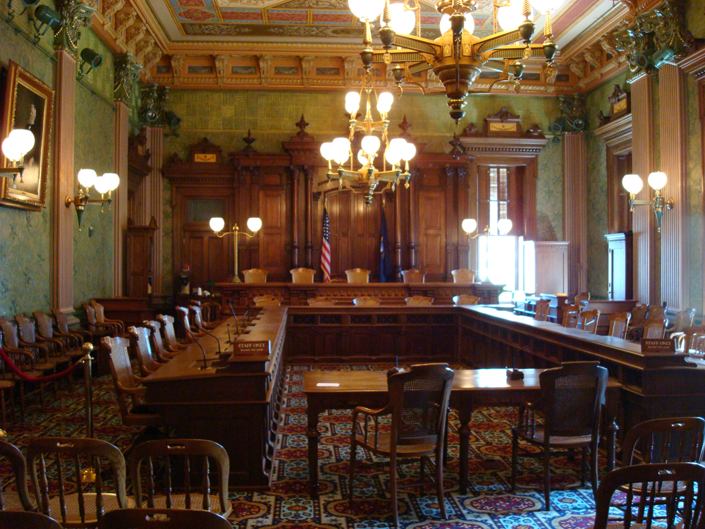

* Identify and differentiate between different types of crimes
* Evaluate U.S. crime statistics
* Understand the three branches of the U.S. criminal justice system

 "){: #import-auto-id1349570}

Although deviance is a violation of social norms, it’s not always punishable, and it’s not necessarily bad. **Crime**{: data-type="term" #import-auto-id2689839}, on the other hand, is a behavior that violates official law and is punishable through formal sanctions. Walking to class backward is a deviant behavior. Driving with a blood alcohol percentage over the state’s limit is a crime. Like other forms of deviance, however, ambiguity exists concerning what constitutes a crime and whether all crimes are, in fact, “bad” and deserve punishment. For example, during the 1960s, civil rights activists often violated laws intentionally as part of their effort to bring about racial equality. In hindsight, we recognize that the laws that deemed many of their actions crimes—for instance, Rosa Parks taking a seat in the “whites only” section of the bus—were inconsistent with social equality.

As you have learned, all societies have informal and formal ways of maintaining social control. Within these systems of norms, societies have **legal codes**{: data-type="term" #import-auto-id842608} that maintain formal social control through laws, which are rules adopted and enforced by a political authority. Those who violate these rules incur negative formal sanctions. Normally, punishments are relative to the degree of the crime and the importance to society of the value underlying the law. As we will see, however, there are other factors that influence criminal sentencing.

### Types of Crimes

Not all crimes are given equal weight. Society generally socializes its members to view certain crimes as more severe than others. For example, most people would consider murdering someone to be far worse than stealing a wallet and would expect a murderer to be punished more severely than a thief. In modern U.S. society, crimes are classified as one of two types based on their severity. **Violent crimes**{: data-type="term" #import-auto-id1904230} (also known as “crimes against a person”) are based on the use of force or the threat of force. Rape, murder, and armed robbery fall under this category. **Nonviolent crimes**{: data-type="term" #import-auto-id2626144} involve the destruction or theft of property but do not use force or the threat of force. Because of this, they are also sometimes called “property crimes.” Larceny, car theft, and vandalism are all types of nonviolent crimes. If you use a crowbar to break into a car, you are committing a nonviolent crime; if you mug someone with the crowbar, you are committing a violent crime.

When we think of crime, we often picture **street crime**{: data-type="term" #import-auto-id2770627}, or offenses committed by ordinary people against other people or organizations, usually in public spaces. An often overlooked category is **corporate crime**{: data-type="term" #import-auto-id1365511}, or crime committed by white-collar workers in a business environment. Embezzlement, insider trading, and identity theft are all types of corporate crime. Although these types of offenses rarely receive the same amount of media coverage as street crimes, they can be far more damaging. Financial frauds such as insurance scams, Ponzi schemes, and improper practices by banks can devastate families who lose their savings or home.

An often-debated third type of crime is **victimless crime**{: data-type="term" #import-auto-id1255710}. Crimes are called victimless when the perpetrator is not explicitly harming another person. As opposed to battery or theft, which clearly have a victim, a crime like drinking a beer when someone is twenty years old or selling a sexual act do not result in injury to anyone other than the individual who engages in them, although they are illegal. While some claim acts like these are victimless, others argue that they actually do harm society. Prostitution may foster abuse toward women by clients or pimps. Drug use may increase the likelihood of employee absences. Such debates highlight how the deviant and criminal nature of actions develops through ongoing public discussion.

Hate Crimes

On the evening of October 3, 2010, a seventeen-year-old boy from the Bronx was abducted by a group of young men from his neighborhood and taken to an abandoned row house. After being beaten, the boy admitted he was gay. His attackers seized his partner and beat him as well. Both victims were drugged, sodomized, and forced to burn one another with cigarettes. When questioned by police, the ringleader of the crime explained that the victims were gay and “looked like \[they\] liked it” (Wilson and Baker 2010).

Attacks based on a person’s race, religion, or other characteristics are known as **hate crimes**{: data-type="term" #import-auto-id2281532}. Hate crimes in the United States evolved from the time of early European settlers and their violence toward Native Americans. Such crimes weren’t investigated until the early 1900s, when the Ku Klux Klan began to draw national attention for its activities against blacks and other groups. The term “hate crime,” however, didn’t become official until the1980s (Federal Bureau of Investigations 2011).

An average of 195,000 Americans fall victim to hate crimes each year, but fewer than five percent ever report the crime (FBI 2010). The majority of hate crimes are racially motivated, but many are based on religious (especially anti-Semitic) prejudice (FBI 2010). After incidents like the murder of Matthew Shepard in Wyoming in 1998 and the tragic suicide of Rutgers University student Tyler Clementi in 2010, there has been a growing awareness of hate crimes based on sexual orientation.

"){: #import-auto-id2689318}

### Crime Statistics

The FBI gathers data from approximately 17,000 law enforcement agencies, and the Uniform Crime Reports (UCR) is the annual publication of this data (FBI 2011). The UCR has comprehensive information from police reports but fails to account for the many crimes that go unreported, often due to victims’ fear, shame, or distrust of the police. The quality of this data is also inconsistent because of differences in approaches to gathering victim data; important details are not always asked for or reported (Cantor and Lynch 2000).

Due to these issues, the U.S. Bureau of Justice Statistics publishes a separate self-report study known as the National Crime Victimization Report (NCVR). A **self-report study**{: data-type="term"} is a collection of data gathered using voluntary response methods, such as questionnaires or telephone interviews. Self-report data are gathered each year, asking approximately 160,000 people in the United States about the frequency and types of crime they’ve experienced in their daily lives (BJS 2013). The NCVR reports a higher rate of crime than the UCR, likely picking up information on crimes that were experienced but never reported to the police. Age, race, gender, location, and income-level demographics are also analyzed (National Archive of Criminal Justice Data 2010).

The NCVR survey format allows people to more openly discuss their experiences and also provides a more-detailed examination of crimes, which may include information about consequences, relationship between victim and criminal, and substance abuse involved. One disadvantage is that the NCVR misses some groups of people, such as those who don\'t have telephones and those who move frequently. The quality of information may also be reduced by inaccurate victim recall of the crime (Cantor and Lynch 2000).

### Public Perception of Crime

Neither the NCVR nor the UCS accounts for all crime in the United States, but general trends can be determined. Crime rates, particularly for violent and gun-related crimes, have been on the decline since peaking in the early 1990s (Cohn, Taylor, Lopez, Gallagher, Parker, and Maass 2013). However, the public believes crime rates are still high, or even worsening. Recent surveys (Saad 2011; Pew Research Center 2013, cited in Overburg and Hoyer 2013) have found U.S. adults believe crime is worse now than it was twenty years ago.

Inaccurate public perception of crime may be heightened by popular crime shows such as *CSI*, *Criminal Minds* and *Law &amp; Order* (Warr 2008) and by extensive and repeated media coverage of crime. Many researchers have found that people who closely follow media reports of crime are likely to estimate the crime rate as inaccurately high and more likely to feel fearful about the chances of experiencing crime (Chiricos, Padgett, and Gertz 2000). Recent research has also found that people who reported watching news coverage of 9/11 or the Boston Marathon Bombing for more than an hour daily became more fearful of future terrorism (Holman, Garfin, and Silver 2014).

### The U.S. Criminal Justice System

A **criminal justice system**{: data-type="term" #import-auto-id1317987} is an organization that exists to enforce a legal code. There are three branches of the U.S. criminal justice system: the police, the courts, and the corrections system.

#### Police

**Police**{: data-type="term" #import-auto-id3637603} are a civil force in charge of enforcing laws and public order at a federal, state, or community level. No unified national police force exists in the United States, although there are federal law enforcement officers. Federal officers operate under specific government agencies such as the Federal Bureau of Investigations (FBI); the Bureau of Alcohol, Tobacco, Firearms, and Explosives (ATF); and the Department of Homeland Security (DHS). Federal officers can only deal with matters that are explicitly within the power of the federal government, and their field of expertise is usually narrow. A county police officer may spend time responding to emergency calls, working at the local jail, or patrolling areas as needed, whereas a federal officer would be more likely to investigate suspects in firearms trafficking or provide security for government officials.

State police have the authority to enforce statewide laws, including regulating traffic on highways. Local or county police, on the other hand, have a limited jurisdiction with authority only in the town or county in which they serve.

 "){: #import-auto-id1428533}

#### Courts

Once a crime has been committed and a violator has been identified by the police, the case goes to court. A **court**{: data-type="term" #import-auto-id1318799} is a system that has the authority to make decisions based on law. The U.S. judicial system is divided into federal courts and state courts. As the name implies, federal courts (including the U.S. Supreme Court) deal with federal matters, including trade disputes, military justice, and government lawsuits. Judges who preside over federal courts are selected by the president with the consent of Congress.

State courts vary in their structure but generally include three levels: trial courts, appellate courts, and state supreme courts. In contrast to the large courtroom trials in TV shows, most noncriminal cases are decided by a judge without a jury present. Traffic court and small claims court are both types of trial courts that handle specific civil matters.

Criminal cases are heard by trial courts with general jurisdictions. Usually, a judge and jury are both present. It is the jury’s responsibility to determine guilt and the judge’s responsibility to determine the penalty, though in some states the jury may also decide the penalty. Unless a defendant is found “not guilty,” any member of the prosecution or defense (whichever is the losing side) can appeal the case to a higher court. In some states, the case then goes to a special appellate court; in others it goes to the highest state court, often known as the state supreme court.

<figure markdown="1" id="import-auto-id1333177">
<figcaption>
This county courthouse in Kansas (left) is a typical setting for a state trial court. Compare this to the courtroom of the Michigan Supreme Court (right). (Photo (a) courtesy of Ammodramus/Wikimedia Commons; Photo (b) courtesy of Steve &amp; Christine/Wikimedia Commons)
</figcaption>
{: #eip-id1237005}

{: #eip-id1877478}

</figure>

#### Corrections

The **corrections system**{: data-type="term" #import-auto-id1521030}, more commonly known as the prison system, is charged with supervising individuals who have been arrested, convicted, and sentenced for a criminal offense. At the end of 2010, approximately seven million U.S. men and women were behind bars (BJS 2011d).

The U.S. incarceration rate has grown considerably in the last hundred years. In 2008, more than 1 in 100 U.S. adults were in jail or prison, the highest benchmark in our nation’s history. And while the United States accounts for 5 percent of the global population, we have 25 percent of the world’s inmates, the largest number of prisoners in the world (Liptak 2008b).

Prison is different from jail. A jail provides temporary confinement, usually while an individual awaits trial or parole. Prisons are facilities built for individuals serving sentences of more than a year. Whereas jails are small and local, prisons are large and run by either the state or the federal government.

Parole refers to a temporary release from prison or jail that requires supervision and the consent of officials. Parole is different from probation, which is supervised time used as an alternative to prison. Probation and parole can both follow a period of incarceration in prison, especially if the prison sentence is shortened.

### Summary

Crime is established by legal codes and upheld by the criminal justice system. In the United States, there are three branches of the justice system: police, courts, and corrections. Although crime rates increased throughout most of the twentieth century, they are now dropping.

### Section Quiz

Which of the following is an example of corporate crime?

1.  Embezzlement
2.  Larceny
3.  Assault
4.  Burglary
{: type="a"}

Answer

A

Spousal abuse is an example of a \_\_\_\_\_\_\_\_.

1.  street crime
2.  corporate crime
3.  violent crime
4.  nonviolent crime
{: type="a"}

Answer

C

Which of the following situations best describes crime trends in the United States?

1.  Rates of violent and nonviolent crimes are decreasing.
2.  Rates of violent crimes are decreasing, but there are more nonviolent crimes now than ever before.
3.  Crime rates have skyrocketed since the 1970s due to lax corrections laws.
4.  Rates of street crime have gone up, but corporate crime has gone down.
{: type="a"}

Answer

A

What is a disadvantage of the *National Crime Victimization Survey* (NCVS)?

1.  The NCVS doesn’t include demographic data, such as age or gender.
2.  The NCVS may be unable to reach important groups, such as those without phones.
3.  The NCVS doesn’t address the relationship between the criminal and the victim.
4.  The NCVS only includes information collected by police officers.
{: type="a"}

Answer

B

### Short Answer

Recall the crime statistics presented in this section. Do they surprise you? Are these statistics represented accurately in the media? Why, or why not?

### Further Research

Is the U.S. criminal justice system confusing? You’re not alone. Check out this handy flowchart from the Bureau of Justice Statistics: [http://openstaxcollege.org/l/US\\\_Criminal\\\_Justice\\\_BJS][1]

How is crime data collected in the United States? Read about the methods of data collection and take the National Crime Victimization Survey. Visit [http://openstaxcollege.org/l/Victimization\\\_Survey][2]

### References

Bureau of Justice Statistics. 2013. “Data Collection: National Crime Victimization Survey (NCVS).” Bureau of Justice Statistics, n.d. Retrieved November 1, 2014 ([http://www.bjs.gov/index.cfm?ty=dcdetail&amp;iid=245][3])

Cantor, D. and Lynch, J. 2000. *Self-Report Surveys as Measures of Crime and Criminal Victimization*. Rockville, MD: National Institute of Justice. Retrieved February 10, 2012 ([https://www.ncjrs.gov/criminal\\\_justice2000/vol\\\_4/04c.pdf][4]).

Chiricos, Ted; Padgett, Kathy; and Gertz, Mark. 2000. “Fear, TV News, and The Reality of Crime.” *Criminology*, 38, 3. Retrieved November 1, 2014 ([http://onlinelibrary.wiley.com/doi/10.1111/j.1745-9125.2000.tb00905.x/abstract][5])

Cohn, D’Verta; Taylor, Paul; Lopez, Mark Hugo; Gallagher, Catherine A.; Parker, Kim; and Maass, Kevin T. 2013. “Gun Homicide Rate Down 49% Since 1993 Peak: Public Unaware; Pace of Decline Slows in Past Decade.” *Pew Research Social &amp; Demographic Trends*, May 7. Retrieved November 1, 2014 ([http://www.pewsocialtrends.org/2013/05/07/gun-homicide-rate-down-49-since-1993-peak-public-unaware/][6])

Federal Bureau of Investigation. 2010. “Latest Hate Crime Statistics.” Retrieved February 10, 2012 ([http://www.fbi.gov/news/stories/2010/november/hate\\\_112210/hate\\\_112210][7]).

Federal Bureau of Investigation. 2011. “Uniform Crime Reports.” Retrieved February 10, 2012 ([http://www.fbi.gov/about-us/cjis/ucr][8]).

Holman, E. Allison; Garfin, Dana; and Silver, Roxane (2013). “Media’s Role in Broadcasting Acute Stress Following the Boston Marathon Bombings.” Proceedings of the National Academy of Sciences of the USA, November 14. Retrieved November 1, 2014 ([http://www.danarosegarfin.com/uploads/3/0/8/5/30858187/holman\\\_et\\\_al\\\_pnas\\\_2014.pdf][9])

Langton, Lynn and Michael Planty. 2011. “Hate Crime, 2003–2009.” Bureau of Justice Statistics. Retrieved February 10, 2012 ([http://www.bjs.gov/index.cfm?ty=pbdetail&amp;iid=1760][10]).

Liptak, Adam. 2008a. “1 in 100 U.S. Adults Behind Bars, New Study Says.” *New York Times*, February 28. Retrieved February 10, 2012 ([http://www.nytimes.com/2008/02/28/us/28cnd-prison.html][11]).

Liptak, Adam. 2008b. “Inmate Count in U.S. Dwarfs Other Nations’.” *New York Times*, April 23. Retrieved February 10, 2012 ([http://www.nytimes.com/2008/04/23/us/23prison.html?ref=adamliptak][12]).

National Archive of Criminal Justice Data. 2010. “National Crime Victimization Survey Resource Guide.” Retrieved February 10, 2012 ([http://www.icpsr.umich.edu/icpsrweb/NACJD/NCVS/][13]).

Overburg, Paul and Hoyer, Meghan. 2013. “Study: Despite Drop in Gun Crime, 56% Think It’s Worse.” *USA Today*, December, 3. Retrieved November 2, 2014 ([http://www.usatoday.com/story/news/nation/2013/05/07/gun-crime-drops-but-americans-think-its-worse/2139421/][14])

Saad, Lydia. 2011. “Most Americans Believe Crime in U.S. is Worsening: Slight Majority Rate U.S. Crime Problem as Highly Serious; 11% Say This about Local Crime.” Gallup: Well-Being, October 31. Retrieved November 1, 2014 ([http://www.gallup.com/poll/150464/americans-believe-crime-worsening.aspx][15])

Warr, Mark. 2008. “Crime on the Rise? Public Perception of Crime Remains Out of Sync with Reality.” The University of Texas at Austin: Features, November, 10. Retrieved November 1, 2014 ([http://www.utexas.edu/features/2008/11/10/crime/][16])

Wilson, Michael and Al Baker. 2010. “Lured into a Trap, Then Tortured for Being Gay.” *New York Times*, October 8. Retrieved from February 10, 2012 ([http://www.nytimes.com/2010/10/09/nyregion/09bias.html?pagewanted=1][17]).

### Glossary
{: data-type="glossary-title"}

corporate crime
: crime committed by white-collar workers in a business environment
{: #import-auto-id1773712}

corrections system
: the system tasked with supervising individuals who have been arrested for, convicted of, or sentenced for criminal offenses
{: #import-auto-id1484310}

court
: a system that has the authority to make decisions based on law
{: #import-auto-id2290785}

crime
: a behavior that violates official law and is punishable through formal sanctions
{: #import-auto-id1820533}

criminal justice system
: an organization that exists to enforce a legal code
{: #import-auto-id1302877}

hate crimes
: attacks based on a person’s race, religion, or other characteristics
{: #import-auto-id2662002}

legal codes
: codes that maintain formal social control through laws
{: #import-auto-id2431682}

nonviolent crimes
: crimes that involve the destruction or theft of property, but do not use force or the threat of force
{: #import-auto-id2784609}

police
: a civil force in charge of regulating laws and public order at a federal, state, or community level
{: #import-auto-id2879160}

self-report study
: a collection of data acquired using voluntary response methods, such as questionnaires or telephone interviews
{: #import-auto-id2624634}

street crime
: crime committed by average people against other people or organizations, usually in public spaces
{: #import-auto-id1326721}

victimless crime
: activities against the law, but that do not result in injury to any individual other than the person who engages in them
{: #import-auto-id1773722}

violent crimes
: crimes based on the use of force or the threat of force
{: #import-auto-id3654480}

[1]: http://openstaxcollege.org/l/US_Criminal_Justice_BJS
[2]: http://openstaxcollege.org/l/Victimization_Survey
[3]: http://www.bjs.gov/index.cfm?ty=dcdetail&amp;iid=245
[4]: https://www.ncjrs.gov/criminal_justice2000/vol_4/04c.pdf
[5]: http://onlinelibrary.wiley.com/doi/10.1111/j.1745-9125.2000.tb00905.x/abstract
[6]: http://www.pewsocialtrends.org/2013/05/07/gun-homicide-rate-down-49-since-1993-peak-public-unaware/
[7]: http://www.fbi.gov/news/stories/2010/november/hate_112210/hate_112210
[8]: http://www.fbi.gov/about-us/cjis/ucr
[9]: http://www.danarosegarfin.com/uploads/3/0/8/5/30858187/holman_et_al_pnas_2014.pdf
[10]: http://www.bjs.gov/index.cfm?ty=pbdetail&amp;iid=1760
[11]: http://www.nytimes.com/2008/02/28/us/28cnd-prison.html
[12]: http://www.nytimes.com/2008/04/23/us/23prison.html?ref=adamliptak
[13]: http://www.icpsr.umich.edu/icpsrweb/NACJD/NCVS/
[14]: http://www.usatoday.com/story/news/nation/2013/05/07/gun-crime-drops-but-americans-think-its-worse/2139421/
[15]: http://www.gallup.com/poll/150464/americans-believe-crime-worsening.aspx
[16]: http://www.utexas.edu/features/2008/11/10/crime/
[17]: http://www.nytimes.com/2010/10/09/nyregion/09bias.html?pagewanted=1
